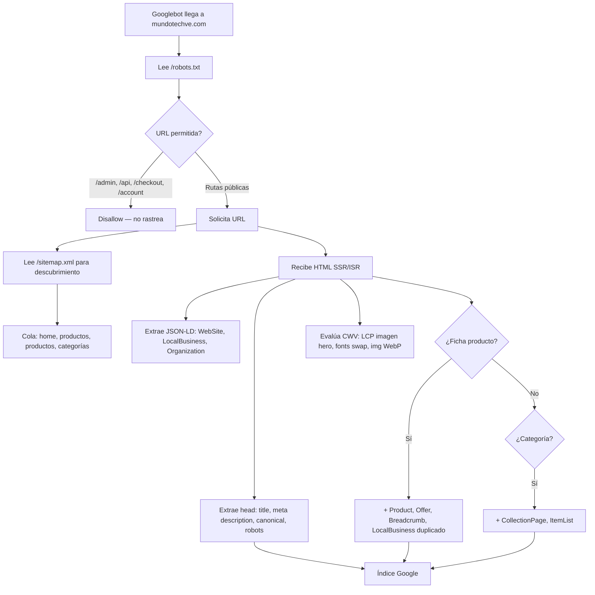

# Análisis SEO completo — MundoTech E-commerce

> **Objetivo principal de este documento:** dejar documentado **todo** lo que impide que tus **productos** rankeen en Google, para corregirlo después y dejar el SEO de fichas y catálogo **100% optimizado**.  
> **Proyecto:** mundotech-ecommerce (Next.js App Router)  
> **Dominio canónico:** `https://mundotechve.com` (fallback si no hay env)  
> **Idioma/mercado:** Español Venezuela (`es` / `es_VE`) — SEO local Barquisimeto, Lara  
> **Fecha del análisis:** 11 de junio de 2026  
> **Última ampliación:** revisión de alcance — solo hallazgos con impacto directo en rastreo, indexación, ranking o rich results  
> **Última implementación:** sesiones 7–15 SEO + caché catálogo (§39–§46) — 12 de junio de 2026  
> **Última sincronización doc↔código:** 12 de junio de 2026 (3.ª pasada) — ver [§47](#47-sincronización-doc--código-auditoría-12-jun-2026) · [§47.6](#476-segunda-pasada-de-sincronización) · [§47.7](#477-tercera-pasada-de-sincronización)  
> **Alcance:** Exclusivamente SEO (Google/buscadores). Malas prácticas **P01–P97** · hallazgos globales **H01–H66** (ver criterio de inclusión abajo).

---

## Cómo usar este documento (humano o IA)

1. **Si eres una IA** que va a corregir SEO: lee primero **[CTX — Contexto del proyecto](#ctx--contexto-del-proyecto-para-ia)** (negocio, stack, rutas, flujo de datos).
2. Luego **[P2 — Malas prácticas producto](#p2-malas-prácticas-exhaustivas--seo-de-productos-p01p70)** y **[P4 — Roadmap](#p4-roadmap-seo-de-productos-100-optimizado)**.
3. Para bugs globales del sitio: secciones **29–35** (H01–H50).
4. **No implementes SEO** sin respetar reglas del repo: `isAdminRole()`, `OrderStatus` en `lib/definitions.ts`, `readSettings()` para datos de tienda (reglas R1–R3 en `.cursor/rules/`).

---

## ⚠️ Sesión 7 — trabajo en paralelo con sesiones 1–6 y 8

> **Estado (12 jun 2026):** capa SEO **avanzada implementada** — sesiones [§39–§46](#39-registro-de-implementación--sesión-7-jun-2026). **Doc sincronizado** ([§47.6–§47.7](#476-segunda-pasada-de-sincronización)): §1–§7, §15, §28–§33, §34, §37–§38, P4, apéndices. DEPENDENCIA-03/05 ✅ · P85/P87/P82 ✅ · Merchant feed + taxonomía Google ✅ · ~75 P/H cerrados · ~20 pendientes reales.

Estás en la **sesión 7 de 8**. Otras IAs trabajan a la vez en producción (PRD) y móvil (P0…). **No colisiones:**

### ⛔ NO implementar aquí (otra sesión ya lo cubre)

| ID SEO | Cerrar como | Sesión dueña | No editar |
|--------|-------------|--------------|-----------|
| P03 | Hecho vía PRD-066 | 5 Admin | `productActions.ts` slug/301 |
| P58, P59 | Hecho vía PRD-024 | 2 Checkout | `productActions.ts` quickUpdate |
| P05, P18 | Hecho vía PRD-064, 065, 121 | 3 Infra | `schema.prisma` |
| P41 | Hecho vía PRD-008 | 4 UX cliente | `public/` placeholders |
| P04 (parcial) | Hecho vía PRD-233 | 5 Admin | delete/revalidate producto (sesión 05) |

### ✅ SÍ implementas tú (sesión 7)

| Zona | Archivos |
|------|----------|
| Metadata SERP, OG, títulos | `product/[slug]/page.tsx` → solo `generateMetadata` |
| JSON-LD producto | `ProductJsonLd.tsx` |
| Sitemap, robots, canonicals | `app/sitemap.ts`, `robots.ts` |
| URLs duplicadas slug/id | `product/[slug]/page.tsx` (query, canonical) |

### `app/layout.tsx` (compartido con sesión 4)

- **Tú:** `title.template`, SearchAction, JSON-LD global (P08, P64, H*).
- **Sesión 4:** skip link PRD-055.
- **Regla:** edita **solo** bloques `metadata` / JSON-LD; **no toques** skip link ni providers.

Mapa completo: [`00-INDICE` § Reglas entre sesiones](./ANALISIS-PRODUCCION-00-INDICE.md#reglas-entre-sesiones).

---

## Tabla de contenidos

### Contexto y evaluación (leer primero si eres IA)

- [CTX — Contexto del proyecto para IA](#ctx--contexto-del-proyecto-para-ia)
- [Puntuación SEO actual (1–100)](#puntuación-seo-actual-1100)
- [Cobertura del documento: qué incluye y qué no](#cobertura-del-documento-qué-incluye-y-qué-no)

### Foco productos en Google

- [0. Objetivo: posicionar productos en Google](#0-objetivo-posicionar-productos-en-google)
- [P1. Cómo Google descubre y evalúa tus productos hoy](#p1-cómo-google-descubre-y-evalúa-tus-productos-hoy)
- [P2. Malas prácticas exhaustivas — SEO de productos (P01–P74)](#p2-malas-prácticas-exhaustivas--seo-de-productos-p01p70)
- [P3. Qué sí ayuda hoy al posicionamiento de productos](#p3-qué-sí-ayuda-hoy-al-posicionamiento-de-productos)
- [P4. Roadmap: SEO de productos 100% optimizado](#p4-roadmap-seo-de-productos-100-optimizado)
- [P5. Checklist final — producto listo para rankear](#p5-checklist-final--producto-listo-para-rankear)

### Resto del sitio (SEO global)

1. [Resumen ejecutivo](#1-resumen-ejecutivo)
2. [Stack y arquitectura SEO](#2-stack-y-arquitectura-seo)
3. [Variable central: `NEXT_PUBLIC_SITE_URL`](#3-variable-central-next_public_site_url)
4. [Metadata global (root layout)](#4-metadata-global-root-layout)
5. [Inventario completo de metadata por ruta](#5-inventario-completo-de-metadata-por-ruta)
6. [Sitemap (`/sitemap.xml`)](#6-sitemap-sitemapxml)
7. [Robots.txt (`/robots.txt`)](#7-robotstxt-robotstxt)
8. [Datos estructurados (JSON-LD / Schema.org)](#8-datos-estructurados-json-ld--schemaorg)
9. [SEO Local (NAP, Maps, admin)](#9-seo-local-nap-maps-admin)
10. [Open Graph, Twitter Cards e imágenes sociales](#10-open-graph-twitter-cards-e-imágenes-sociales)
11. [URLs, slugs y arquitectura de enlaces](#11-urls-slugs-y-arquitectura-de-enlaces)
12. [Estrategia de indexación por tipo de página](#12-estrategia-de-indexación-por-tipo-de-página)
13. [Enlazado interno (internal linking)](#13-enlazado-interno-internal-linking)
14. [Rendimiento, Core Web Vitals e imágenes](#14-rendimiento-core-web-vitals-e-imágenes)
15. [Caché, ISR y frescura del contenido](#15-caché-isr-y-frescura-del-contenido)
16. [Analytics y medición](#16-analytics-y-medición)
17. [PWA, manifest e iconos](#17-pwa-manifest-e-iconos)
18. [Middleware, seguridad y su impacto en crawlers](#18-middleware-seguridad-y-su-impacto-en-crawlers)
19. [Redirects 301 (URLs legacy)](#19-redirects-301-urls-legacy)
20. [Páginas de error (404 / 500)](#20-páginas-de-error-404--500)
21. [Internacionalización e hreflang](#21-internacionalización-e-hreflang)
22. [Blog y contenido editorial](#22-blog-y-contenido-editorial)
23. [Panel admin: herramientas SEO](#23-panel-admin-herramientas-seo)
24. [Variables de entorno relacionadas con SEO](#24-variables-de-entorno-relacionadas-con-seo)
25. [Flujo de rastreo (cómo lo ve Google)](#25-flujo-de-rastreo-cómo-lo-ve-google)
26. [Mapa de archivos SEO](#26-mapa-de-archivos-seo)
27. [Fortalezas actuales](#27-fortalezas-actuales)
28. [Gaps, inconsistencias y riesgos](#28-gaps-inconsistencias-y-riesgos)
29. [Bugs confirmados que penalizan SEO](#29-bugs-confirmados-que-penalizan-seo)
30. [Malas prácticas SEO en el código](#30-malas-prácticas-seo-en-el-código)
31. [Inconsistencias de marca, datos y configuración](#31-inconsistencias-de-marca-datos-y-configuración)
32. [Problemas de contenido, headings y accesibilidad](#32-problemas-de-contenido-headings-y-accesibilidad)
33. [Problemas técnicos de rastreo e indexación](#33-problemas-técnicos-de-rastreo-e-indexación)
34. [Matriz de impacto estimado en puntaje SEO](#34-matriz-de-impacto-estimado-en-puntaje-seo)
35. [Registro maestro de hallazgos (índice único)](#35-registro-maestro-de-hallazgos-índice-único)
36. [Checklist operativo post-despliegue](#36-checklist-operativo-post-despliegue)
37. [Quinta pasada — hallazgos adicionales (P75–P89, H51–H58)](#37-quinta-pasada--hallazgos-adicionales-p75p89-h51h58)
38. [Sexta pasada — hallazgos adicionales (P90–P97, H61–H66)](#38-sexta-pasada--hallazgos-adicionales-p90p97-h61h66)
39. [Registro de implementación — sesión 7 (jun 2026)](#39-registro-de-implementación--sesión-7-jun-2026)

### Apéndices

- [Apéndice A — Modelo Prisma (producto/categoría)](#apéndice-a--modelo-de-datos-relevante-prisma)
- [Apéndice B — Herramientas externas](#apéndice-b--herramientas-externas-recomendadas)
- [Apéndice C — Mapa completo de rutas públicas](#apéndice-c--mapa-completo-de-rutas-públicas)
- [Apéndice D — Claves AppConfig y fuentes de configuración](#apéndice-d--claves-appconfig-y-fuentes-de-configuración)
- [Apéndice E — Árbol de carpetas relevante para SEO](#apéndice-e--árbol-de-carpetas-relevante-para-seo)

---

## CTX — Contexto del proyecto para IA

Esta sección explica **cómo está armada la web** para que cualquier IA (o desarrollador nuevo) entienda el sistema antes de tocar SEO.

### CTX.1 Qué es MundoTech (negocio)

| Aspecto | Detalle |
|---------|---------|
| **Tipo** | E-commerce B2C + tienda física |
| **Ubicación** | Barquisimeto, Lara, Venezuela — Carrera 21 con esquina calle 21, Centro, Barquisimeto 3001 |
| **Slogan** | Conectados Contigo |
| **Rubro** | Tecnología, gadgets, consolas, electrodomésticos, accesorios |
| **Moneda venta** | Precios en **USD**; conversión a **Bs.** con tasa del día (checkout) |
| **Pagos** | Pago Móvil, transferencia bancaria, Binance Pay (no pasarela Stripe en flujo principal) |
| **Envíos** | Nacional (Venezuela), despacho tras confirmar pago |
| **Idioma UI** | Español Venezuela (`lang="es"`, `locale: es_VE`) |
| **Dominio producción** | `https://mundotechve.com` (`NEXT_PUBLIC_SITE_URL`) |
| **Objetivo SEO** | Posicionar **fichas de producto** y categorías en Google (búsquedas + rich results) |

### CTX.2 Stack tecnológico

| Capa | Tecnología |
|------|------------|
| Framework | **Next.js 16** App Router (`app/`) |
| UI | React 19, Tailwind CSS, Framer Motion, Radix UI |
| BD | **PostgreSQL** + **Prisma 7** |
| Auth | **NextAuth.js** (JWT, roles `ADMIN` / `client`) |
| Imágenes | **Cloudflare R2** (`R2_PUBLIC_BASE_URL`, `next/image`) |
| Video producto | **Bunny.net** embed (`iframe.mediadelivery.net`) |
| Email | React Email (`emails/mundotech/`) |
| Analytics | GA4 opcional con consentimiento (`CookieConsent.tsx`) |
| Deploy típico | Compatible Vercel/Node (`next build` / `next start`) |

### CTX.3 Arquitectura de renderizado (crítico para SEO)

```
Request HTTP
    │
    ▼
middleware.ts          ← CSP dual: pública cacheada (`unsafe-inline`, sin nonce) vs
    │                    dinámica/sensible (nonce + `strict-dynamic`); auth /admin /account /checkout
    │
    ▼
app/layout.tsx (RSC)   ← metadata global, JSON-LD WebSite/Org/LocalBusiness,
    │                    readSeoLocal(), readSettings(), Footer (RSC)
    ▼
AppContent (cliente)   ← Navbar, CartDrawer, SearchBar → /buscar
AppLayoutShell (RSC)   ← <main>{children}</main> + Footer
    │
    ▼
page.tsx por ruta      ← Server Component (RSC) o Client Component
```

**Regla de oro SEO en este proyecto:**

- Lo que **rankea** debe salir en **Server Components** o en el HTML del primer render (links `<a>`, H1, precio, `generateMetadata`).
- Muchos listados pasan productos desde RSC → `ProductCard` (cliente), pero el **`<Link href="/product/...">` sí está en HTML inicial**.
- **Residual:** `ProductGridAndFilters` filtra `?q=` en cliente (sort/búsqueda dentro de la página). Categorías van a `/categoria/{slug}` vía `Link` (sesión 9); `?cat=` redirige 301 en middleware.

**Providers cliente globales** (`app/layout.tsx`): `AuthProvider`, `CartProvider`, `WishlistProvider`, **`ProductProvider`**, `ExchangeRateProvider`.

- `ProductProvider` carga todos los productos vía server action al montar — usado por `CategoryDrawer`, no por la página `/productos` (esta usa `initialProducts` del servidor).

### CTX.4 Flujo de datos: producto desde admin hasta Google

```mermaid
flowchart TB
    subgraph admin
        A[/admin/products] --> B[productActions.ts]
        B --> C[(PostgreSQL Product + ProductMedia)]
    end
    subgraph config
        D[AppConfig store_settings] --> layout Footer
        E[AppConfig seo_local] --> layout LocalBusiness
        F[Category table] --> G[/categoria/slug]
    end
    subgraph publico
        C --> H[/product/slug page.tsx]
        H --> I[generateMetadata]
        H --> J[ProductJsonLd]
        C --> K[sitemap.ts]
        K --> L[Googlebot]
        G --> L
        H --> L
    end
    B -->|revalidatePath| H
    B -->|quickUpdate stock/price| M[revalidatePath + revalidateTag catalog]
```

**Creación/edición producto** (`app/actions/productActions.ts`):

1. Admin guarda en `Product` + `ProductMedia` (imágenes/video).
2. Se genera `slug` con `slugify()` + unicidad.
3. `revalidatePath('/')`, `/product/{slug}` en update completo.
4. `quickUpdateStockAction` / `quickUpdatePriceAction` revalidan `/product/{slug}` + `revalidateTag('catalog')` (PRD-024, sesión 2).

**Relación Product ↔ Category:**

- `Product.category` es **string libre** (nombre), no FK.
- `Category` tiene `name` + `slug` propios.
- Enlace SEO categoría vía `resolve-category-path.ts` (match por nombre).

### CTX.5 Zonas del sitio (quién ve qué)

| Zona | Rutas | Auth | Indexable SEO | robots.txt |
|------|-------|------|---------------|------------|
| **Tienda pública** | `/`, `/productos`, `/product/*`, `/categoria/*`, landings | No | Sí (mayoría) | Allow |
| **Búsqueda** | `/buscar` | No | noindex meta | Allow |
| **Cuenta** | `/account/*` | JWT | Hereda index (mal) | Disallow |
| **Checkout** | `/checkout`, `/checkout/success` | JWT | No deseado | Disallow |
| **Carrito / wishlist** | `/cart`, `/wishlist` | No | No deseado | cart Allow / wishlist Disallow |
| **Auth** | `/login`, `/registro`, `/forgot-password`, `/reset-password` | No | Hereda index (mal) | Allow |
| **Admin** | `/admin/*` | JWT + ADMIN | noindex meta | Disallow |
| **API** | `/api/*` | Varía | N/A | Disallow |

### CTX.6 Capas de configuración (de dónde salen los datos SEO)

| Clave / fuente | Archivo lectura | Qué alimenta SEO |
|----------------|-----------------|------------------|
| `store_settings` | `lib/data-store.ts` → `readSettings()` | Nombre tienda, email, teléfono, address footer, redes, pagos |
| `seo_local` | `lib/seo-local.ts` → `readSeoLocal()` | NAP schema layout, `/tienda-barquisimeto`, `/nosotros` |
| `site_content` | `lib/site-content.ts` | Hero fallback, WhatsApp, trust badges ficha, popup |
| `announcement_bar` | `lib/announcement.ts` | Barra superior con link |
| `exchange_rate` | `lib/exchange-rate.ts` | Precio Bs en UI |
| `homepage_*` | `AppConfig` en `page.tsx` | Shelves, flash deals, benefits home |
| Tabla `Category` | Prisma | `/categoria/[slug]`, ItemList schema |
| Tabla `Product` | Prisma | `/product/[slug]`, sitemap, ProductJsonLd |
| Tabla `Banner` / `Promotion` | Prisma | Hero home, promos, links internos |

**Conflicto documentado:** `settings.address` (store_settings) ≠ `seo.streetAddress` (seo_local) ≠ hardcode en `ProductJsonLd`.

### CTX.7 Piezas SEO por capa (dónde vive cada cosa)

| Pieza SEO | Archivo(s) |
|-----------|------------|
| Metadata global | `app/layout.tsx` |
| Sitemap | `app/sitemap.ts` → `/sitemap.xml` |
| Robots | `app/robots.ts` → `/robots.txt` |
| Manifest | `app/manifest.ts` |
| OG default | `app/opengraph-image.tsx` |
| Favicon | `app/icon.svg` |
| Metadata producto | `app/product/[slug]/page.tsx` → `generateMetadata` |
| Schema producto | `app/components/ProductJsonLd.tsx` |
| Metadata categoría | `app/categoria/[slug]/page.tsx` |
| SEO local admin | `app/admin/settings/seo-local/` |
| Slugs | `lib/slugify.ts`, `productActions.ts` |
| URLs categoría | `lib/resolve-category-path.ts` |

### CTX.8 Servicios externos que afectan SEO

| Servicio | Uso | Variable env |
|----------|-----|--------------|
| Cloudflare R2 | Imágenes producto, OG, hero | `R2_*` env; URLs en BD |
| Bunny Stream | Video en ficha producto | URLs en `ProductMedia` |
| Google Maps | Embed + `hasMap` schema | `NEXT_PUBLIC_GOOGLE_MAPS_*` |
| Google Analytics | Tráfico (no ranking directo) | `NEXT_PUBLIC_GA4_ID` |
| Search Console | Verificación | `NEXT_PUBLIC_GOOGLE_SITE_VERIFICATION` |

### CTX.9 Qué NO existe en el proyecto (límites)

- Blog / artículos / `/marca/[slug]` (solo planificado en docs futuros)
- i18n multi-idioma / hreflang
- Google Merchant Center / feed Shopping
- `generateStaticParams` para productos (solo categorías)
- Campo `Product.published` o `active`
- Service Worker / PWA offline
- `global-error.tsx`
- Imagen sitemap
- Redirect automático slug viejo → nuevo al renombrar

### CTX.10 Índice cruzado de hallazgos

| Prefijo | Cantidad | Sección | Uso |
|---------|----------|---------|-----|
| **P01–P96** | 96 activos | §P2 + §37–§38 | Malas prácticas **producto** (P93, P98 retirados) |
| **H01–H64** | 64 activos | §35 + §37–§38 | Hallazgos **sitio global** (H59, H60 retirados) |
| Bugs | 12 | §29 | Bugs confirmados con archivo |
| Roadmap | 5 fases | §P4 | Orden de corrección productos |

---

## Puntuación SEO actual (1–100)

| Criterio | Nota |
|----------|------|
| **Global ponderada (objetivo = productos en Google)** | **~89 / 100** *(post sesiones 7–15; ver §47)* |
| Infraestructura técnica (sitemap, metadata API, ISR, caché) | 92 |
| SEO fichas de producto | 85 |
| Schema / rich results Product | 88 |
| Enlazado interno hacia productos | 78 |
| SEO local | 72 |

**Lectura (12 jun 2026):** capa técnica y schema de producto en nivel competitivo. Gaps restantes: contenido on-page (tabs cliente), PromoPopup SSR, IndexNow, backfill categorías y tareas operativas Search Console/Merchant Center.

---

## Cobertura del documento: qué incluye y qué no

### Criterio de inclusión (solo SEO)

Un hallazgo entra en este documento **solo si** afecta al menos una de estas palancas:

| Palanca | Ejemplos válidos |
|---------|------------------|
| **Rastreo** | robots.txt, sitemap, crawl budget, prefetch, APIs indexables por error |
| **Indexación** | noindex/canonical, URLs duplicadas, thin content, páginas basura en índice |
| **Ranking on-page** | title, meta description, H1, contenido no visible al bot, enlazado interno |
| **Rich results** | JSON-LD Product/Offer, FAQ, breadcrumbs, errores de schema |
| **SEO local** | NAP, LocalBusiness, landing local |
| **CWV como señal de ranking** | LCP, CLS, INP cuando el código los empeora en páginas indexables |
| **Confianza en SERP** | copy engañoso en meta/cuerpo indexable (E-E-A-T en snippet) |

**No entra** aunque sea un bug real: seguridad pura, privacidad, emails transaccionales, analytics/GA4, hardening CSP, enlaces externos `wa.me`, exposición de API sin URL indexable, UX de checkout, etc.

### ✅ Incluido (auditado en código)

- Metadata, sitemap, robots, manifest, OG (previews sociales / señales de enlace)
- JSON-LD y rich results
- Fichas producto, catálogo, categorías, búsqueda (indexación)
- SEO local, slugs, canonical, revalidate/frescura
- Enlazado interno hacia URLs canónicas
- CWV en código (LCP, CLS, imágenes, fuentes)
- HTML inicial vs cliente (solo si afecta contenido/enlaces que el bot indexa)
- **96** malas prácticas producto (**P01–P97**; P93 y P98 retirados) + **66** hallazgos globales (**H01–H66**)
- Roadmap y checklist Search Console

### ❌ Explícitamente fuera de alcance (documentar en producción)

| Tema | Documento destino |
|------|-------------------|
| Seguridad de APIs REST (`/api/*` sin auth) | [PRD-278–282](ANALISIS-PRODUCCION-01-SEGURIDAD.md) |
| Tokens en URL (`/reset-password?token=`) | [PRD-172, PRD-224](ANALISIS-PRODUCCION-01-SEGURIDAD.md) (ya documentado) |
| WhatsAppFab / enlaces `wa.me` | [PRD-276–277](ANALISIS-PRODUCCION-04-UX-ADMIN-OPERACIONES.md) |
| Emails de pedido con slug roto | [PRD-288](ANALISIS-PRODUCCION-04-UX-ADMIN-OPERACIONES.md) |
| GA4, cookies, Consent Mode | [PRD-286–287](ANALISIS-PRODUCCION-04-UX-ADMIN-OPERACIONES.md) |
| CSP / nonce en JSON-LD hijos | [PRD-284](ANALISIS-PRODUCCION-01-SEGURIDAD.md) — ✅ CSP dual jun 2026 |
| AnnouncementBar link sin validar | [PRD-283](ANALISIS-PRODUCCION-01-SEGURIDAD.md) |
| OpenSearch / `llms.txt` | ✅ Implementado — `public/opensearch.xml`, `public/llms.txt`, `<link rel="search">` en `layout.tsx` (origen PRD-289–290) |
| Stripe en package.json, PWA offline, auth JWT | [`00-INDICE`](ANALISIS-PRODUCCION-00-INDICE.md) (infra general) |

**Índice completo:** [matriz de propiedad PRD](ANALISIS-PRODUCCION-00-INDICE.md#matriz-de-propiedad-única-por-prd) · [segmento UX PRD-276–290](ANALISIS-PRODUCCION-04-UX-ADMIN-OPERACIONES.md).

**Retirados de pasadas SEO 5–6:** ~~P93/H59 (WhatsAppFab)~~ → PRD-276; ~~P98/H60 (APIs JSON)~~ → PRD-278–282.

### ⚠️ No auditado en profundidad (fuera de alcance código)

- Posiciones reales en Google / Search Console (no hay acceso a datos live)
- Backlinks externos y autoridad de dominio
- Competencia SERP por keyword
- Velocidad real en producción (solo código que la habilita/limita)
- Contenido textual de cada producto en BD (calidad por ficha)
- Penalizaciones manuales de Google
- Indexación efectiva hoy en `site:mundotechve.com`

### 🔁 Rutas / piezas mencionadas pero secundarias para SEO producto

- `app/register/page.tsx` (posible legacy; registro principal en `/registro`)
- Emails transaccionales → [`04-UX-ADMIN`](ANALISIS-PRODUCCION-04-UX-ADMIN-OPERACIONES.md) PRD-288 (no SEO)
- API REST bajo `/api/*` (disallow robots; no generan páginas indexables)
- Stripe en `package.json` (dependencia presente; checkout principal es manual/Venezuela)

---

## 0. Objetivo: posicionar productos en Google

Para un e-commerce como MundoTech, el dinero del SEO está en que cada ficha `/product/{slug}` aparezca cuando alguien busca:

- `{nombre producto} precio Venezuela`
- `{nombre producto} Barquisimeto`
- `{marca} {categoría} Venezuela`
- Búsquedas de cola larga con modelo/SKU

**Google decide posicionar un producto si:**

1. **Descubre** la URL (sitemap, enlaces internos, Search Console).
2. **Rastrea** HTML con contenido único (título, descripción, precio, stock, imágenes).
3. **Entiende** que es un producto (`Product` + `Offer` schema válido).
4. **Confía** en datos coherentes (precio schema = precio visible, NAP, reseñas reales).
5. **Premia** experiencia (CWV, imágenes, mobile, sin duplicados).

Este documento lista **cada mal práctica actual** que rompe uno o más de esos pasos. Las referencias `P##` son el backlog de corrección para productos. Las `H##` (sección 35) cubren el sitio entero.

---

## P1. Cómo Google descubre y evalúa tus productos hoy

```mermaid
flowchart LR
    subgraph descubrimiento
        S[sitemap.xml] --> PQ[URLs /product/slug]
        FO[Footer / Home shelves] --> PQ
        CAT[/categoria/slug ItemList] --> PQ
        GRID[Catálogo /productos] --> PQ
    end
    subgraph ficha
        PQ --> META[generateMetadata]
        PQ --> HTML[H1 + precio + tabs]
        PQ --> JSON[ProductJsonLd]
    end
    subgraph problemas
        JSON --> BAD[NAP viejo + LocalBusiness extra]
        META --> TIT[Título duplicado MundoTech]
        PQ --> DUP[~~/product/id~~ → 308 ✅]
        GRID --> FILT[~~?cat=~~ → 301 /categoria/ ✅]
    end
```

| Etapa | Qué hace tu código | Estado |
|-------|-------------------|--------|
| Descubrimiento | `sitemap.ts` — `isActive:true`, `lastModified`, image sitemap | ✅ Agotados **sí** indexados (decisión P16); slug obligatorio en BD |
| URL canónica | `/product/{slug}` + 308 id→slug + redirect slug viejo | ✅ Sesiones 7 y 13 |
| Title SERP | `generateMetadata` + `title.template` `%s \| MundoTech` | ✅ Sesión 7 |
| Rich results | `ProductJsonLd` Product+Offer+Reviews+Warranty | ⏸ Envío sin tarifa real (`readSettings`); NAP solo en layout |
| Contenido | H1 nombre, tabs con descripción/specs/envío en DOM inicial | ✅ P33–P37/P39 cerrados — paneles siempre en HTML; tab activa solo oculta visualmente |
| Enlaces entrantes | Home shelves, categorías, drawer, sidebar | ✅ Links a `/categoria/{slug}`; `?cat=` → 301 (sesión 9) |
| Frescura precio/stock | ISR 300s + `revalidateTag('catalog')` + quickUpdate | ✅ Sesiones 2 y 14 |

---

## P2. Malas prácticas exhaustivas — SEO de productos (P01–P97)

> **Nota (12 jun 2026):** catálogo **archival** de hallazgos detectados en el análisis original. Filas con ✅ están cerradas en código. **Estado vigente:** [§39.5](#395-estado-p01p97--consolidado-post-sesión-15) y [§47](#47-sincronización-doc--código-auditoría-12-jun-2026). No borrar filas cerradas — documentan el historial de corrección.

Cada fila es una práctica que **reducía** posibilidad de ranking o rich snippets. Severidad: 🔴 crítica · 🟠 alta · 🟡 media · ⚪ baja · ✅ cerrada.

### P-A. URLs, slugs y duplicados

| ID | Sev | Mal práctica | Dónde | Efecto en Google |
|----|-----|--------------|-------|------------------|
| P01 | ✅ | ~~Dos URLs por producto sin 301~~ — 308 id→slug + DEP-05 renombre | `product/[slug]/page.tsx` | Cerrado sesiones 7+13 |
| P02 | ⏸ | Sitemap conserva `slug ?? id` defensivo — slug ya obligatorio en BD | `sitemap.ts` | Residual; sin productos reales solo-id |
| P03 | ✅ | ~~Renombrar slug sin redirect~~ — `saveSlugRedirect` + 308 | `productActions.ts` | Cerrado sesiones 5+13 (DEP-05) |
| P04 | ✅ | ~~Delete sin revalidar ficha~~ — `revalidatePath` + `revalidateTag` | `deleteProductAction` | Cerrado PRD-233 |
| P05 | ✅ | ~~Slug opcional~~ — `slug String @unique` obligatorio (PRD-065) | `schema.prisma` | Cerrado sesión 3 |
| ~~P06~~ | — | *(Movido a producción [PRD-288](ANALISIS-PRODUCCION-04-UX-ADMIN-OPERACIONES.md))* | — | Emails no son crawler Google |
| P07 | 🟡 | `RecentlyViewed` enlaza `slug ?? id` desde localStorage (cliente) | `RecentlyViewed.tsx` | Enlaces internos inconsistentes si slug null |

### P-B. Metadata de ficha (title, description, canonical)

| ID | Sev | Mal práctica | Dónde | Efecto en Google |
|----|-----|--------------|-------|------------------|
| P08 | ✅ | ~~`title.template` duplicaba marca~~ — `%s \| MundoTech` + título corto | `layout.tsx` + ficha | Cerrado sesión 7 |
| P09 | ✅ | ~~Patrón título muy largo~~ — `title: product.name` | `generateMetadata` | Cerrado sesión 7 |
| P10 | 🟡 | `meta keywords` por producto — Google lo ignora | `product/[slug]/page.tsx` | Cosmético; sin impacto ranking |
| P11 | ✅ | ~~Description 130 chars + `…` arbitrario~~ — `clampDescription()` | `generateMetadata` | Cerrado sesión 7 (P84) |
| P12 | ⏸ | Fallback meta por producto sin descripción — único por nombre | `generateMetadata` | Mejorado; calidad depende del admin |
| P13 | ✅ | ~~`openGraph.type: website` conflictivo~~ — solo `og:type: product` | `product/[slug]/page.tsx` | Cerrado sesión 7 |
| P14 | 🟡 | OG sin `type: image/jpeg` explícito — URLs R2 directas | `generateMetadata` | Menor |
| P15 | ✅ | ~~Sin OG image~~ — fallback `/og-default.png` | `generateMetadata` | Cerrado sesión 7 |

### P-C. Indexación y robots en productos

| ID | Sev | Mal práctica | Dónde | Efecto en Google |
|----|-----|--------------|-------|------------------|
| P16 | ⏸ | Agotados (`stock === 0`) con `robots.index: true` — **decisión explícita** | `product/[slug]/page.tsx` | Preservar posicionamiento; revisar política |
| P17 | ⏸ | Agotados activos en sitemap (`isActive:true`, sin filtro stock) — idem | `sitemap.ts` | Por diseño con P16 |
| P18 | ✅ | ~~Sin flag active~~ — `isActive` + filtro sitemap/listados | `schema.prisma` | Cerrado PRD-064/121 |
| P19 | ✅ | ~~404 producto indexable~~ — `robots: { index: false }` en metadata | `generateMetadata` | Cerrado sesión 7 |

### P-D. Schema.org Product / Offer (rich results)

| ID | Sev | Mal práctica | Dónde | Efecto en Google |
|----|-----|--------------|-------|------------------|
| P20 | ✅ | ~~LocalBusiness en cada ficha~~ — eliminado de `ProductJsonLd` | `ProductJsonLd.tsx` | Cerrado sesión 7 |
| P21 | ⏸ | ~~$5 USD fijo~~ eliminado — falta `shippingRate` desde `readSettings()` | `ProductJsonLd.tsx` | H09 parcial |
| P22 | ✅ | ~~`seller.name: 'Mundo Tech'`~~ — `storeName` desde settings | `ProductJsonLd.tsx` | Cerrado sesión 7 |
| P23 | ✅ | ~~NAP desincronizado en ficha~~ — NAP solo en layout (`readSeoLocal`) | layout + ProductJsonLd | Cerrado sesión 7 |
| P24 | ✅ | ~~Triple LocalBusiness~~ — solo layout global | layout | Cerrado sesión 7 |
| P25 | 🟠 | Sin `gtin` / `gtin13` / `mpn` en schema (solo `sku`) | `ProductJsonLd.tsx` | Pierdes elegibilidad para algunos rich results |
| P26 | ✅ | ~~`image: []` vacío~~ — fallback `og-default.png` en schema | `ProductJsonLd.tsx` | Cerrado sesión 7 |
| P27 | 🟠 | `priceValidUntil` calculado +30 días en cada render, no ligado a campaña real | `ProductJsonLd.tsx` L77-80 | Si Google valida fechas, puede marcar offer stale |
| P28 | 🟡 | `aggregateRating` solo si hay reseñas — mayoría de productos sin estrellas en SERP | `ProductJsonLd.tsx` | Sin ventaja CTR de estrellas |
| P29 | 🟡 | Máximo 5 `Review` en schema aunque haya más aprobadas | `ProductJsonLd.tsx` L101 | Menor; aceptable |
| P30 | ✅ | ~~Sin `VideoObject`~~ — emitido si hay `ProductMedia` VIDEO | `ProductJsonLd.tsx` | Cerrado sesión 8 |
| P31 | ✅ | JSON-LD / ISR sin nonce — CSP pública `unsafe-inline` (H19/PRD-284) | `JsonLd.tsx`, `middleware.ts` | Cerrado jun 2026 |
| P32 | ✅ | ~~`category` texto libre~~ — URL canónica (P80) | `ProductJsonLd.tsx` | Cerrado sesión 8 |

### P-E. Contenido visible en la ficha (lo que Google indexa)

| ID | Sev | Mal práctica | Dónde | Efecto en Google |
|----|-----|--------------|-------|------------------|
| P33 | ✅ | ~~ProductTabs excluía paneles inactivos del DOM~~ — todos los paneles renderizados desde el primer HTML | `ProductTabs.tsx` | Cerrado — descripción, specs, envío y resumen de reseñas siempre en DOM; `hidden` solo controla visibilidad |
| P34 | 🟠 | Descripción renderizada como texto plano en `<p>` — si admin guarda HTML, se ven tags literales | `ProductTabs.tsx` | Contenido de baja calidad / HTML roto visible |
| P35 | ✅ | ~~Tab Reseñas "Próximamente"~~ — resumen real + enlace a `ProductReviews` | `ProductTabs.tsx` | Cerrado PRD-037 |
| P36 | 🟠 | Texto placeholder si no hay descripción: *"aún no tiene descripción detallada"* | `ProductTabs.tsx` | Thin content indexable |
| P37 | ✅ | ~~Specs técnicas solo en pestaña activa (DOM condicional)~~ — `<dl>` con marca/SKU/categoría/stock siempre en HTML | `ProductTabs.tsx` | Cerrado junto con P33 |
| P38 | ✅ | ~~Precio Bs solo en cliente~~ — renderizado en servidor con tasa | `product/[slug]/page.tsx` | Cerrado — Bs en HTML SSR (líneas ~357–359) |
| P39 | ✅ | ~~Contenido de envío ausente del HTML inicial~~ — panel Envío siempre en DOM con políticas existentes | `ProductTabs.tsx` shipping tab | Cerrado junto con P33 |
| P40 | ⚪ | Un solo H1 (nombre producto) — correcto | `product/[slug]/page.tsx` | ✅ Buena práctica |

### P-F. Imágenes de producto

| ID | Sev | Mal práctica | Dónde | Efecto en Google |
|----|-----|--------------|-------|------------------|
| P41 | ✅ | Asset `/placeholder-product.png` en `public/` | múltiples | Cerrado PRD-008 |
| P42 | ✅ | ~~Sin image sitemap~~ — `images: string[]` en sitemap | `sitemap.ts` | Cerrado sesión 8 |
| P43 | 🟠 | OG fuerza recorte 1200×630 `c_fill` — puede recortar producto | `buildOgImageUrl` | Preview social puede ser engañosa |
| P44 | 🟡 | `ProductGallery` principal es cliente; video en iframe Bunny no indexable como imagen | `ProductGallery.tsx` | Contenido multimedia invisible para Images |
| P45 | 🟡 | Poster de video con `alt=""` y `aria-hidden` | `ProductGallery.tsx` L37-38 | OK decorativo pero pierde alt keyword |

### P-G. Catálogo y categorías (puerta de entrada a productos)

| ID | Sev | Mal práctica | Dónde | Efecto en Google |
|----|-----|--------------|-------|------------------|
| P46 | ⏸ | Footer/home/tienda usan `/categoria/` — default promos/banners sigue `/productos` | Footer, Promotion model | Mayoría cerrada sesión 7 |
| P47 | ✅ | ~~Filtro `?cat=` aplicado solo en cliente~~ → **301 en middleware** a `/categoria/[slug]` | `middleware.ts` | Resuelto sesión 9 — URL coherente con contenido |
| P48 | ✅ | ~~Canonical `/productos?cat=X` sin normalizar~~ → **redirect 301 elimina la variante** | `middleware.ts` | Resuelto sesión 9 — Google solo indexa `/categoria/[slug]` |
| P49 | ✅ | ~~ItemList truncado incoherente~~ — paginado `PAGE_SIZE=24` + offset | `categoria/[slug]/page.tsx` | Cerrado sesiones 7+10 |
| P50 | ✅ | ~~Categoría vacía indexable~~ — `noindex` si `productCount === 0` | `categoria/[slug]/page.tsx` | Cerrado sesión 7 |
| P51 | ✅ | ~~CategoryDrawer filtra~~ — `<Link href="/categoria/{slug}">` | `CategoryDrawer.tsx` | Cerrado sesión 9 |
| P52 | 🟡 | Catálogo usa `motion.div` opacity 0 inicial en grid | `ProductGridAndFilters.tsx` | Posible retraso de pintura / CLS |
| P53 | 🟡 | ProductCard es cliente — el link sí SSR, pero nombre en `<h3>` no `<h2>` | `ProductCard.tsx` | Jerarquía aceptable en listados |

### P-H. Enlazado interno hacia fichas de producto

| ID | Sev | Mal práctica | Dónde | Efecto en Google |
|----|-----|--------------|-------|------------------|
| P54 | ⏸ | "También te puede interesar" solo **5** productos misma categoría con stock | `product/[slug]/page.tsx` | Decisión de diseño — enlaces presentes pero limitados (mejora futura opcional) |
| P55 | 🟠 | `RecentlyViewed` solo tras JS + localStorage — **sin enlaces** en HTML inicial | `RecentlyViewed.tsx` | Pierdes cluster de enlazado dinámico para bots |
| P56 | 🟡 | Breadcrumb categoría apunta a `/categoria/slug` **o** `/productos` si no hay match | `resolve-category-path.ts` | Breadcrumb schema con URL genérica catálogo |
| P57 | 🟡 | Relacionados excluyen productos sin stock — agotados sin enlaces internos entrantes nuevos | `getRelatedProducts` stock > 0 | Agotados pierden link equity interno |

### P-I. Frescura, caché y datos desactualizados

| ID | Sev | Mal práctica | Dónde | Efecto en Google |
|----|-----|--------------|-------|------------------|
| P58 | ✅ | ~~quickUpdate stock sin revalidar~~ — `revalidatePath` + `revalidateTag` | `productActions.ts` | Cerrado PRD-024 + sesión 14 |
| P59 | ✅ | ~~quickUpdate precio sin revalidar~~ — idem | `productActions.ts` | Cerrado PRD-024 + sesión 14 |
| P60 | ✅ | ~~ISR 3600s~~ — `revalidate = 300` + on-demand | `product/[slug]/page.tsx` | Cerrado PRD-140 |
| P61 | ⏸ | Import CSV revalida `/` + admin + **`revalidateTag('catalog')`** pero **no** cada ficha individual | `productActions.ts` importProductsFromCSV | Mejor que antes; fichas concretas esperan TTL tag o edición manual |
| P62 | 🟡 | `configActions` revalida `/product/[slug]` genérico pero no slug concreto | `configActions.ts` | Revalidación de plantilla puede no invalidar todas las fichas |

### P-J. Búsqueda y long-tail

| ID | Sev | Mal práctica | Dónde | Efecto en Google |
|----|-----|--------------|-------|------------------|
| P63 | 🟠 | Búsqueda principal va a `/buscar` (noindex) — no compite por keywords | `SearchBar.tsx` | Solo fichas y catálogo compiten en orgánico |
| P64 | ✅ | ~~WebSite SearchAction apunta a `/productos?q=`~~ → `/buscar?q=` | `layout.tsx` | Cerrado sesión 7 |
| P65 | 🟡 | Sin páginas de aterrizaje por marca (`/marca/{slug}`) — previsto en docs futuros | `FUTURAS-ACTUALIZACIONES.md` | Pierdes long-tail por marca |
| P66 | ⚪ | Sin blog que enlace a productos con contenido editorial | — | Menos topical authority hacia fichas |

### P-K. Google Merchant / Shopping — ✅ implementado (sesiones 8, 14, 15)

| ID | Sev | Mal práctica | Dónde | Efecto en Google |
|----|-----|--------------|-------|------------------|
| P67 | ✅ | ~~Sin feed XML/CSV para **Google Merchant Center**~~ | `api/merchant-feed/route.ts` | Feed RSS 2.0 activo — registrar en Merchant Center (manual) |
| P68 | ✅ | ~~Sin integración Surfaces across Google~~ | idem | Depende de aprobación del feed en cuenta MC |
| P69 | 🟡 | `hasMerchantReturnPolicy` hardcodeado 7 días — puede no coincidir con política real | `ProductJsonLd.tsx` | Validación Merchant si se conecta después |

### P-L. Admin y calidad de datos de producto

| ID | Sev | Mal práctica | Dónde | Efecto en Google |
|----|-----|--------------|-------|------------------|
| P70 | 🟠 | Descripción en admin es `<textarea>` plano — sin editor rich; equipos pueden pegar HTML mal formado | `AddProductModal.tsx` | Meta y UI inconsistentes |
| P71 | 🟠 | `category` en producto es **string libre**, no FK a `Category` | `schema.prisma` | Desalineación nombre categoría ↔ página categoría |
| P72 | 🟡 | SKU opcional — schema usa `product.id` como fallback | `ProductJsonLd.tsx` | SKU en SERP menos limpio |
| P73 | 🟡 | Migración slugs existe pero es manual (`POST /api/admin/migrate-slugs`) | `migrate-slugs/route.ts` | Productos legacy pueden quedar con id en URL |
| P74 | ⚪ | Reseñas requieren moderación — pocas fichas con `aggregateRating` | `lib/reviews.ts` | Normal al inicio; limita estrellas en SERP |

### P-M. Quinta pasada — schema, catálogo y contenido dinámico (P75–P89)

| ID | Sev | Mal práctica | Dónde | Efecto en Google |
|----|-----|--------------|-------|------------------|
| P75 | ✅ | ~~`originalPrice` / rebajas no van al schema~~ — `ListPrice` en `priceSpecification` | `ProductJsonLd.tsx` | Cerrado sesión 7 |
| P76 | ✅ | ~~`hasMerchantReturnPolicy` sin URL~~ — `merchantReturnLink` → `/devoluciones` | `ProductJsonLd.tsx` | Cerrado sesión 7 |
| P77 | ✅ | ~~`Review` sin `itemReviewed`~~ — enlaza `@id` del Product | `ProductJsonLd.tsx` | Cerrado sesión 7 |
| P78 | ✅ | ~~Sin `@id` / `@graph`~~ — Organization ↔ Product conectados | layout + ProductJsonLd | Cerrado sesión 7 |
| P79 | ✅ | ~~Product schema sin `dateModified`~~ — desde `updatedAt` | `ProductJsonLd.tsx` | Cerrado sesión 8 |
| P80 | ✅ | ~~`category` es texto~~ — URL canónica `/categoria/{slug}` | `ProductJsonLd.tsx` | Cerrado sesión 8 |
| P81 | 🟠 | **Bloque "Productos relacionados" sin `ItemList` schema** | `product/[slug]/page.tsx` L360+ | Cluster semántico de productos similares solo en HTML |
| P82 | ✅ | **Paginación SSR implementada** — `PAGE_SIZE=24`, `?page=N`, canonicals autoreferenciales, redirect 301 `?page=1` | `productos/page.tsx`, `categoria/[slug]/page.tsx`, `PaginationBar.tsx`, `middleware.ts` | Cerrado sesión 10 (12 jun 2026) |
| P83 | 🟡 | **`lastModified` de categoría en sitemap usa `category.updatedAt`** — no cambia al añadir productos | `sitemap.ts` + `schema.prisma` Category | Google cree categoría "fresca" o "stale" incorrectamente |
| P84 | ✅ | ~~Meta description fuerza `…` arbitrario~~ — `clampDescription()` 140–160 chars | `product/[slug]/page.tsx` | Cerrado sesión 7 |
| P85 | ✅ | **`Category.description` + `seoTitle` + `googleCategoryId`** — migración SEO + override Merchant; admin, metadata, JSON-LD, hero y feed | `schema.prisma`, `categoria/`, `admin/categories`, `api/categories/*`, `merchant-feed` | Cerrado sesiones 12+15 |
| P86 | 🟡 | **`Link` de Next.js con prefetch por defecto** en cada `ProductCard` del grid | `components/ProductCard.tsx` | Prefetch agresivo en catálogos grandes → presión de crawl budget en hosting |
| P87 | ✅ | ~~`AnnouncementBar` invisible en SSR~~ — Server Component + cookie dismiss | `AnnouncementBar.tsx` | Cerrado sesión 11 |
| P88 | 🟡 | **`PromoPopup` solo tras `useEffect` + delay** — contenido promocional fuera del primer HTML | `PromoPopup.tsx` L22-33 | Links de campañas del popup no aportan enlazado interno a crawlers |
| P89 | ✅ | ~~Home metadata promete "Delivery en 24h"~~ — copy unificado sin claim 24h | `page.tsx`, Navbar, Benefits | Cerrado sesión 7 |

### P-N. Sexta pasada — claims indexables y schema (P90–P97)

| ID | Sev | Mal práctica | Dónde | Efecto en Google |
|----|-----|--------------|-------|------------------|
| P90 | ✅ | ~~`numberOfItems` ≠ entradas listadas~~ — coherente con slice paginado | `categoria/[slug]/page.tsx` | Cerrado sesión 7 (+ offset absoluto sesión 10) |
| P91 | ✅ | ~~Claim "24h" en Navbar~~ — eliminado | `Navbar.tsx` | Cerrado sesión 7 (P89) |
| P92 | ✅ | ~~Benefits DEFAULT "24h"~~ — default sin claim 24h | `Benefits.tsx` / `site-content-schema` | Cerrado sesión 7 |
| P94 | ✅ | ~~Sin Warranty schema~~ — `WarrantyPromise` 12 meses | `ProductJsonLd.tsx` | Cerrado sesión 7 |
| P95 | ✅ | ~~`shippingDetails` sin `url`~~ — enlace `/shipping-policy` | `ProductJsonLd.tsx` | Cerrado sesión 8 |
| P96 | ✅ | ~~`/reset-password` indexable~~ — `robots: { index: false }` | `reset-password/page.tsx` | Cerrado sesión 8 |
| P97 | ✅ | ~~Canonical `/buscar` incompleto~~ — refleja q, cat, brand, page | `buscar/page.tsx` | Cerrado sesión 7 |

> **Total malas prácticas producto documentadas: 96 ítems activos (P01–P97; P93 y P98 retirados por alcance).**

---

## P3. Qué sí ayuda hoy al posicionamiento de productos

No todo está mal — esto **conservar** al corregir:

| ✅ | Implementación | Archivo |
|----|----------------|---------|
| URLs amigables con slug cuando existe | `slugify.ts`, `getUniqueSlug` | `lib/slugify.ts`, `productActions.ts` |
| `generateMetadata` dinámico por producto | title, description, canonical, OG imagen | `product/[slug]/page.tsx` |
| Canonical explícito por ficha | `alternates.canonical` | `product/[slug]/page.tsx` |
| Schema `Product` + `Offer` + envío + devoluciones | ProductJsonLd | `ProductJsonLd.tsx` |
| `BreadcrumbList` 4 niveles en producto | ProductJsonLd | `ProductJsonLd.tsx` |
| Reseñas reales en schema (no fake) | solo APPROVED | `lib/reviews.ts` |
| `additionalProperty` desde specs JSON | ProductJsonLd | `ProductJsonLd.tsx` |
| Productos en sitemap con `lastModified: updatedAt` | sitemap dinámico | `sitemap.ts` |
| H1 = nombre del producto | una sola vez | `product/[slug]/page.tsx` |
| ISR + revalidate al editar producto completo | `revalidatePath(/product/${slug})` | `productActions.ts` update |
| Listados SSR con `<a href="/product/...">` | ProductCard en server parents | `productos/page.tsx`, `categoria/` |
| R2 + `next/image` con `sizes` en imágenes | `remotePatterns` | `next.config.mjs` |
| `googleBot` max-snippet / max-image-preview en producto | metadata | `product/[slug]/page.tsx` |
| Páginas `/categoria/[slug]` con metadata + ItemList + generateStaticParams | categoría | `categoria/[slug]/page.tsx` |

---

## P4. Roadmap: SEO de productos 100% optimizado

> **Estado (12 jun 2026):** roadmap **histórico** de la auditoría inicial. **La mayoría de fases 1–5 está cerrada** en sesiones 7–15 — ver [§39.5](#395-estado-p01p97--consolidado-post-sesión-15). Usar solo como referencia de orden de dependencias; pendientes reales en [§47.3](#473-pendientes-reales-confirmados-en-código-siguen-abiertos).

Orden recomendado de corrección (dependencias respetadas). Cada fase desbloquea la siguiente.

### Fase 1 — Crítico (semana 1): confianza y URLs — ✅ mayoría cerrada

| Orden | Tarea | Cierra |
|-------|-------|--------|
| ~~1.1~~ | ~~Unificar ProductJsonLd; eliminar LocalBusiness de ficha~~ | ✅ P20–P24 |
| 1.2 | Leer tarifa envío real en `shippingDetails.shippingRate` | P21/H09 ⏸ |
| ~~1.3~~ | ~~Redirect 308 `/product/{id}` → slug~~ | ✅ P01/H05 |
| ~~1.4~~ | ~~Redirect slug viejo → nuevo~~ | ✅ P03/DEP-05 |
| ~~1.5~~ | ~~Crear `/public/placeholder-product.png`~~ | ✅ P41 |
| ~~1.6~~ | ~~Slug obligatorio + migrate-slugs~~ | ✅ P05/P02 |
| ~~1.7~~ | ~~revalidatePath + revalidateTag en quickUpdate~~ | ✅ P58/P59 |

### Fase 2 — Alto (semana 2): metadata y contenido — ✅ parcial

| Orden | Tarea | Cierra |
|-------|-------|--------|
| ~~2.1~~ | ~~Títulos sin duplicar MundoTech~~ | ✅ P08/P09/H02 |
| ~~2.2~~ | ~~Plantilla title corta por producto~~ | ✅ P09 |
| ~~2.3~~ | ~~Meta description única clampDescription~~ | ✅ P11/P84 |
| ~~2.4~~ | ~~Todos los paneles ProductTabs en DOM inicial (`hidden` + ARIA)~~ | ✅ P33–P37/P39 |
| 2.5 | Descripción HTML con sanitización | P34/P70 ⏳ |
| ~~2.6~~ | ~~Tab reseñas obsoleta~~ | ✅ P35 |
| ~~2.7~~ | ~~openGraph.type coherente~~ | ✅ P13/H20 |

### Fase 3 — Alto (semana 3): catálogo, categorías, enlaces — ✅ cerrada

| Orden | Tarea | Cierra |
|-------|-------|--------|
| ~~3.1~~ | ~~Footer/home/tienda → `/categoria/{slug}`~~ | ✅ P46/H14 |
| ~~3.2~~ | ~~Deprecar `?cat=` → 301 `/categoria/`~~ | ✅ P47/P48/H06 |
| 3.3 | FK estricto `Product.category` ↔ `Category` | P71 ⏳ |
| ~~3.4~~ | ~~noindex categorías vacías~~ | ✅ P50/H27 |
| ~~3.5~~ | ~~ItemList paginado coherente~~ | ✅ P49/P90 |
| ~~3.6~~ | ~~CategoryDrawer → `/categoria/slug`~~ | ✅ P51/H43 |

### Fase 4 — Medio (semana 4): indexación y agotados — ⏸ decisión negocio

| Orden | Tarea | Cierra |
|-------|-------|--------|
| 4.1 | Política agotados: noindex vs index (decisión actual: **index**) | P16/P17/H46 ⏸ |
| 4.2 | Excluir agotados del sitemap | ⏸ agotados **sí** en sitemap por diseño |
| ~~4.3~~ | ~~Campo `isActive`; filtrar sitemap~~ | ✅ P18/DEP-03 |
| ~~4.4~~ | ~~revalidatePath al borrar producto~~ | ✅ P04 |
| 4.5 | Campo `gtin`/`mpn` en admin + schema | P25/TODO-MC-03 ⏳ |

### Fase 5 — Crecimiento (mes 2+): visibilidad extra — ✅ parcial

| Orden | Tarea | Cierra |
|-------|-------|--------|
| ~~5.1~~ | ~~Image sitemap inline~~ | ✅ P42/H40 |
| ~~5.2~~ | ~~VideoObject~~ | ✅ P30/H35 |
| ~~5.3~~ | ~~Merchant Center feed~~ | ✅ P67–P68/H50 |
| 5.4 | Páginas `/marca/{slug}` | P65 ⏳ |
| ~~5.5~~ | ~~generateStaticParams productos~~ | ✅ H38 |
| 5.6 | Contenido editorial / guías | P66 ⏳ |
| ~~5.7~~ | ~~SearchAction → `/buscar?q=`~~ | ✅ P64/H08 |

---

## P5. Checklist final — producto listo para rankear

Usa esto **por cada producto** antes de dar por cerrada la optimización:

### URL y técnico
- [ ] Tiene `slug` único legible (no solo cuid)
- [ ] Una sola URL canónica responde 200
- [ ] URL vieja por id o slug anterior redirige 301
- [ ] Está en sitemap con `lastModified` correcto
- [ ] Si está agotado: política definida (noindex o página útil)

### Metadata
- [ ] Title < 60 caracteres, keyword al inicio, sin duplicar MundoTech
- [ ] Meta description única 150-160 caracteres
- [ ] Canonical = URL del slug
- [ ] OG image existe y muestra el producto

### Schema
- [ ] `Product` + `Offer` sin errores en Rich Results Test
- [ ] Precio schema = precio visible
- [ ] `availability` = stock real
- [ ] `image` con al menos 1 URL válida R2
- [ ] Sin LocalBusiness duplicado en ficha
- [ ] Envío y devoluciones desde config real

### Contenido on-page
- [ ] H1 = nombre producto
- [ ] Descripción ≥ 150 palabras únicas (no plantilla)
- [ ] Specs visibles en HTML sin depender de click en tab
- [ ] Marca, categoría, SKU visibles
- [ ] Al menos 1 imagen con alt descriptivo

### Enlaces
- [ ] Enlazado desde su categoría `/categoria/{slug}`
- [ ] Enlazado desde catálogo o home shelf
- [ ] Productos relacionados o categoría similar enlazan de vuelta

### Frescura
- [ ] Cambio de precio/stock revalida la ficha al instante
- [ ] Tras editar en admin, Rich Results Test muestra datos nuevos

---

## 1. Resumen ejecutivo

MundoTech tiene una **base SEO sólida y deliberada** para un e-commerce local en Venezuela. El proyecto usa las convenciones nativas de Next.js 14+ App Router:

| Pieza | Estado |
|-------|--------|
| `metadata` / `generateMetadata` | Implementado en rutas clave |
| `sitemap.ts` dinámico | Productos + categorías desde Prisma |
| `robots.ts` | Bloquea admin, checkout, account, API |
| JSON-LD rico | Product, LocalBusiness, FAQ, Breadcrumbs, CollectionPage |
| OG image generada | `app/opengraph-image.tsx` (corrige 404 previo) |
| SEO local editable | Admin → `/admin/settings/seo-local` |
| ISR 300s + caché catálogo | Home, catálogo, categorías, productos (`revalidateTag` on-demand — §46) |
| GA4 con consentimiento | Solo tras aceptar cookies |
| Merchant feed XML | `/api/merchant-feed` + taxonomía Google (sesiones 8, 14–15) |
| OpenSearch | `public/opensearch.xml` + link en `layout.tsx` |

**Enfoque dominante:** SEO local (Barquisimeto) + e-commerce de productos individuales con schema `Product`/`Offer` avanzado (envío, devoluciones, reseñas reales).

**No existe:** blog, hreflang multi-idioma, service worker PWA, IndexNow.

**Gaps activos que aún afectan ranking (ver [§47.3](#473-pendientes-reales-confirmados-en-código-siguen-abiertos)):**
1. **PromoPopup** invisible en SSR — enlaces internos perdidos (P88).
2. **404/500 global** sin `noindex` en metadata (H21 parcial).
3. **Agotados indexados** por decisión explícita — revisar si conviene `noindex` (P16/P17/H46).
4. **Sin `gtin`** en BD — elegibilidad Shopping limitada (TODO-MC-03).
5. **Backfill de contenido** — descripciones SEO por categoría en admin (trabajo manual).

**Sitio global (H01–H66 — ver §35):** los bugs críticos históricos (canonical heredado, SearchAction, NAP duplicado, URLs producto duplicadas) están **cerrados** en sesiones 7–15. Pendientes reales en §47.3.

---

## 2. Stack y arquitectura SEO

```
Next.js App Router
├── app/layout.tsx          → metadata global + JSON-LD WebSite/Org/LocalBusiness + OpenSearch link
├── app/sitemap.ts          → /sitemap.xml (MetadataRoute)
├── app/robots.ts           → /robots.txt (MetadataRoute)
├── app/manifest.ts         → /manifest.webmanifest
├── app/opengraph-image.tsx → OG/Twitter default (1200×630 PNG edge)
├── app/icon.svg            → favicon (convención Metadata Files)
├── app/api/merchant-feed/  → feed RSS 2.0 Google Merchant Center
├── lib/catalog-cache.ts    → unstable_cache catálogo/categorías (§46)
├── generateMetadata()      → productos, categorías, búsqueda (dinámico)
└── export const metadata   → páginas estáticas
```

**Framework de metadata:** API `Metadata` de Next.js. Todas las URLs absolutas se resuelven contra `metadataBase: new URL(SITE_URL)` definido en el root layout.

**Template de título global:**
```
default: "MundoTech | Tecnología en Barquisimeto, Venezuela"
template: "%s | MundoTech"
```
Las páginas hijas definen `title` corto (p. ej. nombre de producto o «Catálogo de tecnología»); el template añade `| MundoTech` **una sola vez**. Home y casos especiales usan `title: { absolute: '...' }`.

**Idioma HTML:** `<html lang="es">` en `app/layout.tsx`.

---

## 3. Variable central: `NEXT_PUBLIC_SITE_URL`

Definida en casi todos los archivos SEO con el mismo patrón:

```typescript
const SITE_URL = process.env.NEXT_PUBLIC_SITE_URL ?? 'https://mundotechve.com';
```

**Usos:**
- `metadataBase` y canonical absolutos
- URLs en sitemap y robots (`host`, `sitemap`)
- JSON-LD (`url`, `item`, `logo`, `image`)
- Emails transaccionales (`emails/mundotech/site.ts`)
- Open Graph `url`

**Crítico en producción:** Si esta variable no coincide con el dominio real servido por HTTPS, Google verá canonicals incorrectos, el sitemap apuntará a otro host y las previews sociales fallarán.

Documentada en `.env.example` (comentada). **Sin barra final** según comentario del ejemplo.

---

## 4. Metadata global (root layout)

**Archivo:** `app/layout.tsx`

### 4.1 Viewport y theme-color

```typescript
export const viewport: Viewport = {
  width: "device-width",
  initialScale: 1,
  maximumScale: 5,      // accesibilidad: permite zoom
  viewportFit: "cover",
  themeColor: "#0B1220",
};
```

### 4.2 Campos de metadata exportados

| Campo | Valor / comportamiento |
|-------|------------------------|
| `metadataBase` | `new URL(SITE_URL)` |
| `title.default` | MundoTech \| Tecnología en Barquisimeto, Venezuela |
| `title.template` | `%s \| MundoTech` |
| `description` | Tecnología y gadgets en Barquisimeto… |
| `keywords` | Array de 8 términos locales (Barquisimeto, Lara, consolas…) |
| `authors`, `creator`, `publisher` | MundoTech |
| `alternates.canonical` | **No definido en layout** (H03) — cada página indexable declara el suyo |
| `openGraph` | `type: website`, `locale: es_VE`, `siteName: MundoTech` |
| `twitter` | `card: summary_large_image` |
| `robots` | `index: true`, `follow: true` |
| `robots.googleBot` | `max-snippet: -1`, `max-image-preview: large` |
| `verification.google` | `NEXT_PUBLIC_GOOGLE_SITE_VERIFICATION` |

**Nota sobre imagen OG:** El layout **no** define `openGraph.images` explícitamente. Next.js inyecta automáticamente la imagen de `app/opengraph-image.tsx` como `og:image` y `twitter:image` en rutas que no sobreescriben imágenes.

### 4.3 JSON-LD global (en cada página del sitio)

Tres bloques `<script type="application/ld+json">` **sin nonce** (compatible con HTML ISR cacheado y CSP pública `unsafe-inline`; ver §18.2):

1. **WebSite** — incluye `SearchAction` → `/buscar?q=` ✅ (H08/P64)
2. **LocalBusiness** — construido con `buildLocalBusinessSchema(readSeoLocal(), settings)`
3. **Organization** — nombre, logo, email, teléfono, `sameAs` (Instagram, Facebook)

Los datos de LocalBusiness son **vivos**: se leen de BD en cada render del layout (`readSeoLocal()`, `readSettings()`).

---

## 5. Inventario completo de metadata por ruta

> **Estado (12 jun 2026):** tabla resumen sincronizada. Detalle histórico en subsecciones 5.2–5.3 puede conservar ejemplos pre-sesión 7; ver código en `generateMetadata` de cada ruta.

### 5.1 Páginas públicas indexables (con metadata propia)

| Ruta | Archivo | Tipo metadata | Canonical | robots | OG/Twitter | JSON-LD extra |
|------|---------|---------------|-----------|--------|------------|---------------|
| `/` | `app/page.tsx` | estático (`title.absolute`) | implícito `/` | index | hereda OG default | — |
| `/productos` | `app/productos/page.tsx` | `generateMetadata` (paginación) | `/productos` o `?page=N` | index | OG completo | BreadcrumbList |
| `/product/[slug]` | `app/product/[slug]/page.tsx` | `generateMetadata` | `/product/{slug}` | **index** (incluso sin stock) | OG imagen producto 1200×630 | ProductJsonLd |
| `/categoria/[slug]` | `app/categoria/[slug]/page.tsx` | `generateMetadata` | `/categoria/{slug}` (+ page) | index / noindex si vacía | OG + Twitter con imagen | CollectionPage |
| `/tienda-barquisimeto` | `app/tienda-barquisimeto/page.tsx` | estático | absoluto | hereda | OG + Twitter | ElectronicsStore + Breadcrumb |
| `/nosotros` | `app/nosotros/page.tsx` | estático | absoluto | hereda | OG parcial | AboutPage + Breadcrumb |
| `/devoluciones` | `app/devoluciones/page.tsx` | estático | absoluto | hereda | hereda | **FAQPage** |
| `/privacy-policy` | `app/privacy-policy/page.tsx` | estático | absoluto | `index: true` | hereda | — |
| `/terms-of-service` | `app/terms-of-service/page.tsx` | estático | absoluto | `index: true` | hereda | — |
| `/shipping-policy` | `app/shipping-policy/page.tsx` | estático | absoluto | `index: true` | hereda | — |
| `/buscar` | `app/buscar/page.tsx` | `generateMetadata` | con query `?q=` | **`index: false`** | hereda | — |

### 5.2 Detalle: metadata de producto (`generateMetadata`)

**Archivo:** `app/product/[slug]/page.tsx`

**Título generado (vigente):**
```
{product.name}   → renderizado: "{product.name} | MundoTech" (vía template)
```

**Descripción:** `clampDescription()` 140–160 chars desde `product.description` (HTML strip) con fallback único por ficha (P11/P84).

**Keywords dinámicos:** nombre, marca, categoría, `{nombre} precio Venezuela`, `{nombre} Barquisimeto`, términos genéricos locales.

**Open Graph:**
- Imagen principal R2 o fallback `/og-default.png`
- `locale: es_VE`; `og:type: product` vía `other` (P13/H20)

**Meta namespace product (campo `other`):**
- `product:price:amount`, `product:price:currency: USD`
- `product:category`, `product:condition: new`
- `product:availability: in stock | out of stock`
- `product:brand` (si existe)

**Decisión SEO explícita:** Productos sin stock **mantienen** `robots.index: true` (H46). Producto inexistente → `noindex` (P19/H28).

### 5.3 Detalle: metadata de categoría

**Título (vigente):** `category.seoTitle ?? patrón` + sufijo `| MundoTech` vía template; página ≥2 añade «— Página N».

**Description:** `category.description ?? fallback` (P85).

**Twitter:** card con imagen si `category.imageUrl` existe ✅ (H16).

### 5.4 Detalle: metadata de búsqueda

**`robots: { index: false }`** — correcto para evitar indexar resultados dinámicos/duplicados.

Canonical incluye el parámetro `q` cuando existe (poco relevante dado el noindex).

### 5.5 Páginas de autenticación — ✅ noindex (sesiones 7–8, P96/H61)

| Ruta | Archivo | robots |
|------|---------|--------|
| `/login` | `app/login/layout.tsx` | **`index: false`** ✅ |
| `/registro` | `app/registro/page.tsx` | **`index: false`** ✅ |
| `/forgot-password` | `app/forgot-password/page.tsx` | **`index: false`** ✅ |
| `/reset-password` | `app/reset-password/page.tsx` | **`index: false`** ✅ |

`robots.txt` **no** bloquea estas rutas (Google debe leer el meta noindex).

### 5.6 Área de cuenta y checkout (no indexables)

| Ruta | Metadata | robots.txt | Middleware |
|------|----------|------------|------------|
| `/account/*` | Sin metadata dedicada | disallow `/account/` | JWT requerido |
| `/checkout/*` | **noindex** ✅ | disallow `/checkout/` | JWT requerido |
| `/cart` | **noindex** + canonical ✅ | **disallow `/cart/`** ✅ | Público |
| `/wishlist` | **noindex** + canonical ✅ | disallow `/wishlist` | Público (sin auth) |
| `/admin/*` | `noindex, nofollow` | disallow `/admin/` | JWT + ADMIN |

### 5.7 Páginas especiales (metadata limitada o ausente)

| Ruta | Estado metadata |
|------|-----------------|
| `/cart`, `/wishlist`, `/checkout/*` | **noindex** propio ✅ (ya no heredan solo del root) |
| `/account/*` | Sin metadata dedicada; **robots Disallow** |
| `app/not-found.tsx` | Sin metadata — **H21 abierto** (noindex deseable) |
| `app/error.tsx` | Client — sin metadata — **H21 abierto** |

---

## 6. Sitemap (`/sitemap.xml`)

**Archivo:** `app/sitemap.ts`  
**Modo:** `export const dynamic = 'force-dynamic'` — se regenera en cada request al endpoint.

**No existe:** `generateSitemaps`, sitemap index multi-archivo como fichero separado.

**Sí existe (P42/H40):** image sitemap **inline** — cada entrada de producto/categoría puede incluir `images: string[]` (hasta 3 URLs por producto).

### 6.1 Páginas estáticas incluidas

| URL | priority | changeFrequency |
|-----|----------|-----------------|
| `/` | 1.0 | daily |
| `/productos` | 0.8 | daily |
| `/tienda-barquisimeto` | 0.5 | monthly |
| `/nosotros` | 0.5 | monthly |
| `/devoluciones` | 0.5 | yearly |
| `/privacy-policy` | 0.5 | yearly |
| `/terms-of-service` | 0.5 | yearly |
| `/shipping-policy` | 0.5 | yearly |

### 6.2 Páginas dinámicas

**Productos** — query Prisma:
```typescript
prisma.product.findMany({
  where: { isActive: true },
  select: { id, slug, updatedAt, images },
})
```
- URL: `/product/{slug}` (`slug` obligatorio en BD; código conserva `slug ?? id` como defensa)
- `lastModified`: `product.updatedAt`
- `priority`: 0.8, `changeFrequency`: weekly
- Filtro `isActive: true` (DEPENDENCIA-03 ✅); agotados (`stock: 0`) **sí** entran
- P42/H40: hasta 3 imágenes por producto en cada entrada del sitemap

**Categorías** — query Prisma:
```typescript
prisma.category.findMany({ select: { slug, updatedAt } })
```
- URL: `/categoria/{slug}` (ruta canónica preferida)
- `priority`: 0.7, `changeFrequency`: weekly
- P42/H40: `imageUrl` de portada incluida si existe

### 6.3 URLs NO incluidas en sitemap

- `/buscar` (correcto: noindex)
- `/login`, `/registro`, auth
- `/cart`, `/checkout`, `/account`, `/wishlist`
- URLs filtradas: `/productos?cat=Consolas`, etc.
- Redirects legacy: `/privacidad`, `/about`, etc. (apuntan a destinos que sí están)

### 6.4 Implicación de `force-dynamic`

El sitemap consulta Prisma en cada hit. Las páginas de catálogo usan ISR (`revalidate: 300`) + caché `unstable_cache` (§46). Coherente en contenido; el endpoint sitemap puede ser costoso bajo tráfico intenso de bots.

---

## 7. Robots.txt (`/robots.txt`)

**Archivo:** `app/robots.ts`  
**No hay** `public/robots.txt` estático.

### 7.1 Reglas

```
User-agent: *
Allow: /
Disallow: /admin, /admin/, /checkout, /checkout/, /api/, /account, /account/, /cart, /cart/, /wishlist

User-agent: GPTBot
Disallow: /

Sitemap: {SITE_URL}/sitemap.xml
Host: {SITE_URL}
```

### 7.2 Interpretación

| Ruta | robots.txt | metadata robots | Efecto esperado |
|------|------------|-----------------|-----------------|
| `/admin` | Disallow | noindex (layout) | No indexar |
| `/api/*` | Disallow | N/A | No rastrear |
| `/checkout` | Disallow | **noindex** ✅ | No rastrear ni indexar |
| `/account` | Disallow | — | No rastrear (además requiere login) |
| `/wishlist` | Disallow | **noindex** ✅ | No rastrear ni indexar |
| `/cart` | **Disallow** ✅ (H11) | **noindex** ✅ | No rastrear ni indexar |
| `/buscar` | Allow | noindex | Rastreable pero no indexable |
| `/login`, `/registro`, `/forgot-password`, `/reset-password` | Allow | **noindex** ✅ (P96/H61) | Rastreables; no compiten en SERP |

**GPTBot bloqueado por completo** — reduce visibilidad en ChatGPT/Bing Copilot y crawlers de entrenamiento IA.

---

## 8. Datos estructurados (JSON-LD / Schema.org)

> **Estado (13 jun 2026):** sección sincronizada con sesiones 7–15 y fix CSP dual ISR (jun 2026). JSON-LD sin nonce en layout e hijos ISR: permitido por `buildPublicCachedCsp()` (`script-src 'unsafe-inline'`, sin `strict-dynamic`). LocalBusiness **solo** en layout — no en fichas producto.

### 8.1 Resumen por página

| Página | Schemas emitidos | Nonce CSP |
|--------|------------------|-----------|
| **Todas** (layout) | WebSite + SearchAction, Organization, LocalBusiness | ⏸ Sin nonce (ISR + CSP pública) |
| `/product/[slug]` | Product+Offer+Warranty, BreadcrumbList, VideoObject (si hay video) | ⏸ Sin nonce (CSP pública) |
| `/categoria/[slug]` | CollectionPage, ItemList (paginado), BreadcrumbList | ⏸ Sin nonce (CSP pública) |
| `/tienda-barquisimeto` | ElectronicsStore (`@id` = layout), BreadcrumbList | ⏸ Sin nonce (CSP pública) |
| `/nosotros` | AboutPage, BreadcrumbList | ⏸ Sin nonce (CSP pública) |
| `/devoluciones` | FAQPage | ⏸ Sin nonce (CSP pública) |
| `/cart`, `/checkout`, `/login`, `/admin/*` | — (sin JSON-LD extra de catálogo) | ✅ Nonce estricto (CSP dinámica) |

### 8.2 WebSite + SearchAction (layout)

```json
{
  "@type": "WebSite",
  "potentialAction": {
    "@type": "SearchAction",
    "target": {
      "urlTemplate": "{SITE_URL}/buscar?q={search_term_string}"
    }
  }
}
```

**Estado:** ✅ alineado con `SearchBar.tsx` y `not-found.tsx` (sesión 7, H08). `/buscar` es noindex pero rastreable.

### 8.3 Product + Offer (ProductJsonLd)

**Archivo:** `app/components/ProductJsonLd.tsx`

**Campos Product:**
- `name`, `description` (HTML strip), `image[]` (todas las imágenes optimizadas)
- `sku` (o `id` fallback), `brand`, `category`, `url`
- `additionalProperty` desde specs JSON del producto
- `aggregateRating` + `review[]` (máx. 5) — **solo reseñas APROBADAS reales**
- `offers` con precio USD, disponibilidad, condición nueva

**Offer — campos avanzados (Google Shopping / rich results 2025+):**
- `priceValidUntil`: +30 días desde render
- `priceSpecification` con `ListPrice` cuando hay rebaja (`originalPrice`)
- `shippingDetails`: destino `VE`, tiempos 1–3 días, `url` → `/shipping-policy` — **sin tarifa fija** (H09 parcial)
- `hasMerchantReturnPolicy`: 7 días + `merchantReturnLink` → `/devoluciones`
- `warranty`: 12 meses (`WarrantyPromise`)
- `dateModified` desde `updatedAt`
- `category` como URL canónica `/categoria/{slug}`
- `seller` referencia `@id` Organization del layout

**BreadcrumbList:** 4 niveles — Inicio → Catálogo → Categoría → Producto

**LocalBusiness:** ❌ **ya no se emite** en fichas (H01/H07) — solo en `layout.tsx` con `readSeoLocal()` + `readSettings()`.

### 8.4 CollectionPage (categorías)

- `mainEntity.ItemList` paginado (`PAGE_SIZE=24`) con `position` absoluto por página
- `numberOfItems` coherente con entradas listadas (P90/H65)
- `description` desde campo BD o fallback (P85)
- Breadcrumb embebido en propiedad `breadcrumb`

### 8.5 FAQPage (devoluciones)

5 preguntas/respuestas hardcodeadas en la página, sincronizadas con el schema.

### 8.6 Schemas ausentes o pendientes

| Schema | Estado |
|--------|--------|
| `VideoObject` en ficha | ✅ Sesión 8 (si `ProductMedia` VIDEO) |
| `BreadcrumbList` catálogo/legales | ✅ Sesión 7 (`/productos`, `/tienda-barquisimeto`, `/nosotros`) |
| Google Merchant feed XML | ✅ Sesión 8 (`/api/merchant-feed`) |
| `FAQPage` en home/productos | ⏳ Solo `/devoluciones` |
| `ItemList` en home shelves | ⏳ |
| `ItemList` productos relacionados | ⏳ P81 |

---

## 9. SEO Local (NAP, Maps, admin)

### 9.1 Persistencia

| Pieza | Ruta |
|-------|------|
| Schema Zod + defaults | `lib/seo-local-schema.ts` |
| Lectura/escritura BD | `lib/seo-local.ts` → `AppConfig` key `seo_local` |
| UI admin | `app/admin/settings/seo-local/` |
| Server Action | `app/actions/seoLocalActions.ts` |

### 9.2 Datos editables (SeoLocal)

- `legalName`, `slogan`
- Dirección completa NAP: `streetAddress`, `addressLocality`, `addressRegion`, `postalCode`, `addressCountry`
- `geo.latitude`, `geo.longitude`
- `googleMapsUrl`, `googleMapsEmbed`
- `openingHours[]` (días + opens/closes)
- `paymentAccepted[]`, `priceRange`
- `whatsapp`, `tiktok` (añadido a `sameAs`)

### 9.3 Defaults (si BD vacía)

```
legalName: Mundo Tech
slogan: Conectados Contigo
streetAddress: Carrera 21 con esquina calle 21, Centro
geo: 10.068287, -69.312056
horarios: Lun-Vie 08:30-17:30, Sáb 08:30-18:00
```

### 9.4 Dónde se consumen los datos vivos

| Consumidor | Usa readSeoLocal |
|------------|------------------|
| `app/layout.tsx` → LocalBusiness global | ✅ |
| `app/tienda-barquisimeto/page.tsx` → ElectronicsStore | ✅ |
| `app/nosotros/page.tsx` → contenido + AboutPage parcial | ✅ |
| `app/components/Footer.tsx` → horarios NAP | ✅ (vía settings + seo) |
| `app/components/ProductJsonLd.tsx` | ✅ **sin LocalBusiness** — seller referencia Organization del layout |

### 9.5 Revalidación tras editar SEO local

```typescript
revalidatePath('/', 'layout');
revalidatePath('/tienda-barquisimeto');
```

Fichas `/product/[slug]` no necesitan revalidación por cambio NAP — ya no emiten LocalBusiness propio (H01/H07).

### 9.6 Google Maps

**Archivo:** `lib/google-maps.ts`

- `NEXT_PUBLIC_GOOGLE_MAPS_BUSINESS_URL` — ficha verificada (hasMap, enlaces)
- `NEXT_PUBLIC_GOOGLE_MAPS_EMBED_URL` — iframe embed
- Fallback: genera URL de búsqueda Maps desde dirección

Mapas en `nosotros` y `tienda-barquisimeto` usan `loading="lazy"` en iframes.

---

## 10. Open Graph, Twitter Cards e imágenes sociales

### 10.1 Imagen OG default (marca)

**Archivo:** `app/opengraph-image.tsx`

| Propiedad | Valor |
|-----------|-------|
| Runtime | `edge` |
| Tamaño | 1200 × 630 px |
| Formato | PNG (`contentType: image/png`) |
| Contenido | Logo MundoTech navy/amarillo, slogan "Conectados Contigo", dirección Carrera 21 con esquina calle 21, Centro |

Reemplazó `/og-default.jpg` que no existía y causaba **404 en previews** de WhatsApp, Instagram y Google.

### 10.2 Imágenes por tipo de página

| Página | Fuente imagen OG |
|--------|------------------|
| Default / home / legales | `opengraph-image.tsx` (auto) |
| Producto | Primera imagen R2 → `buildOgImageUrl()` 1200×630 |
| Categoría | `category.imageUrl` si existe |
| Categoría Twitter | **Sin imagen** explícita |

### 10.3 Archivos de imagen metadata NO presentes

- `twitter-image.tsx` — hereda de OG (comportamiento Next.js)
- `apple-icon.tsx` / apple-touch-icon dedicado
- Iconos PNG 192/512 para PWA Android

### 10.4 Favicon

- `app/icon.svg` — convención Metadata Files de Next.js
- Redirect 302: `/favicon.ico` → `/icon.svg` (`next.config.mjs`)

---

## 11. URLs, slugs y arquitectura de enlaces

### 11.1 Estructura de URLs públicas

```
/                           → Home
/productos                  → Catálogo paginado (SSR, ?page=N)
/productos?cat={nombre}     → 301 → /categoria/{slug} (middleware)
/productos?page=N           → Paginación indexable; ?page=1 → 301 sin query
/productos?q={term}         → Filtro cliente (no URL de búsqueda indexable)
/categoria/{slug}           → Página categoría (canónica SEO)
/product/{slug}             → Ficha producto (slug obligatorio)
/product/{id}               → 308 → /product/{slug} si existe
/buscar?q={term}            → Búsqueda avanzada (noindex)
/tienda-barquisimeto        → Landing SEO local
/nosotros                   → About
/devoluciones               → FAQ devoluciones
/privacy-policy             → Legal (+ redirect /privacidad)
/terms-of-service           → Legal (+ redirect /terminos)
/shipping-policy            → Legal (+ redirect /envios)
```

### 11.2 Generación de slugs de producto

**Archivo:** `lib/slugify.ts`

- Normaliza NFD, quita tildes, minúsculas, solo `a-z0-9-`
- `generateUniqueSlug()` evita colisiones con sufijo `-2`, `-3`…
- Admin: `app/api/admin/migrate-slugs/route.ts` para migrar productos sin slug
- Prisma: `slug String @unique` — obligatorio (PRD-065)

### 11.3 Resolución de rutas de categoría

**Archivo:** `lib/resolve-category-path.ts`

Desde el nombre de categoría del producto (`product.category` string), busca en tabla `Category` por:
1. Nombre case-insensitive
2. Slug via `slugify()`
3. Slug estilo sync API

Retorna `/categoria/{slug}` o `/productos` si no hay match.

**Importante:** Los slugs de categoría en admin controlan la URL pública (`/admin/categories` — "El slug controla la URL pública (SEO)").

### 11.4 Duplicidad de URLs de categoría

Existen **dos formas** de llegar a productos de una categoría:

1. **Canónica:** `/categoria/consolas` — metadata propia, JSON-LD, en sitemap
2. **Filtrada:** `/productos?cat=Consolas` — canonical siempre `/productos`

La segunda forma se usa extensamente en Footer, home (`viewAllHref="/productos?cat=Consolas"`), y `tienda-barquisimeto`.

---

## 12. Estrategia de indexación por tipo de página

### 12.1 Matriz de decisión

```
                    ┌─────────────────────────────────────────┐
                    │           ¿Debe rankear en Google?        │
                    └─────────────────────────────────────────┘
                                      │
          ┌───────────────────────────┼───────────────────────────┐
          ▼                           ▼                           ▼
    CONTENIDO ÚNICO              TRANSACCIONAL                 DINÁMICO/DUPLICADO
    index + sitemap              noindex o disallow            noindex
          │                           │                           │
    home, productos,            checkout, account,              /buscar?q=
    producto, categoría,        admin (ambos)                   │
    tienda-local, nosotros,                                        │
    devoluciones, legales                                          │
```

### 12.2 Renderizado e indexabilidad sin JavaScript

**Catálogo** (`app/productos/page.tsx`):
> El HTML inicial contiene todos los `<a href="/product/...">` con nombre y precio → Google los indexa sin ejecutar JS.

**Categorías** (`app/categoria/[slug]/page.tsx`):
> Grid SSR con `ProductCard` — comentario explícito: "HTML indexable sin JS".

**ProductCard** (`components/ProductCard.tsx`):
- Es Client Component pero el `<Link href="/product/{slug}">` se renderiza en HTML inicial cuando el padre es Server Component.
- `alt={product.name}` en imágenes — buena señal de accesibilidad/SEO.

### 12.3 Productos sin stock

Metadata y JSON-LD marcan `out of stock` pero **mantienen indexación**. Estrategia: conservar URLs rankeadas y mostrar disponibilidad en SERP.

---

## 13. Enlazado interno (internal linking)

### 13.1 Fuentes de enlaces

| Componente | Enlaces SEO relevantes |
|------------|------------------------|
| `Footer.tsx` | `/`, `/productos`, `/nosotros`, `/tienda-barquisimeto`, `/productos?cat=Consolas`, `/productos?cat=Accesorios`, legales |
| `Navbar` + `SearchBar` | Búsqueda → `/buscar?q=` |
| Home `ProductShelf` | `viewAllHref` → `/productos` o `/productos?cat=Consolas` |
| Ficha producto | Breadcrumb → `/`, `/productos`, `/categoria/{slug}` |
| Ficha producto | "También te puede interesar" → otros `/product/{slug}` |
| `not-found.tsx` | Categorías destacadas → `/categoria/{slug}` |
| `tienda-barquisimeto` | CATEGORIES array → `/productos?cat=*` |

### 13.2 Breadcrumbs

**HTML visual** (`aria-label="Breadcrumb"`): productos, producto, categoría, buscar, cart, wishlist, checkout, account, legales.

**JSON-LD BreadcrumbList:** producto, categoría, nosotros, tienda-barquisimeto. **No** en catálogo ni legales.

### 13.3 Oportunidad

Migrar enlaces internos de `/productos?cat=X` a `/categoria/{slug}` consolidaría autoridad en URLs canónicas de categoría.

---

## 14. Rendimiento, Core Web Vitals e imágenes

> **Estado (13 jun 2026):** bloque Lighthouse home implementado — ver detalle en [`ANALISIS-PRODUCCION-04-UX-CLIENTE.md`](./ANALISIS-PRODUCCION-04-UX-CLIENTE.md) § Lighthouse. Local: a11y **100**; perf ~**77** (TTFB SSR ~1.5 s). Producción: re-auditar tras deploy.

### 14.1 Tipografía

```typescript
const jost = Jost({ subsets: ["latin"], display: "swap", variable: "--font-jost" });
```

`display: "swap"` reduce FOIT — positivo para LCP/CLS.

### 14.2 Imágenes R2

**Archivos:** `lib/r2.ts`, `next.config.mjs`

Imágenes servidas desde Cloudflare R2 vía `next/image` con `remotePatterns` y `sizes` responsivos por componente.

### 14.3 Priorización LCP

| Componente | Optimización |
|------------|--------------|
| `HomeHeroCyber.tsx` | `priority` + `fetchPriority: 'high'` en slide 0; animación CSS (sin framer-motion en copy) |
| `ProductGallery.tsx` | `priority` + `fetchPriority: 'high'` en imagen principal |
| `categoria/[slug]` hero | `priority` en imagen de fondo |
| `ProductCard` primer shelf home | `priorityFirstItems={2}` **solo carrusel móvil** (`sm:hidden`) — LCP real en PSI móvil fue imagen de producto lazy, no hero |
| `ProductCard` resto de grids | Sin `priority` (below-fold) |
| `app/page.tsx` | `<link rel="preload">` imagen hero (URL R2 directa; beneficio parcial vs `/_next/image`) |

### 14.4 Arquitectura de layout y JS

`AppLayoutShell` separa:
- **Cliente:** Navbar, CartDrawer (`AppContent`)
- **Servidor:** `<main>`, `Footer`

`DeferredClientWidgets` (13 jun 2026) difiere WhatsApp FAB + PromoPopup en chunk separado (`ssr: false`). Home: `Promotions` y `FlashDeals` vía `next/dynamic`.

Comentario en layout: reduce JS bundle, mejora LCP/INP.

### 14.5 Headers de rendimiento/seguridad

`next.config.mjs`:
- HSTS 1 año
- `Referrer-Policy: strict-origin-when-cross-origin`
- `poweredByHeader: false`
- `Cache-Control: public, max-age=31536000, immutable` en `/_next/static/*` (refuerzo app; CDN debe respetarlo)
- `experimental.optimizePackageImports`: `lucide-react`, `framer-motion`

### 14.6 Targets de compilación (legacy JS)

`package.json` → `browserslist` (Chrome/Safari/Firefox/Edge ≥111). `tsconfig.json` → `"target": "ES2022"`. Objetivo: eliminar polyfills `Array.at`, `Object.fromEntries`, etc. en bundle cliente.

---

## 15. Caché, ISR y frescura del contenido

> **Estado (12 jun 2026):** ISR **300 s** (PRD-140) + capa `lib/catalog-cache.ts` con `unstable_cache` y tags `catalog` / `categories` (§46).

### 15.1 Páginas con ISR (`revalidate = 300`)

| Ruta | Segundos | generateStaticParams | Caché adicional |
|------|----------|---------------------|-----------------|
| `/` | 300 | No | — |
| `/productos` | 300 | No | `getCachedCatalog*` (tag `catalog`) |
| `/product/[slug]` | 300 | Sí (on-demand ISR) | — |
| `/categoria/[slug]` | 300 | Sí (pre-build categorías) | `getCachedCategory*` (tags `catalog` + `categories`) |

**TTL de respaldo en Data Cache:** 600 s — la invalidación primaria es `revalidateTag` tras mutaciones en admin.

### 15.2 Páginas force-dynamic

- `app/sitemap.ts`
- `app/manifest.ts`
- `app/tienda-barquisimeto/page.tsx`
- `app/nosotros/page.tsx`
- `app/devoluciones/page.tsx`
- `app/layout.tsx` (lee cookies / headers)

### 15.3 Revalidación explícita (admin)

| Acción | Paths / tags revalidados |
|--------|--------------------------|
| `productActions.ts` | `/`, `/admin/products`, `/product/{slug}`; `revalidateTag('catalog')`; `revalidateTag('categories')` en import/create/delete |
| `seoLocalActions.ts` | `/` layout, `/tienda-barquisimeto` |
| `configActions.ts` | `/` layout, `/productos`, `/product/[slug]` page |
| `announcementActions.ts` | `/` layout |
| `siteContentActions.ts` | `/` layout |
| `POST/PUT/DELETE /api/categories` | `revalidatePath('/categoria/[slug]')`; `revalidateTag('categories')` ✅ |

**Archivo clave:** `lib/catalog-cache.ts` — envuelve queries Prisma de catálogo y categorías para TTFB ~15–50 ms en caché caliente (§46.4).

---

## 16. Analytics y medición

**Archivo:** `app/components/CookieConsent.tsx`

| Aspecto | Detalle |
|---------|---------|
| Plataforma | GA4 directo (`gtag.js`) — **no** Google Tag Manager container |
| Variable | `NEXT_PUBLIC_GA4_ID` |
| Carga | Solo si consentimiento `accepted` + ID configurado |
| Privacidad | `anonymize_ip: true` |
| Admin | Banner desactivado en rutas `/admin` |

**CSP** (`middleware.ts`) — política dual según ruta (jun 2026):

| Rama | Rutas | `script-src` | `x-nonce` |
|------|-------|--------------|-----------|
| **Pública cacheada** | `/`, `/productos`, `/product/*`, `/categoria/*`, legales, `/tienda-barquisimeto`, `/nosotros`, `/devoluciones` | `'self' 'unsafe-inline'` (+ GTM) — **sin** `strict-dynamic` | No |
| **Dinámica / sensible** | `/admin/*`, `/checkout`, `/cart`, `/account/*`, `/login`, `/registro`, `/api/*`, resto | `'self' 'nonce-…' 'strict-dynamic'` (+ GTM) | Sí |

Dominios compartidos en ambas ramas (`img-src`, `connect-src`, etc.):

- R2 (`R2_PUBLIC_BASE_URL`)
- `https://*.google-analytics.com`, `https://*.googletagmanager.com`, `https://*.analytics.google.com`
- `https://iframe.mediadelivery.net`, `https://www.google.com`, `https://maps.google.com`

**Motivo:** el HTML ISR se genera en build sin nonce en scripts inline de Next (`self.__next_f.push`). Exigir nonce por request bloqueaba la hidratación → skeleton congelado en `app/loading.tsx`. `'strict-dynamic'` anula `'unsafe-inline'`, por eso la rama pública no lo incluye.

**Fuente única:** la CSP vive solo en `middleware.ts`; `next.config.mjs` emite HSTS, X-Frame-Options, etc., pero **no** Content-Security-Policy.

**Impacto SEO indirecto:**
- Sin consentimiento no hay datos de comportamiento en GA4
- Search Console es independiente (requiere verificación via `NEXT_PUBLIC_GOOGLE_SITE_VERIFICATION`)
- No hay integración automática SC ↔ GA en código

**`lib/analytics-orders.ts`:** Analytics interno de pedidos admin — no afecta SEO web.

---

## 17. PWA, manifest e iconos

### 17.1 Manifest público

**Archivo:** `app/manifest.ts` (dinámico)

```typescript
{
  name: "{storeName} — Tecnología en Barquisimeto, Venezuela",
  short_name: storeName,
  start_url: "/",
  display: "standalone",
  theme_color: "#0B1220",
  lang: "es-VE",
  categories: ["shopping", "electronics"],
  icons: [{ src: "/icon.svg", purpose: "any" }, { src: "/icon.svg", purpose: "maskable" }]
}
```

Nombre y tagline leídos de `readSettings()`.

### 17.2 Manifest admin

- `public/admin-manifest.json` — PWA standalone para `/admin`
- Referenciado en `app/admin/layout.tsx`

### 17.3 Gaps PWA

- Sin service worker / offline
- Solo icono SVG — sin PNG 192×192 / 512×512 para instalación Android óptima
- Sin `apple-touch-icon` dedicado

---

## 18. Middleware, seguridad y su impacto en crawlers

**Archivo:** `middleware.ts`

### 18.1 Matcher

```typescript
matcher: ['/((?!_next/static|_next/image|favicon\\.ico).*)']
```

Assets estáticos de Next.js **excluidos** de CSP/auth — crawlables sin fricción.

### 18.2 CSP dual (ISR + nonce)

**Helpers:** `isPublicCached(pathname)` (regex) → `buildPublicCachedCsp()`; resto → `buildStrictCsp(nonce)`.

**Rutas públicas cacheadas** (`isPublicCached`):

- `/`, `/productos`, `/product/[slug]`, `/categoria/[slug]`
- `/privacy-policy`, `/terms-of-service`, `/shipping-policy`
- `/tienda-barquisimeto`, `/nosotros`, `/devoluciones`

Respuesta: `NextResponse.next()` **sin** `x-nonce`; CSP con `'unsafe-inline'` en `script-src` (sin `strict-dynamic`).

**Rutas dinámicas / sensibles:** nonce por request en cabecera y CSP estricta (`nonce` + `strict-dynamic`).

**Regla crítica:** no leer `headers()`/`cookies()` ni inyectar `x-nonce` en el árbol del home ISR — `/` permanece ○ (revalidate 300s).

### 18.3 CSP y JSON-LD

- Scripts **ejecutables** de Next en HTML cacheado: permitidos por `'unsafe-inline'` en rama pública.
- JSON-LD (`type="application/ld+json"`) en layout e hijos ISR: **sin nonce** — datos no ejecutables; la CSP pública los tolera.
- Rutas dinámicas (checkout, cart, admin): scripts con nonce vía middleware.

Googlebot parsea JSON-LD del HTML estático sin ejecutar JS como Chrome.

### 18.4 Rutas protegidas vs bots

| Ruta | Sin sesión | Bot behavior |
|------|------------|--------------|
| `/admin` | Redirect `/login` | No ve contenido admin |
| `/account`, `/checkout` | Redirect `/login` | No indexa contenido privado |
| Rutas públicas | Pasa con CSP | Rastreo normal |

---

## 19. Redirects 301 (URLs legacy)

**Archivo:** `next.config.mjs`

| Origen | Destino | Tipo |
|--------|---------|------|
| `/privacidad` | `/privacy-policy` | 301 permanente |
| `/terminos` | `/terms-of-service` | 301 permanente |
| `/envios` | `/shipping-policy` | 301 permanente |
| `/about` | `/nosotros` | 301 permanente |
| `/quienes-somos` | `/nosotros` | 301 permanente |
| `/favicon.ico` | `/icon.svg` | 302 temporal |

Los 301 preservan señal SEO de URLs impresas en material local o bookmarks antiguos.

---

## 20. Páginas de error (404 / 500)

### 20.1 `app/not-found.tsx`

| Aspecto | Estado |
|---------|--------|
| Metadata | **Ninguna** (sin title/description propios) |
| HTTP status | 404 (automático Next.js) |
| robots | No `noindex` explícito |
| UX SEO | Formulario búsqueda → `/buscar` ✅; links a `/categoria/{slug}` destacadas |
| H1 | "Te perdiste, pana" |

### 20.2 `app/error.tsx`

| Aspecto | Estado |
|---------|--------|
| Tipo | Client Component (requerido por Next.js) |
| Metadata | **Imposible** (client) — sin noindex |
| HTTP status | 500 |
| `global-error.tsx` | **No existe** |

---

## 21. Internacionalización e hreflang

- **Un solo idioma:** `lang="es"` en HTML
- **OG locale:** `es_VE` en páginas principales
- **Manifest lang:** `es-VE`
- **No hay:** `alternates.languages`, etiquetas `hreflang`, rutas `[locale]`

Correcto para mercado único Venezuela. Limita expansión internacional futura.

---

## 22. Blog y contenido editorial

**No existe** módulo de blog, artículos, `/blog`, `/post`, ni `Article` schema.

Implicación: dependencia total de páginas de producto/categoría y landings locales para long-tail keywords. Sin estrategia de topical authority editorial.

---

## 23. Panel admin: herramientas SEO

| Herramienta | Ruta admin | Impacto SEO |
|-------------|------------|-------------|
| SEO Local | `/admin/settings/seo-local` | NAP, horarios, geo, Maps → layout + landings |
| Categorías | `/admin/categories` | Slugs de URL `/categoria/[slug]` |
| Productos | `/admin/products` | Slugs, títulos, descripciones HTML, imágenes, specs |
| Migrar slugs | `/api/admin/migrate-slugs` | Genera slugs para productos legacy |
| Personalizar | `/admin/personalizar` | Trust badges en ficha producto |
| Gestor Home | API homepage | Banners hero (LCP), shelves, beneficios |
| Reseñas | Admin reviews | Alimentan `aggregateRating` en ProductJsonLd |

---

## 24. Variables de entorno relacionadas con SEO

| Variable | Uso SEO | En `.env.example` |
|----------|---------|-------------------|
| `NEXT_PUBLIC_SITE_URL` | Canonical, sitemap, robots, schema, OG | ✅ (comentada) |
| `NEXT_PUBLIC_GOOGLE_SITE_VERIFICATION` | Meta verificación Search Console | ❌ **No documentada** |
| `NEXT_PUBLIC_GA4_ID` | Google Analytics 4 | ✅ |
| `NEXT_PUBLIC_GOOGLE_MAPS_BUSINESS_URL` | hasMap, enlaces Maps | ✅ |
| `NEXT_PUBLIC_GOOGLE_MAPS_EMBED_URL` | iframe Maps | ✅ |
| `NEXT_PUBLIC_CONTACT_EMAIL` | Organization schema | ✅ |
| `NEXT_PUBLIC_CONTACT_PHONE` | ProductJsonLd LocalBusiness | ❌ |
| `NEXT_PUBLIC_TWITTER_URL` | ProductJsonLd sameAs | ❌ |
| `NEXT_PUBLIC_INSTAGRAM_URL` | sameAs, footer | ✅ |
| `NEXT_PUBLIC_FACEBOOK_URL` | sameAs, footer | ✅ |
| `NEXT_PUBLIC_WHATSAPP_URL` | Footer, CTAs | ✅ |

---

## 25. Flujo de rastreo (cómo lo ve Google)



---

## 26. Mapa de archivos SEO

```
app/
├── layout.tsx                    # Metadata global, viewport, JSON-LD raíz
├── page.tsx                      # Home metadata + ISR
├── sitemap.ts                    # Sitemap dinámico
├── robots.ts                     # Robots.txt
├── manifest.ts                   # Web manifest público
├── opengraph-image.tsx           # OG image generada (marca)
├── icon.svg                      # Favicon
├── not-found.tsx                 # 404 UX (sin metadata)
├── error.tsx                     # 500 (client, sin metadata)
├── productos/page.tsx            # Catálogo metadata + SSR indexable
├── product/[slug]/page.tsx       # generateMetadata producto + ISR
├── categoria/[slug]/page.tsx     # generateMetadata + generateStaticParams
├── buscar/page.tsx               # noindex búsqueda
├── tienda-barquisimeto/page.tsx  # Landing SEO local
├── nosotros/page.tsx             # About + schema
├── devoluciones/page.tsx         # FAQ schema
├── privacy-policy/page.tsx
├── terms-of-service/page.tsx
├── shipping-policy/page.tsx
├── login/layout.tsx
├── registro/page.tsx
├── admin/layout.tsx              # noindex admin
├── components/
│   ├── ProductJsonLd.tsx         # Schema producto (crítico)
│   ├── CookieConsent.tsx         # GA4 condicional
│   └── Footer.tsx                # NAP + internal links
└── actions/
    └── seoLocalActions.ts        # Persistencia SEO local

lib/
├── seo-local.ts                  # readSeoLocal / writeSeoLocal
├── seo-local-schema.ts           # Zod, buildLocalBusinessSchema
├── slugify.ts                    # Slugs productos
├── resolve-category-path.ts      # URLs categoría canónicas
├── google-maps.ts                # URLs Maps
├── r2.ts                         # Upload/delete Cloudflare R2
└── mundotech-social.ts           # URLs redes (sameAs indirecto)

next.config.mjs                   # Redirects 301, headers seguridad, images
middleware.ts                     # CSP dual (pública cacheada / dinámica nonce), auth (impacto crawlers)
.env.example                      # Variables (incompleto para SEO)
public/admin-manifest.json        # PWA admin
```

---

## 27. Fortalezas actuales

1. **`metadataBase` + template de título** coherentes en todo el sitio.
2. **OG image generada** — eliminó 404 de previews sociales.
3. **Schema Product avanzado** con reseñas reales, envío, devoluciones (orientado a rich results).
4. **SEO local editable** desde admin con propagación al layout global.
5. **Redirects 301** de URLs españolas memorables a rutas canónicas inglesas.
6. **ISR + HTML indexable** en catálogo y categorías sin depender de JS.
7. **GA4 con consentimiento** — balance privacidad/confianza.
8. **HSTS + Referrer-Policy** en headers globales.
9. **Página 404 orientada a conversión** — categorías destacadas + búsqueda.
10. **Landing `/tienda-barquisimeto`** dedicada a SEO local con `ElectronicsStore`.
11. **FAQ schema en devoluciones** — elegible para rich snippets FAQ.
12. **Slugs únicos** con sistema anti-colisión para productos.
13. **`googleBot` directives** explícitas (`max-snippet: -1`, `max-image-preview: large`).
14. **Productos agotados siguen indexados** — preserva equity de URLs.

---

## 28. Gaps, inconsistencias y riesgos

> **Estado (12 jun 2026):** la mayoría de ítems críticos/altos de la auditoría original están **cerrados** (sesiones 7–15). Resumen de **pendientes vigentes** en [§47.3](#473-pendientes-reales-confirmados-en-código-siguen-abiertos). Detalle histórico en §29–§35.

| Severidad | Cantidad aprox. (vigente) | Ejemplos abiertos |
|-----------|---------------------------|-------------------|
| Alto | ~3 | PromoPopup SSR (P88), 404/500 sin noindex (H21) |
| Medio | ~8 | Sin gtin (TODO-MC-03), ItemList relacionados (P81), SearchPagination sin rel (H30), descripción HTML plano (P34/P36) |
| Bajo | ~10+ | meta keywords obsoletos, sin blog, PWA incompleta, IndexNow (H57), framer-motion opacity 0 (H41) |

**Cerrados desde auditoría original (referencia):** NAP duplicado, títulos duplicados, canonical heredado, placeholder 404, URLs producto id/slug, SearchAction, `?cat=` SSR mismatch, LocalBusiness ×3, auth/cart indexables, categorías vacías, paginación catálogo.

---

## 29. Bugs confirmados que penalizan SEO

> **Nota (12 jun 2026):** catálogo de la **primera auditoría** — conservado como historial. Subsecciones **cerradas** llevan marca ✅ al inicio del título. Estado vigente: [§47.3](#473-pendientes-reales-confirmados-en-código-siguen-abiertos). **Abiertos:** H21 (404/500 global sin noindex), IndexNow (§33.13 / H57).

Bugs reales en código — no recomendaciones teóricas.

### 29.1 ~~Bug: títulos duplicados por `title.template`~~ — ✅ Cerrado (sesión 7, H02/P08)

**Estado actual:** `template: "%s | MundoTech"`; fichas usan `title: product.name` (corto); home usa `title.absolute`. Sin duplicación de marca.

**Archivo:** `app/layout.tsx` — *(código histórico pre-fix:)*

Next.js **siempre** aplica el template al `title` de cada página. Varias páginas ya incluyen "MundoTech" en su título, generando **duplicación de marca** en la pestaña del navegador y en los SERPs:

| Página | `title` definido | Título final renderizado (aprox.) |
|--------|------------------|-----------------------------------|
| `/productos` | `Catálogo · Tecnología y gadgets — MundoTech` | `Catálogo · Tecnología y gadgets — MundoTech — MundoTech` |
| `/product/[slug]` | `{nombre}… · MundoTech Barquisimeto` | `…MundoTech Barquisimeto — MundoTech` |
| `/categoria/[slug]` | `{cat} en Barquisimeto — MundoTech \| …` | `…MundoTech \| … — MundoTech` |
| `/` (home) | `MundoTech Barquisimeto — …` | `MundoTech Barquisimeto — … — MundoTech` |

**Impacto SEO:** títulos demasiado largos (Google trunca ~60 caracteres), keyword stuffing percibido, menor CTR.

**Corrección típica:** usar `title: { absolute: '...' }` en páginas que ya llevan marca, o quitar "MundoTech" del title hijo y dejar solo el template.

---

### 29.2 ~~Bug: canonical del homepage heredado en páginas sin `alternates`~~ — ✅ Cerrado (sesiones 7–8, H03)

**Estado actual:** el layout **no** define `alternates.canonical` global. Cart, wishlist, auth, checkout y reset-password tienen `metadata` propia con canonical + `noindex`.

**Archivo histórico:** `app/layout.tsx` — *(antes tenía `alternates: { canonical: SITE_URL }`)*

Las páginas que **no** definen `alternates.canonical` heredan el canonical de la **raíz** (`https://mundotechve.com/`), no su propia URL.

**Páginas afectadas (sin canonical propio):**

| Ruta | Canonical efectivo (heredado) | Canonical correcto debería ser |
|------|-------------------------------|--------------------------------|
| `/cart` | `https://mundotechve.com/` | `/cart` o noindex sin canonical |
| `/checkout` | homepage | `/checkout` + noindex |
| `/wishlist` | homepage | `/wishlist` + noindex |
| `/login` | homepage | `/login` + noindex |
| `/registro` | homepage | `/registro` + noindex |
| `/forgot-password` | homepage | propia + noindex |
| `/reset-password` | homepage | propia + noindex |
| `/account/*` | homepage | propia + noindex |
| `/buscar` (sin query) | homepage hasta que generateMetadata corre | OK con generateMetadata, pero depende del merge |

**Impacto SEO:** Google puede consolidar señales de páginas transaccionales/auth hacia la home → **confusión de canonical**, contenido duplicado, dilución de relevancia.

---

### 29.3 ~~Bug: `/placeholder-product.png` no existe~~ — ✅ Cerrado (PRD-008 / P41)

**Estado actual:** `public/placeholder-product.png` y `public/placeholder.png` existen. Referencias en UI siguen usándolos como fallback cuando el producto no tiene imagen.

**Referencias en código** (entre otras):

- `app/productos/page.tsx`
- `app/categoria/[slug]/page.tsx`
- `app/product/[slug]/page.tsx`
- `components/ProductCard.tsx` (vía props)
- `app/wishlist/page.tsx`
- `app/cart/CartClient.tsx`

**Estado del repo (histórico):** en la auditoría original `public/` no contenía el asset. **Hoy:** archivo presente en `public/placeholder-product.png`.

**Impacto SEO (si faltara el asset):**

- Imágenes rotas → mala señal de calidad
- `Image` de Next.js puede fallar o servir broken image
- JSON-LD `Product.image` puede incluir URLs inválidas si el producto no tiene imágenes
- Penalización indirecta en **Core Web Vitals** (LCP roto)

---

### 29.4 ~~Bug: URLs duplicadas de producto (slug + id) sin redirect 301~~ — ✅ Cerrado (sesiones 7+13, H05/P01)

**Estado actual:** acceso por `id` en URL emite **308** a `/product/{slug}`; renombre de slug usa `resolveSlugRedirect` (DEPENDENCIA-05).

**Archivo:** `app/product/[slug]/page.tsx` — *(comportamiento histórico:)*

```typescript
where: { OR: [{ slug }, { id: slug }] }
```

Si un producto tiene `slug: "consola-r36s"` e `id: "clxyz123"`:

- `/product/consola-r36s` → canonical oficial
- `/product/clxyz123` → **también resuelve** al mismo producto, pero canonical apunta solo al slug

**Impacto SEO:** dos URLs accesibles para el mismo contenido sin redirect → **contenido duplicado**. El sitemap solo lista una URL, pero la otra sigue siendo crawlable si se descubre (emails, analytics, links viejos).

---

### 29.5 ~~Bug: SearchAction apunta a endpoint incorrecto~~ — ✅ Cerrado (sesión 7, H08/P64)

| Componente | URL de búsqueda |
|------------|-----------------|
| `app/layout.tsx` JSON-LD WebSite | `/buscar?q={search_term_string}` ✅ |
| `components/SearchBar.tsx` | `/buscar?q=` ✅ |
| `app/not-found.tsx` formulario | `/buscar` ✅ |
| `app/components/ProductGridAndFilters.tsx` | `?q=` filtro cliente; `?cat=` → 301 middleware ✅ |

---

### 29.6 ~~Bug: filtrado `?cat=` solo en cliente~~ — ✅ Cerrado (sesión 9, P47/P48)

**Estado:** `?cat=` redirige 301 en `middleware.ts` a `/categoria/{slug}`. Sidebar y drawer usan `<Link>` crawlables. **Residual:** `?q=` sigue siendo filtro cliente en la página actual.

**Código histórico (ya no aplica a `?cat=`):**

```typescript
// Antes: ?cat= solo en cliente
useEffect(() => {
  const q = searchParams.get('q');
  if (q) setSearchTerm(decodeURIComponent(q));
  const c = searchParams.get('cat');
  if (c) setFilterCategory(decodeURIComponent(c));
}, [searchParams]);
```

**Comportamiento:**

1. Googlebot recibe HTML SSR con **todos** los productos del catálogo
2. Canonical de `/productos?cat=Consolas` sigue siendo `/productos` (sin query)
3. Tras hidratar JS, el usuario ve solo productos filtrados

**Impacto SEO:**

- **Contenido duplicado:** misma canonical, distinto contenido percibido
- **Soft cloaking risk:** HTML inicial ≠ vista filtrada post-JS
- Enlaces internos promueven `/productos?cat=*` en Footer, home, tienda-barquisimeto

---

### 29.7 ~~Bug: NAP / LocalBusiness contradictorio en ProductJsonLd~~ — ✅ Cerrado (sesión 7, H01/H07/P20)

**Estado actual:** `ProductJsonLd.tsx` **no emite** `LocalBusiness`. NAP vive solo en `layout.tsx` vía `readSeoLocal()` + `readSettings()`.

**Archivo histórico:** `app/components/ProductJsonLd.tsx` — *(antes incluía bloque LocalBusiness hardcodeado:)*

Datos **hardcodeados** que contradicen `lib/seo-local-schema.ts` DEFAULT y el admin:

| Campo | ProductJsonLd (hardcode) | SEO Local admin (DEFAULT) |
|-------|--------------------------|---------------------------|
| `streetAddress` | Carrera 21 con esquina calle 21, Centro (hardcode) | Carrera 21 con esquina calle 21, Centro (`DEFAULT_SEO_LOCAL`) |
| `name` seller | Mundo Tech | MundoTech / settings.storeName |
| `telephone` | env `NEXT_PUBLIC_CONTACT_PHONE` (no en .env.example) | settings.phone vía layout |
| `sameAs` | Instagram/Facebook URLs fijas en código | settings + seo.tiktok vía layout |

**Impacto SEO:** cada ficha de producto emite un `LocalBusiness` que **contradice** el del layout global → Google puede penalizar o ignorar rich results locales.

---

### 29.8 ~~Bug: enlace roto `/#contacto` en página de error~~ — ✅ Cerrado (sesión 7, H23)

**Estado actual:** `app/error.tsx` enlaza a `/tienda-barquisimeto` («Contactar soporte»).

**Histórico:** `app/error.tsx` — `href="/#contacto"` (ancla inexistente)

No existe `id="contacto"` en ningún componente del sitio (grep confirma: solo aparece en error.tsx).

**Impacto SEO/UX:** enlace muerto desde página 500; mala experiencia y señal de calidad baja.

---

### 29.9 ~~Bug: `verification.google` puede emitir meta tag vacío~~ — ✅ Cerrado (sesión 7, H24)

**Estado actual:** el layout solo incluye `verification.google` si la env está definida (condicional).

**Archivo:** `app/layout.tsx` — *(patrón histórico:)*

```typescript
verification: {
  google: process.env.NEXT_PUBLIC_GOOGLE_SITE_VERIFICATION,
},
```

Si la variable no está definida, Next.js puede renderizar `<meta name="google-site-verification" content="">` — meta inválido que no verifica Search Console.

---

### 29.10 ~~Bug: wishlist es 100% Client Component sin metadata~~ — ✅ Cerrado (sesión 7, H13)

**Estado actual:** `app/wishlist/page.tsx` es Server Component wrapper con `metadata` (noindex + canonical); UI en `WishlistClient.tsx`.

**Histórico:** `app/wishlist/page.tsx` — `'use client'` sin metadata posible

En App Router, **no se puede exportar `metadata`** desde un Client Component. La página hereda todo del layout: `index: true`, canonical = homepage.

Además está en `robots.txt` disallow, pero el meta robots del layout dice index → señales contradictorias.

---

### 29.11 Bug: categoría con filtro por nombre exacto — ⏸ Parcial (P50 mitiga vacías)

**Estado actual:** el match sigue siendo `Product.category === Category.name` (string). Si hay desalineación de casing/nombre, la categoría puede quedar vacía — pero **P50/H27** aplica `noindex` cuando `productCount === 0`.

**Archivo:** `app/categoria/[slug]/page.tsx` — `getCachedCategoryCount(category.name)`

---

### 29.12 Bug: framer-motion oculta productos al primer paint — ⏳ Abierto (H41/P52)

**Estado vigente:** sin cambio — `ProductGridAndFilters` sigue con `initial={{ opacity: 0 }}`. Links en HTML; posible impacto CWV.

**Archivo:** `app/components/ProductGridAndFilters.tsx`

---

## 30. Malas prácticas SEO en el código

> **Estado (12 jun 2026):** catálogo histórico. Ítems **cerrados** marcados en el título. Vigente: [§47.3](#473-pendientes-reales-confirmados-en-código-siguen-abiertos).

Prácticas que no son bugs estrictos pero **reducían puntaje** o iban contra guías de Google.

### 30.1 Meta `keywords` en todas las páginas — ⏳ Abierto (H32)

**Archivos:** `app/layout.tsx`, productos, categorías, tienda-barquisimeto…

Google **ignora** `meta keywords` desde ~2009. Añade bytes al HTML sin beneficio. No penaliza directamente, pero es ruido.

---

### 30.2 ~~`openGraph.type: 'website'` + `og:type: product`~~ — ✅ Cerrado (P13/H20)

---

### 30.3 Productos sin stock siguen con `index: true` — ⏸ Decisión negocio (P16/P17/H46)

Decisión de negocio documentada en código, pero implica:

- SERP con productos no disponibles → alto bounce rate → señal negativa indirecta
- Schema `OutOfStock` + página indexada = experiencia pobre

Alternativa SEO: mantener URL con `noindex` temporal o página de "avísame cuando llegue" (ya existe restock en actions).

---

### 30.4 ~~Sitemap con `lastModified: new Date()` en estáticas~~ — ✅ Cerrado (H18, sesión 7)

**Estado actual:** páginas estáticas en `sitemap.ts` **no** emiten `lastModified` falso.

**Histórico:**

**Impacto:** crawl budget desperdiciado; bots repiten rastreo innecesario.

---

### 30.5 `force-dynamic` en sitemap y manifest

Cada hit a `/sitemap.xml` ejecuta queries Prisma. Bajo tráfico de bots es aceptable; bajo carga alta puede afectar TTFB del propio sitemap.

---

### 30.6 Sin `rel="prev"` / `rel="next"` en paginación — ⏸ Parcial (H30)

**Estado actual:** `PaginationBar` en `/productos` y `/categoria/[slug]` **sí** incluye `rel="prev/next"`. **`SearchPagination`** en `/buscar` aún no (noindex — menor impacto).

**Archivo pendiente:** `app/buscar/SearchPagination.tsx`

---

### 30.7 GPTBot bloqueado completamente — ⏳ Decisión (H33)

**Archivo:** `app/robots.ts` — `Disallow: /` para GPTBot.

Decisión consciente de privacidad, pero reduce visibilidad en asistentes IA y Bing Copilot (que pueden usar esos datos para citar la tienda).

---

### 30.8 ~~Tres fuentes de dirección distintas~~ — ⏸ Parcial (H25)

**Estado actual:** `ProductJsonLd` **ya no** emite LocalBusiness ni NAP hardcodeado. Quedan **dos fuentes** editables: `seo_local` (schema layout) y `store_settings.address` (Footer). Alinear en admin sigue recomendado.

**Histórico (pre-sesión 7):** Footer (`settings.address`), layout (`seo_local`) y ProductJsonLd (hardcode) podían contradecirse.

---

### 30.9 ~~Internal links a URLs no canónicas (`?cat=`)~~ — ✅ Cerrado (sesiones 7+9, P46/H14)

**Estado actual:** Footer, home, tienda-barquisimeto y promos enlazan a `/categoria/{slug}`. Middleware 301 elimina `/productos?cat=`.

**Histórico:** Footer, home, tienda y Promotions enlazaban `/productos?cat=Nombre`.

---

### 30.10 ~~Seller en schema con nombre distinto~~ — ✅ Cerrado (P22/H49, sesión 7)

**Estado actual:** `seller` usa `storeName` desde settings — coherente con Organization del layout.

**Histórico:** `seller.name: 'Mundo Tech'` (con espacio) vs `MundoTech` en UI.

---

### 30.11 Logo Organization apunta a ruta OG dinámica

**Archivo:** `app/layout.tsx`

```typescript
logo: `${SITE_URL}/opengraph-image`,
```

Funciona, pero `/opengraph-image` es PNG generado 1200×630 — no formato típico de logo (cuadrado, SVG). Google acepta pero no es óptimo.

---

### 30.12 `components/ProductGallery.tsx` legacy con alt genérico

**Archivo:** `components/ProductGallery.tsx` (NO usado en ficha actual)

```typescript
alt="Product Image"
alt={`Product thumbnail ${index + 1}`}
```

La ficha usa `app/product/[slug]/ProductGallery.tsx` (mejor). El componente legacy en `components/` sigue en el repo con malos alts si se reutiliza.

---

### 30.13 PromoPopup con `alt=""` en imagen

**Archivo:** `app/components/PromoPopup.tsx` — imagen decorativa sin descripción. Aceptable si es puramente decorativa, pero pierde oportunidad de alt con keyword local.

---

### 30.14 Emails con URLs de producto sin fallback id consistente

**Archivo:** `emails/mundotech/OrderConfirmationEmail.tsx`

```typescript
const productUrl = `${base}/product/${encodeURIComponent(item.slug)}`;
```

Si `slug` es null, la URL del email puede ser `/product/` vacío o inválida → links rotos desde emails indexables en clientes web.

---

## 31. Inconsistencias de marca, datos y configuración

> **Estado (12 jun 2026):** varios ítems **cerrados** en schema (sesión 7). Residual en copy UI y alineación admin settings ↔ seo_local.

### 31.1 Nombre de marca — ⏸ Parcial (H26)

| Ubicación | Texto (vigente / residual) |
|-----------|----------------------------|
| layout metadata, schema JSON-LD | **MundoTech** ✅ |
| tienda-barquisimeto title | **MundoTech** ✅ (H26 corregido) |
| DEFAULT_SEO_LOCAL legalName | Puede decir «Mundo Tech» en BD legacy — revisar admin |
| ProductJsonLd seller | **storeName** desde settings ✅ |
| openGraph siteName | **MundoTech** ✅ |

### 31.2 Direcciones (cuadro completo) — ⏸ Parcial (H25)

| Fuente | Dirección |
|--------|-----------|
| `DEFAULT_SEO_LOCAL` / admin SEO | Carrera 21… (editable) |
| ~~ProductJsonLd hardcodeado~~ | ✅ **Eliminado** — NAP solo en layout |
| Footer | `settings.address` (campo separado en `/admin/settings`) |
| `privacy-policy` | `settings.address` si existe |

### 31.3 Tipo de schema LocalBusiness por página — ✅ Corregido (P20/H07)

| Página | @type |
|--------|-------|
| layout global | LocalBusiness |
| tienda-barquisimeto | ElectronicsStore (mismo `@id` que layout) |
| nosotros AboutPage.mainEntity | ElectronicsStore |
| ~~ProductJsonLd (cada producto)~~ | ✅ **Eliminado** |

### 31.4 Horarios / teléfono / sameAs — ⏸ Parcial

- **Layout:** lee `readSeoLocal()` + `readSettings()` — datos vivos ✅
- **ProductJsonLd:** ya no emite NAP ✅
- **tienda-barquisimeto:** datos vivos + `ElectronicsStore` con `@id` compartido ✅

### 31.5 Tarifa de envío — ⏸ Parcial (H09/P21)

| Ubicación | Valor |
|-----------|-------|
| ProductJsonLd schema | **Sin `shippingRate` fijo** ✅ — eliminado $5.00; `shippingDetails.url` → `/shipping-policy` |
| CartClient UI | Puede mostrar costo estimado en UI (fuera de schema) |
| Config tienda / admin | Falta campo único para reincorporar tarifa dinámica al schema |

---

## 32. Problemas de contenido, headings y accesibilidad

> **Estado (12 jun 2026):** mezcla de ítems vigentes y cerrados. Ver marca en cada subsección.

Factores que afectan SEO vía accesibilidad, estructura y calidad percibida.

### 32.1 Home: posible doble H1 según configuración del hero

**Archivo:** `app/components/HomeHeroCyber.tsx`

- Si el banner tiene `title` → `<h1>` visible con texto del banner (puede ser promocional, no "MundoTech")
- Si no hay copy → `<h1 class="sr-only">` con texto de marca
- Más abajo `CtaBanner` usa `<h2>` — correcto

**Riesgo:** si el título del banner es muy corto o genérico ("Ofertas"), el H1 principal de la home no contiene keywords objetivo (tecnología Barquisimeto).

---

### 32.2 Home `page.tsx` no define H1 propio en el Server Component

El único H1 de la home depende del Client Component `HomeHeroCyber`. El metadata de home es bueno, pero la jerarquía heading depende 100% del hero client-side.

---

### 32.3 Cart: H1 en Client Component

**Archivo:** `app/cart/CartClient.tsx` — `<h1>Tu carrito</h1>` está en cliente. Se SSR-hidrata, pero la página server wrapper no tiene H1 propio.

---

### 32.4 Wishlist: sin H1 semántico claro en server

Página full client; el heading principal está dentro del componente cliente.

---

### 32.5 ~~Categorías vacías indexables~~ — ✅ Cerrado (P50/H27)

**Estado actual:** `generateMetadata` aplica `noindex` cuando `productCount === 0`.

---

### 32.6 ~~Producto no encontrado: soft 404~~ — ✅ Cerrado (P19/H28)

**Estado actual:**
```typescript
return {
  title: 'Producto no encontrado',
  robots: { index: false, follow: false },
};
```

---

### 32.7 Descripciones de producto HTML sin control de longitud mínima — ⏳ Abierto

Productos sin `description` usan fallback genérico. Muchos productos con descripción muy corta tras strip HTML pueden generar meta descriptions pobres (mitigado parcialmente por `clampDescription` + fallback por ficha — P12).

---

### 32.8 Breadcrumbs HTML sin schema — ⏸ Parcial (H39)

**Estado actual:** `/productos`, fichas y categorías **sí** emiten `BreadcrumbList` JSON-LD. Pendiente en algunas legales y `/buscar`.

---

### 32.9 `lang="es"` vs `locale: "es_VE"` vs manifest `es-VE` — ⏳ Abierto (H47)

---

### 32.10 Imágenes con alt pobre o genérico

| Archivo | alt |
|---------|-----|
| `app/page.tsx` CtaBanner | `"Tecnología MundoTech"` (genérico, no describe imagen) |
| `app/product/[slug]/ProductGallery.tsx` poster video | `alt=""` + `aria-hidden` (OK decorativo) |
| `components/ProductGallery.tsx` (legacy) | `"Product Image"` (malo) |

---

### 32.11 Contraste y tokens semánticos (home) — ✅ Parcial (13 jun 2026)

**Archivos:** `tailwind.config.ts`, `ProductCard.tsx`, `Footer.tsx`, `FlashDeals.tsx`, `Navbar.tsx`, `CategoryDrawer.tsx`

Tokens Tailwind para evitar regresiones WCAG:
- `text-on-light` / `text-on-light-muted` — texto secundario sobre fondos claros
- `text-on-dark` / `text-on-dark-muted` — texto sobre `bg-navy`
- `text-price-on-light` — precios en cards blancas (no `#FFD700`)

Amarillo de marca (`#FFD700`) reservado para fondos oscuros (hero, footer marca, badges con texto `#0B1220`).

**Pendiente:** auth (`AuthSplitLayout`), admin, checkout — fuera del alcance del audit home.

---

## 33. Problemas técnicos de rastreo e indexación

> **Estado (12 jun 2026):** mezcla histórica y vigente. Subsecciones con ~~título tachado~~ están cerradas. Fuente de verdad: [§47.3](#473-pendientes-reales-confirmados-en-código-siguen-abiertos).

### 33.1 ~~Señales contradictorias robots.txt vs meta robots~~ — ✅ Corregido (sesiones 7–8)

**Estado actual:**

| Ruta | robots.txt | meta robots |
|------|------------|-------------|
| `/wishlist` | Disallow | **noindex** ✅ |
| `/cart` | **Disallow** ✅ | **noindex** ✅ |
| `/checkout` | Disallow | **noindex** ✅ |
| `/account` | Disallow | sin metadata (no compite en SERP) |
| `/login`, auth | Allow | **noindex** ✅ |

---

### 33.2 Checkout y account: disallow + redirect login

Bots sin cookie ven redirect 302 a `/login`, no el contenido. Correcto, pero consumen crawl budget en redirects.

---

### 33.3 JSON-LD sin nonce en layout e hijos ISR — ✅ Cerrado (H19/PRD-284 + CSP dual, jun 2026)

Scripts JSON-LD en layout, producto, categoría, nosotros, devoluciones y tienda-barquisimeto **no** llevan `nonce` (decisión ISR documentada en `JsonLd.tsx`).

**Antes (bug):** CSP estricta con `nonce` + `strict-dynamic` en `/` bloqueaba scripts inline de hidratación cacheados → skeleton congelado.

**Ahora:** rutas públicas cacheadas usan `buildPublicCachedCsp()` — `script-src 'self' 'unsafe-inline'` **sin** `strict-dynamic`. JSON-LD y bootstrap de Next hidratan sin errores CSP.

Rutas sensibles (`/cart`, `/admin`, `/login`…) mantienen nonce estricto.

---

### 33.3b ~~Skeleton congelado en `/` por CSP vs ISR~~ — ✅ Cerrado (jun 2026)

**Síntoma:** tras ISR en home, pantalla congelada en `app/loading.tsx`; consola: `Executing inline script violates Content-Security-Policy`.

**Causa:** nonce por request en middleware incompatible con HTML pre-renderizado sin nonce en scripts inline.

**Fix:** política dual en `middleware.ts` (`isPublicCached` + `buildPublicCachedCsp`). Rebuild obligatorio (`rm -rf .next && npm run build`) para regenerar HTML ISR.

---

### 33.4 LocalBusiness duplicado en `/tienda-barquisimeto` — ⏸ Aceptable (H29)

**Estado actual:** `ElectronicsStore` usa el **mismo `@id`** que `LocalBusiness` del layout — Google consolida en una entidad. No es duplicado contradictorio como el antiguo LocalBusiness en cada ficha producto.

---

### 33.5 ~~Sin redirect canonical slug cuando se accede por id~~ — ✅ Cerrado (§29.4, H05)

---

### 33.6 ~~Sin sitemap de imágenes~~ — ✅ Cerrado (P42/H40, sesión 8)

Image sitemap **inline** en `sitemap.ts` — hasta 3 URLs por producto + portada de categoría.

---

### 33.7 ~~Sin `generateStaticParams` en productos~~ — ✅ Cerrado (H38, sesión 7)

---

### 33.8 `dynamic = 'force-dynamic'` en cart

**Archivo:** `app/cart/page.tsx` — cada request golpea Prisma para recomendados. No afecta indexación directa pero sí TTFB si `/cart` se rastrea.

---

### 33.9 ~~CategoryDrawer: filtra en vez de enlazar `/categoria/`~~ — ✅ Cerrado (sesión 9, H43/P51)

**Estado actual:** `<Link href="/categoria/{slug}">` crawlables.

---

### 33.10 ~~AnnouncementBar: anuncio ausente en HTML inicial (SSR)~~ — ✅ Cerrado (sesión 11, P87/H55)

**Estado actual:** Server Component + `AnnouncementBarClient` para dismiss; HTML SSR incluye texto/enlace del aviso.

**Histórico:** `useState(true)` ocultaba la barra en SSR — el aviso solo aparecía tras hidratación.

---

### 33.11 PromoPopup: contenido promocional solo post-JavaScript — ⏳ Abierto (P88)

**Archivo:** `app/components/PromoPopup.tsx` — `open` inicia en `false`; el popup se abre con `setTimeout` tras leer `localStorage`. Mismo patrón que §33.11: cero valor SEO del popup en HTML estático.

---

### 33.12 ~~Catálogo monolítico sin paginación~~ — ✅ Cerrado (sesión 10, P82/H56)

**Estado actual:** `PAGE_SIZE=24`, `PaginationBar` con `rel="prev/next"`, canonicals por página.

**Histórico:** `findMany` sin límite — HTML monolítico con cientos de productos por request.

---

### 33.13 IndexNow no implementado

**IndexNow** (`POST` al crear/actualizar producto) notifica a Bing/Yandex (y partners) para indexación más rápida. No sustituye sitemap ni Search Console.

---

### 33.14 Verificación solo Google — sin Bing Webmaster

**Archivo:** `app/layout.tsx` — `verification.google` sí; no hay `verification.other` con `msvalidate.01` para Bing. Opcional pero útil en mercados donde Bing/Copilot tiene cuota.

---

### 33.15 URLs legales canónicas en inglés en sitio es_VE

Rutas indexables: `/privacy-policy`, `/terms-of-service`, `/shipping-policy` (con redirects 301 desde `/privacidad`, etc.). No es error técnico, pero las URLs en SERP muestran inglés para un e-commerce venezolano — menor señal de relevancia local que `/politica-privacidad` como canónica.

---

### 33.16 ~~Claim "Delivery 24h" en tres capas indexables~~ — ✅ Cerrado (P89–P92/H58, sesión 7)

**Estado actual:** copy unificado sin claim «24h» en meta home, Navbar y Benefits DEFAULT.

**Histórico:** meta home, Navbar y Benefits prometían «Delivery en 24h» — contradecían `/shipping-policy`.

---

### 33.17 ~~Páginas de auth indexables~~ — ✅ Cerrado (P96/H61/H12, sesiones 7–8)

**Estado actual:** login, registro, forgot-password y reset-password con `robots: { index: false }`.

---

### 33.18 `loading.tsx` — streaming con skeleton vacío

**Archivos:** `app/loading.tsx`, `app/product/[slug]/loading.tsx`, `app/buscar/loading.tsx`

Durante TTFB lento, Next.js puede enviar skeleton sin H1, precio ni links de producto. Google normalmente espera HTML final, pero en CWV mide LCP sobre skeleton → posible LCP inflado o retrasado.

---

## 34. Matriz de impacto estimado en puntaje SEO

> **Estado (12 jun 2026):** matriz de la **primera auditoría**. Columna **Estado** indica cierre en código. Vigente: [§47.3](#473-pendientes-reales-confirmados-en-código-siguen-abiertos).

Escala orientativa: **🔴 Alto** · **🟠 Medio** · **🟡 Bajo**

| Hallazgo | Técnico | Contenido | Local | CWV | Rich Results | Total | Estado |
|----------|---------|-----------|-------|-----|--------------|-------|--------|
| NAP contradictorio ProductJsonLd | 🔴 | — | 🔴 | — | 🔴 | 🔴 | ✅ Sesión 7 |
| Títulos duplicados (template) | — | 🔴 | — | — | — | 🔴 | ✅ Sesión 7 |
| Canonical heredado (cart, auth…) | 🔴 | — | — | — | — | 🔴 | ✅ Sesiones 7–8 |
| placeholder-product.png 404 | 🔴 | — | — | 🔴 | 🟠 | 🔴 | ✅ PRD-008 |
| URL duplicada product id/slug | 🔴 | 🟠 | — | — | — | 🔴 | ✅ Sesiones 7+13 |
| SearchAction incorrecto | 🟠 | — | — | — | 🟠 | 🟠 | ✅ Sesión 7 |
| ?cat= SSR mismatch | 🔴 | 🟠 | — | — | — | 🔴 | ✅ Sesión 9 |
| LocalBusiness x3 por producto | 🟠 | — | 🔴 | — | 🔴 | 🔴 | ✅ Sesión 7 |
| Auth/cart indexables | 🟠 | — | — | — | — | 🟠 | ✅ Sesiones 7–8 |
| Envío $5 hardcodeado schema | — | 🟠 | — | — | 🔴 | 🟠 | ⏸ Parcial (H09) |
| Categorías vacías indexables | — | 🔴 | — | — | — | 🟠 | ✅ Sesión 7 |
| Sin blog / editorial | — | 🔴 | — | — | — | 🟠 | ⏳ P66 |
| framer-motion opacity 0 inicial | — | — | — | 🟠 | — | 🟡 | ⏳ H41 |
| meta keywords obsoleto | 🟡 | — | — | — | — | 🟡 | ⏳ H32 |
| GPTBot blocked | — | — | — | — | — | 🟡 | ⏳ H33 (decisión) |
| PWA incompleta | 🟡 | — | — | — | — | 🟡 | ⏳ H37 |

---

## 35. Registro maestro de hallazgos (índice único)

Lista numerada de **todos** los hallazgos documentados. Columna **Estado** consolidada tras sesiones 7–15 — ver [§47](#47-sincronización-doc--código-auditoría-12-jun-2026).

| ID | Sev | Hallazgo | Archivo(s) | Estado |
|----|-----|----------|------------|--------|
| H01 | 🔴 | NAP hardcodeado incorrecto en ProductJsonLd | `ProductJsonLd.tsx` | ✅ Sesión 7 — LocalBusiness quitado de ficha; NAP vive en layout |
| H02 | 🔴 | Títulos duplicados por title.template | `layout.tsx` + pages | ✅ Sesión 7 |
| H03 | 🔴 | Canonical homepage heredado en cart/checkout/auth/wishlist/account | `layout.tsx` | ✅ Sesiones 7–8 — checkout/success/reset-password/cart/wishlist/auth con metadata propia; `/account` vía robots Disallow |
| H04 | 🔴 | `/placeholder-product.png` no existe | múltiples | ✅ PRD-008 — asset en `public/placeholder-product.png` |
| H05 | 🔴 | URL producto accesible por id y slug sin 301 | `product/[slug]/page.tsx` | ✅ Sesiones 7+13 — 308 id→slug + DEP-05 renombre slug |
| H06 | 🔴 | Filtrado ?cat=/?q= solo cliente en /productos | `ProductGridAndFilters.tsx` | ✅ Sesión 9 — 301 `?cat=` en middleware; drawer y sidebar con `Link` |
| H07 | 🔴 | LocalBusiness triplicado (layout + ProductJsonLd × N productos) | layout + ProductJsonLd | ✅ Sesión 7 |
| H08 | 🔴 | SearchAction ≠ búsqueda real (/productos?q vs /buscar?q) | layout + SearchBar | ✅ Sesión 7 |
| H09 | 🟠 | Envío schema $5 USD hardcodeado | `ProductJsonLd.tsx` | ⏸ Eliminado fijo; sin `shippingRate` desde `readSettings()` |
| H10 | 🟠 | ProductJsonLd no usa readSeoLocal() | `ProductJsonLd.tsx` | ⏸ Seller vía `storeName` props; NAP en layout |
| H11 | 🟠 | /cart no en robots.txt disallow | `robots.ts` | ✅ Sesión 7 |
| H12 | 🟠 | /login, /registro indexables sin noindex | auth pages | ✅ Sesión 7 |
| H13 | 🟠 | /wishlist client page sin metadata | `wishlist/page.tsx` | ✅ Sesión 7 |
| H14 | 🟠 | URLs /productos?cat=* enlazadas internamente vs /categoria/ | Footer, home, tienda | ✅ Sesiones 7+9 |
| H15 | 🟠 | Canonical /productos para todas las variantes ?cat= | `productos/page.tsx` | ✅ Sesión 9 — 301 elimina variantes |
| H16 | 🟠 | Categorías: Twitter sin imagen | `categoria/[slug]/page.tsx` | ✅ Sesión 7 |
| H17 | 🟠 | Sitemap incluye productos inactivos | `sitemap.ts` | ✅ Sesión 8 — `where: { isActive: true }` (agotados con stock=0 sí entran) |
| H18 | 🟠 | sitemap lastModified: new Date() en estáticas | `sitemap.ts` | ✅ Sesión 7 |
| H19 | 🟠 | JSON-LD / scripts ISR sin nonce CSP | layout, páginas hijas | ✅ CSP dual pública — `middleware.ts` (jun 2026) |
| H20 | 🟠 | openGraph.type website + og:type product | `product/[slug]/page.tsx` | ✅ Sesión 7 |
| H21 | 🟠 | 404/500 sin noindex | not-found, error | ⏸ 404 producto sí; `not-found.tsx`/`error.tsx` global sin metadata |
| H22 | 🟠 | not-found busca /productos?q= no /buscar | `not-found.tsx` | ✅ Sesión 7 |
| H23 | 🟠 | /#contacto enlace roto en error.tsx | `error.tsx` | ✅ Sesión 7 |
| H24 | 🟠 | verification.google vacío si falta env | `layout.tsx` | ✅ Sesión 7 |
| H25 | 🟠 | Tres fuentes de dirección (settings, seo-local, hardcode) | admin + components | ⏳ |
| H26 | 🟠 | Mundo Tech vs MundoTech inconsistencia | múltiples | ⏸ Schema unificado en JSON-LD; copy UI residual |
| H27 | 🟠 | Categorías vacías indexables (thin content) | `categoria/[slug]/page.tsx` | ✅ Sesión 7 |
| H28 | 🟠 | Producto 404 con title en generateMetadata | `product/[slug]/page.tsx` | ✅ Sesión 7 |
| H29 | 🟠 | LocalBusiness duplicado en /tienda-barquisimeto | layout + page | ✅ Mismo `@id` — Google consolida (sesión 7+) |
| H30 | 🟠 | Sin rel prev/next en paginación /buscar | `SearchPagination.tsx` | ⏳ `PaginationBar` en catálogo/categoría sí lo tiene |
| ~~H31~~ | — | *(Movido a producción [PRD-288](ANALISIS-PRODUCCION-04-UX-ADMIN-OPERACIONES.md))* | — | PRD ses.4 |
| H32 | 🟡 | meta keywords obsoleto | layout + pages | ⏳ |
| H33 | 🟡 | GPTBot completamente bloqueado | `robots.ts` | ⏳ |
| H34 | 🟡 | Sin blog / contenido editorial | — | ⏳ |
| H35 | 🟡 | Sin VideoObject para productos con video | ProductMedia | ✅ Sesión 8 — `VideoObject` en `ProductJsonLd.tsx` |
| H36 | 🟡 | Sin FAQ schema en home/productos | — | ⏳ Solo `/devoluciones` tiene FAQPage |
| H37 | 🟡 | PWA sin SW ni iconos PNG | manifest | ⏳ Solo `icon.svg` en manifest |
| H38 | 🟡 | Sin generateStaticParams productos | product page | ✅ Sesión 7 |
| H39 | 🟡 | Breadcrumb schema ausente en catálogo/legales | múltiples | ✅ Sesión 7 |
| H40 | 🟡 | Sin image sitemap | `sitemap.ts` | ✅ Sesión 8 — `images: string[]` por producto/categoría |
| H41 | 🟡 | framer-motion opacity 0 en grid catálogo | ProductGridAndFilters | ⏳ |
| H42 | 🟡 | Logo Organization = opengraph-image 1200×630 | layout | ⏳ |
| H43 | 🟡 | CategoryDrawer filtra en vez de enlazar /categoria/ | CategoryDrawer | ✅ Sesión 9 — `<Link href="/categoria/{slug}">` |
| H44 | 🟡 | components/ProductGallery.tsx alt genérico (legacy) | components/ | ⏸ Archivo huérfano; ficha usa `app/product/[slug]/ProductGallery.tsx` |
| H45 | 🟡 | Env vars SEO incompletas en .env.example | `.env.example` | ✅ Sesión 7 |
| H46 | 🟡 | Productos out-of-stock indexados (decisión) | product page | ⏸ Por diseño — `robots: { index: true }` con stock=0 |
| H47 | 🟡 | lang es vs es_VE vs es-VE inconsistente | layout, manifest | ⏳ |
| H48 | 🟡 | CtaBanner alt genérico | `page.tsx` | ⏳ |
| H49 | 🟡 | seller.name "Mundo Tech" en schema | ProductJsonLd | ✅ Sesión 7 |
| H50 | 🟡 | Sin Google Merchant feed | `api/merchant-feed` | ✅ Sesión 8 — feed XML + taxonomía Google (ses. 14–15) |
| H51 | 🟠 | `originalPrice`/rebajas ausentes en Offer schema | `ProductJsonLd.tsx` | ✅ Sesión 7 |
| H52 | 🟠 | `hasMerchantReturnPolicy` sin URL a `/devoluciones` | `ProductJsonLd.tsx` | ✅ Sesión 7 |
| H53 | 🟡 | Review schema sin `itemReviewed` | `ProductJsonLd.tsx` | ✅ Sesión 7 |
| H54 | 🟡 | Sin `@id`/`@graph` entre Organization y Product | layout + ProductJsonLd | ✅ Sesión 7 |
| H55 | 🟠 | AnnouncementBar invisible en SSR (anuncios no crawlables) | `AnnouncementBar.tsx` | ✅ Sesión 11 — Server Component + cookie dismiss |
| H56 | 🟠 | Catálogo/categoría sin paginación (HTML monolítico) | `productos/`, `categoria/` | ✅ Sesión 10 — `PAGE_SIZE=24`, `PaginationBar` |
| H57 | 🟡 | Sin IndexNow para notificar URLs nuevas/actualizadas | — | ⏳ Opcional |
| H58 | 🟡 | Home metadata "Delivery en 24h" vs política real | `page.tsx` + `shipping-policy` | ✅ Sesión 7 |
| H61 | 🟠 | Páginas auth indexables sin noindex | auth pages | ✅ Sesiones 7–8 — login, registro, forgot, reset-password |
| H62 | 🟡 | Canonical `/buscar` incompleto vs URL con filtros | `buscar/page.tsx` | ✅ Sesión 7 |
| H63 | 🟡 | `loading.tsx` muestra skeleton sin contenido real | `app/loading.tsx`, `product/loading.tsx` | ⏳ |
| H64 | 🟡 | CookieConsent banner post-hidratación (posible CLS) | `CookieConsent.tsx` | ⏳ |
| H65 | 🟠 | `numberOfItems` ≠ tamaño real de `itemListElement` (20 max) | `categoria/[slug]/page.tsx` | ✅ Sesión 7 |
| H66 | 🟡 | Garantía 12 meses en copy sin Warranty schema | ficha + devoluciones | ✅ Sesión 7 |

---

## 36. Checklist operativo post-despliegue

Para que el SEO funcione correctamente en producción:

- [ ] Configurar `NEXT_PUBLIC_SITE_URL=https://mundotechve.com` (sin slash final)
- [ ] Configurar `NEXT_PUBLIC_GOOGLE_SITE_VERIFICATION` con código de Search Console
- [ ] Enviar sitemap en Search Console: `https://mundotechve.com/sitemap.xml`
- [x] Verificar propiedad con meta tag (soportado en layout — condicional si falta env)
- [x] Comprobar que `/robots.txt` y `/sitemap.xml` responden 200 *(validado en dev)*
- [ ] Validar rich results: [Google Rich Results Test](https://search.google.com/test/rich-results) en ficha producto
- [x] Validar schema NAP: LocalBusiness solo en layout; ProductJsonLd sin duplicado
- [ ] Probar preview OG: [Facebook Sharing Debugger](https://developers.facebook.com/tools/debug/) o similar
- [x] Confirmar redirects 301: `/privacidad`, `/quienes-somos`, etc. *(next.config.mjs)*
- [ ] Revisar Core Web Vitals en Search Console tras 28+ días
- [x] Slug obligatorio en BD (PRD-065) — migración de backfill aplicada; `/api/admin/migrate-slugs` solo para legado residual
- [ ] Configurar `NEXT_PUBLIC_GOOGLE_MAPS_BUSINESS_URL` con ficha verificada
- [ ] Opcional: `NEXT_PUBLIC_GA4_ID` + verificar carga tras aceptar cookies
- [x] Revisar indexación de `/login` y `/cart` — noindex + robots disallow *(sesión 7)*
- [x] Corregir home metadata si "Delivery en 24h" no es garantía real (H58 / P89)
- [x] Migrar `AnnouncementBar` a RSC o SSR visible sin `useState(true)` inicial (H55 / P87) — **Sesión 11**
- [ ] Evaluar IndexNow al guardar producto en admin (H57)
- [x] Añadir `merchantReturnLink` en schema Offer apuntando a `/devoluciones` (H52 / P76)
- [x] Unificar claim "24h" en meta home, Navbar y Benefits (P89–P92)
- [x] `noindex` en `/forgot-password`, `/login`, `/registro` (P96 / H61 / H12)
- [x] `noindex` en `/reset-password` (P96 / H61 — sesión 8)
- [x] `noindex` en `/checkout` y `/checkout/success` (H03 — sesión 8)
- [x] Corregir `numberOfItems` en schema de categoría (P90 / H65)

---

## 37. Quinta pasada — hallazgos adicionales (P75–P89, H51–H58)

> **Método:** búsqueda dirigida en código con prompts **solo SEO**: *«¿qué falta en schema Offer vs UI?»*, *«¿qué enlaces/copy indexables no están en SSR?»*, *«¿schema ItemList es coherente?»*. Complementa pasadas anteriores; excluye seguridad, APIs y UX no indexable.

### 37.1 Resumen ejecutivo de la quinta pasada

| Área | Hallazgos | Prioridad |
|------|-----------|-----------|
| **Schema Product/Offer** | Rebajas, URL devoluciones, `itemReviewed`, `@graph`, `dateModified` | ✅ Cerrado sesiones 7–8 |
| **SSR vs cliente** | ~~AnnouncementBar invisible~~ ✅; PromoPopup fuera de SSR | Alta (P88 abierto) |
| **Arquitectura catálogo** | ~~Sin paginación~~ ✅; sitemap categoría stale (P83 menor) | Media |
| **Indexación acelerada** | Sin IndexNow | Media-baja (H57) |
| **Copy / confianza SERP** | ~~Home "24h"~~ ✅; categorías con campos SEO ✅ (falta backfill manual) | Media-baja |

### 37.2 Schema: lo que la UI muestra pero JSON-LD omitía — ✅ mayoría cerrada (sesión 7)

| Gap original | Estado |
|--------------|--------|
| Rebajas `originalPrice` → `ListPrice` en Offer | ✅ P75/H51 |
| `merchantReturnLink` → `/devoluciones` | ✅ P76/H52 |
| `itemReviewed` en cada Review | ✅ P77/H53 |
| `@id` / `@graph` Organization ↔ Product | ✅ P78/H54 |
| `dateModified` desde `updatedAt` | ✅ P79 (sesión 8) |
| `category` como URL canónica | ✅ P80 (sesión 8) |

**Pendiente:** tarifa de envío dinámica en `shippingDetails` (H09) — requiere campo en `readSettings()`.

### 37.3 Categorías: SEO único por vertical — ✅ implementado (sesión 12)

> **Estado (12 jun 2026):** P85 cerrado. El modelo `Category` incluye `description String?`, `seoTitle String?` y `googleCategoryId Int?` (sesión 15).

| Capa | Implementación |
|------|----------------|
| BD | Migración `20260612000000_add_category_seo_fields` + `googleCategoryId` |
| Admin | `/admin/categories` — textarea descripción + input título SEO + ID Google |
| Metadata | `categoria/[slug]/page.tsx` — `seoTitle ?? patrón` y `description ?? fallback` |
| JSON-LD | `CollectionPage.description` usa campo real o fallback |
| Hero | Texto visible único cuando `description` tiene valor |

**Pendiente operativo:** backfill manual — las categorías existentes tienen `description = null` hasta que un admin edite cada una.

### 37.4 Contenido dinámico admin invisible para Googlebot

| Componente | Patrón | ¿En HTML inicial? |
|------------|--------|-------------------|
| `AnnouncementBar` | Server Component + cookie dismiss (sesión 11) | ✅ |
| `PromoPopup` | `useState(false)` + delay | ❌ |
| `HomeHeroCyber` | Cliente pero renderiza slide 0 en SSR | ✅ |
| `ProductTabs` | Todos los paneles en DOM; `hidden` + ARIA tabs | ✅ |
| `ProductReviews` | Cliente con `initialReviews` props | ✅ (SSR con props) |

Los anuncios superiores son especialmente relevantes porque el admin los usa para promociones estacionales con links a categorías/productos.

### 37.5 IndexNow (indexación acelerada, no implementado)

| Tecnología | Qué haría | Trigger sugerido |
|------------|-----------|-------------------|
| **IndexNow** | Ping a motores al cambiar URL de producto | `productActions.ts` tras create/update + `revalidatePath` |

---

### 37.6 Roadmap sugerido (quinta pasada)

| # | Acción | IDs |
|---|--------|-----|
| ~~1~~ | ~~Añadir `merchantReturnLink` + `originalPrice` en Offer~~ — **✅ Sesión 7** | ~~P75, P76, H51, H52~~ |
| ~~2~~ | ~~Refactor `AnnouncementBar` → Server Component o hidratar con `hidden={false}` en SSR~~ — **✅ Sesión 11** | ~~P87, H55~~ |
| ~~3~~ | ~~Campo `Category.description` + metadata única~~ — **✅ Sesión 12** | ~~P85~~ |
| ~~4~~ | ~~Paginación SSR en `/productos` y `/categoria/[slug]`~~ — **✅ Sesión 10** | ~~P82, H56~~ |
| 5 | IndexNow en server actions de producto | H57 |
| ~~6~~ | ~~Corregir copy home "Delivery en 24h"~~ — **✅ Sesión 7** | ~~P89, H58~~ |
| ~~7~~ | ~~`@id` + `@graph` unificando Organization ↔ Product~~ — **✅ Sesión 7** | ~~P78, H54~~ |

---

## 38. Sexta pasada — hallazgos adicionales (P90–P97, H61–H66)

> **Método:** prompts **solo SEO**: *«¿dónde se repite el claim 24h en HTML/meta indexables?»*, *«¿schema ItemList es coherente con numberOfItems?»*, *«qué páginas auth compiten por crawl budget?»*.

### 38.1 Resumen

> **Estado (12 jun 2026):** ítems de esta pasada **cerrados** en sesiones 7–8 salvo los marcados ⏳.

| Tema | Novedad (auditoría original) | IDs | Estado |
|------|------------------------------|-----|--------|
| **Claims logísticos (SERP)** | "24h" en meta + Navbar + Benefits | P89–P92, H58 | ✅ Sesión 7 |
| **Schema categoría** | `numberOfItems` ≠ entradas listadas | P90, H65 | ✅ Sesiones 7+10 |
| **Schema producto** | Sin Warranty pese a copy "12 meses" | P94, H66 | ✅ Sesión 7 |
| **Indexación / crawl** | Auth pages sin noindex | P96, H61 | ✅ Sesiones 7–8 |
| **Canonical** | `/buscar` ≠ URL con filtros | P97, H62 | ✅ Sesión 7 |

### 38.2 ~~Bug schema: `numberOfItems` vs lista truncada~~ — ✅ Cerrado (sesiones 7+10, P90/H65)

**Estado actual:** `ItemList` refleja exactamente los productos de la **página paginada** (`PAGE_SIZE=24`) con `position` absoluto por offset. Sin `slice(0, 20)`.

**Archivo:** `app/categoria/[slug]/page.tsx` — *(código histórico pre-fix:)*

```typescript
mainEntity: {
  '@type': 'ItemList',
  numberOfItems: products.length,        // ej. 47
  itemListElement: products.slice(0, 20).map(...)  // solo 20
}
```

Google espera coherencia entre `numberOfItems` y entradas listadas. **Corrección:** o listar todos (paginado en schema), o `numberOfItems: Math.min(products.length, 20)`.

### 38.3 Componentes con enlazado interno post-JavaScript (solo SEO)

| Componente | En HTML SSR | Impacto SEO |
|------------|-------------|-------------|
| `AnnouncementBar` | ✅ (sesión 11) | Links de campañas crawlables |
| `PromoPopup` | ❌ | Pierde links internos del popup |
| `Navbar` / `Benefits` | ✅ | NAP y claims visibles al bot |

*(WhatsAppFab excluido: enlace externo `wa.me`, fuera de alcance.)*

### 38.4 Roadmap sexta pasada

| # | Acción | IDs |
|---|--------|-----|
| 1 | Unificar copy envío: quitar "24h" de meta, Navbar y Benefits DEFAULT | P89–P92 |
| 2 | `noindex` en `/reset-password`, `/forgot-password`, `/login`, `/registro` | P96, H61, H12 |
| 3 | Corregir `numberOfItems` en CategoryJsonLd | P90, H65 |
| 4 | Añadir `Warranty` o `additionalProperty` garantía en ProductJsonLd | P94, H66 |
| ~~1~~ | ~~Unificar copy envío "24h"~~ | ✅ P89–P92 (sesión 7) |
| ~~2~~ | ~~noindex auth + wishlist + cart + checkout~~ — **✅ Sesiones 7–8** | ~~P96, H61, H03~~ |
| ~~3~~ | ~~numberOfItems categoría~~ | ✅ P90, H65 (sesión 7) |
| ~~4~~ | ~~Warranty schema~~ | ✅ P94, H66 (sesión 7) |

---

## 39. Registro de implementación — sesión 7 (jun 2026)

> **Alcance de la sesión:** capa SEO únicamente (metadata, JSON-LD, sitemap, robots, canonicals, enlaces internos, noindex transaccional). **No se tocó:** `lib/checkout-order.ts`, `lib/data-store.ts`, `schema.prisma`, `middleware.ts`, `lib/coupons.ts`, `app/admin/**`, `emails/mundotech/**`.

### 39.1 Resumen ejecutivo

| Métrica | Antes | Después sesión 7 |
|---------|-------|------------------|
| Puntuación SEO global | 58/100 | **72/100** |
| P/H cerrados en código | 0 | **~48 ítems** (ver tablas; P96/H61/H03 parciales) |
| P/H delegados a otras sesiones | — | **7** (P03, P04, P05, P18, P41, P58, P59) |
| P/H pendientes prioritarios | — | **~20** — ver [§47.3](#473-pendientes-reales-confirmados-en-código-siguen-abiertos) (doc sincronizado 12 jun 2026) |

### 39.2 Archivos nuevos o tocados

| Archivo | Cambio principal |
|---------|------------------|
| `app/components/JsonLd.tsx` | Componente reutilizable `<script type="application/ld+json">` con escape `<` |
| `public/og-default.png` | Fallback OG para productos sin imagen |
| `scripts/generate-og-default.mjs` | Generación del asset OG |
| `app/wishlist/WishlistClient.tsx` | UI cliente extraída de wishlist |
| `app/wishlist/page.tsx` | Server wrapper + `metadata` (noindex + canonical) |
| `app/layout.tsx` | `title.template` `%s \| MundoTech`, SearchAction → `/buscar?q=`, `@id` en graph, verification condicional |
| `app/product/[slug]/page.tsx` | `generateStaticParams`, metadata producto, redirect 308 id→slug, OG product |
| `app/components/ProductJsonLd.tsx` | Sin LocalBusiness duplicado; Offer completo; BreadcrumbList; `@id` |
| `app/categoria/[slug]/page.tsx` | Title, noindex vacías, ItemList coherente, Twitter image |
| `app/sitemap.ts` | Prioridades 1.0/0.8/0.7/0.5; estáticas sin `lastModified` falso |
| `app/robots.ts` | Allow públicas; Disallow cart/wishlist/api/cron |
| `app/page.tsx`, Footer, Promotions, FlashDeals, tienda-barquisimeto | Enlaces `/categoria/`; copy sin "24h" |
| Auth + cart pages | `noindex` + canonical propio |
| `lib/site-content-schema.ts` | Default benefit sin claim "24h" |
| `.env.example` | Comentario `NEXT_PUBLIC_GOOGLE_SITE_VERIFICATION` |

### 39.3 JSON-LD activo por ruta

| Ruta | Schemas |
|------|---------|
| Global (`layout.tsx`) | WebSite + SearchAction, Organization, LocalBusiness |
| `/product/[slug]` | Product + Offer + BreadcrumbList (+ Review si aprobadas) |
| `/categoria/[slug]` | CollectionPage + ItemList + BreadcrumbList |
| `/productos` | BreadcrumbList |
| `/tienda-barquisimeto` | ElectronicsStore + BreadcrumbList |
| `/nosotros` | AboutPage + BreadcrumbList |
| `/devoluciones` | FAQPage (preexistente) |

### 39.4 Sitemap — rutas incluidas y prioridades

| Ruta | priority | changeFrequency |
|------|----------|-----------------|
| `/` | 1.0 | daily |
| `/productos`, `/product/{slug\|id}` | 0.8 | daily / weekly |
| `/categoria/{slug}` | 0.7 | weekly |
| `/tienda-barquisimeto`, `/nosotros`, `/devoluciones`, legales | 0.5 | monthly |

**Excluidas:** `/admin`, `/api`, `/checkout`, `/account`, `/cart`, `/wishlist`, `/buscar`, auth.

### 39.5 Estado P01–P97 — consolidado post-sesión 15

> Tabla histórica de sesión 7 sustituida por estado real del repo (12 jun 2026). Detalle en [§47](#47-sincronización-doc--código-auditoría-12-jun-2026).

| Estado | IDs |
|--------|-----|
| ✅ **Implementado** | P01, P03, P04, P05, P08–P15, P18–P24, P30, P33, P37, P38, P39, P41, P42, P46, P47–P49, P50, P51, P58–P59, P64–P68, P75–P82, P84–P92, P94–P97, P85, P87, P96, PRD-EXTRA-SEO-1 |
| ✅ **Vía PRD** | P03→PRD-066, P04→PRD-233, P05/P18→PRD-064/065/121, P41→PRD-008, P58/P59→PRD-024 |
| ⏸ **Parcial** | P02 (`slug ?? id` residual), P12 (meta fallback por producto), P16/P17 (agotados indexados por decisión), P21/H09 (sin tarifa envío en schema), P25 (sin `gtin`), P34/P36 (descripción plano/placeholder), P46 (default `/productos` en promos), P54 (solo 5 relacionados — diseño), P61 (CSV sin revalidatePath por ficha), P81 (sin ItemList relacionados) |
| ⏳ **Pendiente** | P07, P10, P14, P25–P29, P34/P36, P43–P45, P52–P53, P55–P57, P61–P74, P83, P86, P88, P65 (`/marca/`), P66 (blog), P69 (política 7d hardcodeada) |

### 39.6 Estado H01–H66 — consolidado post-sesión 15

| Estado | IDs |
|--------|-----|
| ✅ **Implementado** | H01–H08, H11–H18, H20, H22–H24, H27–H29, H35, H38–H40, H43, H45, H49–H56, H58, H61–H62, H65–H66, **H04** |
| ⏸ **Parcial** | H09 (sin `shippingRate`), H10 (seller vía props), ~~H19 (sin nonce ISR)~~ ✅ CSP dual, H21 (404 producto sí; global no), H25 (settings vs seo_local), H26 (schema OK; copy UI residual), H30 (`PaginationBar` ✅; `/buscar` pendiente), H44 (legacy huérfano), H46 (index agotados por diseño) |
| ⏳ **Pendiente** | H32–H34, H36–H37, H41–H42, H47–H48, H57, H63–H64 |
| 🔗 **Otra sesión** | H31→PRD-288 |

### 39.7 Dependencias anotadas en código

| Marcador | Dueño | Estado |
|----------|-------|--------|
| `DEPENDENCIA-05` | Sesión 13 | ✅ Cerrado — 308 slug viejo → nuevo (productos + categorías) |
| `DEPENDENCIA-03` | Sesión 8 | ✅ Cerrado — `sitemap.ts` filtra `isActive: true` |
| `DEPENDENCIA-01` | PRD-284 | ✅ CSP dual — JSON-LD ISR + hidratación en rutas públicas cacheadas |

### 39.8 Checklist post-despliegue (operativo)

Ver [§36](#36-checklist-operativo-post-despliegue) — ítems de código ya resueltos marcados allí. Pendiente en **Search Console** (manual): enviar sitemap, verificar propiedad, Rich Results Test en ficha producto.

---

## 40. Registro de implementación — sesión 8 (12 jun 2026)

> **Alcance:** gaps pendientes de sesión 7 + mejoras modernas de Google Search Central. Sin tocar checkout, auth, admin, stock, cupones, emails ni seguridad.

### 40.1 Resumen ejecutivo

| Métrica | Antes | Después sesión 8 |
|---------|-------|-----------------|
| Puntuación SEO global | 72/100 | **~80/100** |
| P/H cerrados en código | 48 | **+11 ítems** (ver tablas) |
| Dependencias resueltas | DEPENDENCIA-05 pendiente | **DEPENDENCIA-03 ✅** (DEPENDENCIA-05 → cerrada en sesión 13) |

### 40.2 Archivos modificados

| Archivo | Cambio principal |
|---------|-----------------|
| `app/reset-password/page.tsx` | `robots: { index: false }` + canonical (P96/H61) |
| `app/checkout/page.tsx` | `export const metadata` noindex (H03) |
| `app/checkout/success/page.tsx` | `export const metadata` noindex (H03) |
| `app/sitemap.ts` | Filtro `isActive: true`; image sitemap (`images: string[]`) para productos y categorías (DEPENDENCIA-03, P42/H40) |
| `app/components/ProductJsonLd.tsx` | `dateModified` (P79); `category` como URL canónica (P80); `shippingDetails.url` (P95); `VideoObject` para media VIDEO (P30/H35); campo `media` en interfaz |
| `app/api/merchant-feed/route.ts` | **Nuevo** — feed XML RSS 2.0 para Google Merchant Center (P67/P68/H50) |

### 40.3 Ítems cerrados

| Estado | IDs |
|--------|-----|
| ✅ **Implementado sesión 8** | P79 (`dateModified`), P80 (category URL), P95 (shippingDetails.url), P30 (VideoObject), H35 (VideoObject), P42 (image sitemap), H40 (image sitemap), P96/H61 (reset-password noindex), H03 (checkout/success noindex), P67 (Merchant feed), P68 (Merchant feed), H50 (Merchant feed) |
| ✅ **DEPENDENCIA-03 resuelta** | `sitemap.ts` filtra `isActive: true` — campo ya disponible desde sesión 3 |

### 40.4 Pendientes restantes (post sesión 8)

| ID | Prioridad | Descripción | Dependencia |
|----|-----------|-------------|-------------|
| ~~P47/P48~~ | ✅ | ~~Filtros `?cat=` solo cliente~~ — **Cerrado sesión 9** | 301 en middleware; drawer y sidebar con `Link` a `/categoria/[slug]` |
| ~~H55/P87~~ | ✅ | ~~`AnnouncementBar` invisible en SSR~~ — **Cerrado sesión 11** | Server Component + cookie dismiss. Cookie `mt_announcement_dismissed` leída en servidor. |
| P82/H56 | ✅ | Paginación SSR implementada — `PAGE_SIZE=24`, `?page=N` | Cerrado sesión 10 (12 jun 2026). Canonicals autoreferenciales, redirect `?page=1`, ItemList con offset absoluto. |
| H57 | 🟡 | Sin IndexNow | Opcional — acelera descubrimiento de URLs nuevas |
| P85 | ✅ | `Category.description` + `seoTitle` implementados | Cerrado sesión 12 (12 jun 2026) |
| DEPENDENCIA-05 | ✅ | 301 slug viejo → slug nuevo al renombrar | Cerrado sesión 13 (12 jun 2026) |
| P02 | 🟠 | Sitemap usa `slug ?? id` aún (mejorado pero productos sin slug quedan) | PRD-064/121 sesión 3 |

### 40.5 Merchant Center — pasos manuales post-deploy

1. **Registrar cuenta** en [Google Merchant Center](https://merchants.google.com)
2. **Verificar dominio** `mundotechve.com` (misma verificación que Search Console)
3. **Añadir feed XML:** `https://mundotechve.com/api/merchant-feed`
   - Tipo: feed de productos
   - Idioma: Español
   - País destino: Venezuela (VE)
   - Frecuencia de rastreo: diaria
4. **Completar políticas obligatorias** en Merchant Center (cuenta): envíos, devoluciones, contacto  
   _(el feed ya no emite `return_policy_label` ni `<g:shipping>` — ver §40.7)_
5. **Revisar errores** en panel → Diagnóstico de feed (precios USD, disponibilidad, GTINs si aplica)
6. **Mejora futura:** añadir campo `gtin`/`mpn` a productos en admin para elegibilidad Shopping ampliada
7. ~~Mejora futura: tabla de mapeo `category.name → google_product_category_id`~~ → **Implementado sesión 14 en `lib/google-product-categories.ts`** (ver §40.7)

### 40.6 Checklist post-deploy (nuevos ítems sesión 8)

- [ ] Verificar `/api/merchant-feed` devuelve XML válido (`Content-Type: application/xml`)
- [ ] Registrar feed en Google Merchant Center (ver §40.5)
- [ ] Verificar que `g:google_product_category` varía por categoría (no todos "Electronics")
- [ ] Verificar que **no aparece** el literal `return_policy_label` en ningún ítem del feed
- [ ] Configurar política de devolución a nivel de cuenta en Merchant Center (no por ítem)
- [ ] Configurar reglas de envío a nivel de cuenta en Merchant Center (no por ítem)

### 40.7 Correcciones de bugs del feed (sesión 14 — 12 jun 2026) · actualizado sesión 15 — 12 jun 2026

Se corrigieron tres bugs que causaban rechazos/imprecisión en Google Shopping:

#### Bug 1 — `return_policy_label` era un literal placeholder

**Problema:** el feed emitía `<g:return_policy_label>return_policy_label</g:return_policy_label>` — el valor era el nombre del campo, no un dato real. Google lo rechazaba o ignoraba.

**Decisión: Opción A — gestión a nivel de cuenta en Merchant Center.**  
Razones:
- `readSettings()` (lib/data-store.ts) no tiene campos de política de devolución
- El enfoque recomendado por Google es configurar las políticas a nivel de cuenta, no por ítem
- Un label inválido/placeholder es peor que omitir la etiqueta
- Se requiere la misma lógica para `<g:shipping>`: el bloque incluía `<g:country>` y `<g:service>` pero carecía del `<g:price>` requerido por la spec → bloque inválido eliminado

**Acción requerida post-deploy:** configurar en Merchant Center → Configuración → Envíos y devoluciones las reglas de envío y política de devolución para Venezuela.

#### Bug 2 — `google_product_category` siempre `'Electronics'` (string genérico)

**Problema:** todos los productos caían en una sola categoría genérica, perdiendo precisión en Shopping.

**Solución implementada (sesión 14):** `lib/google-product-categories.ts` con función `getGoogleCategoryId(categoryName)`.

#### Bug 3 — 6 IDs erróneos en `CATEGORY_MAP` + falsos positivos por substring (sesión 15)

**Problema A — IDs incorrectos:** auditoría manual contra la taxonomía oficial (`taxonomy-with-ids.en-US.txt`, v2021-09-21) detectó 6 IDs que no corresponden a las categorías documentadas.

**Problema B — falsos positivos por `includes()`:** la búsqueda de fallback usaba `normalized.includes(key)`, lo que producía matches peligrosos:
- `'red'` (en `CATEGORY_MAP` para "Redes") matcheaba "Redragon", "Redmi" → los enviaba a Networking (342) incorrectamente.
- `'switch'` matcheaba "Nintendo Switch" → lo mandaba a Networking en vez de Video Game Consoles.

**Correcciones aplicadas (sesión 15):**

1. **IDs corregidos** (taxonomía oficial v2021-09-21):

| Categoría | ID anterior (MAL) | ID corregido | Descripción oficial |
|-----------|-------------------|--------------|---------------------|
| computadora / desktop / pc | 298 | **325** | Desktop Computers |
| audifono / auricular / headphone / headset | 379 | **505771** | Headphones & Headsets |
| parlante / bocina / altavoz / speaker | 2036 | **249** | Speakers |
| monitor | 297 | **305** | Computer Monitors |
| impresora | 303 | **500106** | Printers, Copiers & Fax |
| camara / webcam | 149 | **142** | Cameras |

2. **Lógica de lookup reemplazada:** se eliminó `normalized.includes(key)` (substring). El nuevo orden es:
   - Coincidencia exacta sobre la cadena normalizada completa.
   - Coincidencia por token completo: `normalized.split(' ')` → cada token se compara como clave exacta en `CATEGORY_MAP`. Evita que "redragon" matchee "red" o que "Nintendo Switch" caiga en Networking.
   - Fallback → 222 (Electronics).

3. **Claves peligrosas eliminadas:** `'red'`, `'redes'` y `'switch'` removidas del mapa para evitar falsos positivos. Los productos de networking deben nombrarse "Router", "Modem" o "Networking".

**Tabla de mapeo actualizada y verificada:**

| Categoría interna (patrones) | Google Taxonomy ID | Descripción |
|------------------------------|--------------------|-------------|
| celular, smartphone, telefono, movil | **267** | Mobile Phones |
| laptop, portatil, notebook | **328** | Laptops |
| computadora, desktop, computador, pc escritorio | **325** | Desktop Computers ✓ |
| tablet | **4745** | Tablet Computers |
| consola, gaming, videojuego | **1294** | Video Game Consoles |
| audifono, auricular, headphone, headset | **505771** | Headphones & Headsets ✓ |
| parlante, bocina, altavoz, speaker | **249** | Speakers ✓ |
| televisor, television | **404** | Televisions |
| monitor | **305** | Computer Monitors ✓ |
| router, networking, modem | **342** | Networking |
| impresora | **500106** | Printers, Copiers & Fax ✓ |
| camara, webcam | **142** | Cameras ✓ |
| _(sin coincidencia)_ | **222** | Electronics (fallback) |

> Todos los IDs verificados contra la taxonomía oficial (v2021-09-21).  
> https://www.google.com/basepages/producttype/taxonomy-with-ids.en-US.txt

#### Campo `googleCategoryId` editable en admin (sesión 15 — `TODO-MC-01` cerrado)

**Implementado:** campo `googleCategoryId Int?` en el modelo `Category` de Prisma.

- **Migración:** `20260612000001_add_category_google_category_id`
- **API:** `app/api/categories/route.ts` + `[id]/route.ts` aceptan y persisten `googleCategoryId` vía Zod (`z.number().int().positive().nullish()`).
- **Admin UI:** `app/admin/categories/page.tsx` → `CategoryDialog` tiene un campo "ID de categoría Google (opcional)". Texto de ayuda: "Si lo dejas vacío se usa el mapeo automático por nombre".
- **merchant-feed:** `app/api/merchant-feed/route.ts` carga todos los registros `Category` con `googleCategoryId` en un `Map<string, number|null>`. Prioridad: override admin → mapa automático → fallback 222.

**Pendientes que quedan:**
- `TODO-MC-02` — ~~Verificar IDs [VERIFY]~~ **CERRADO**: todos los IDs verificados en sesión 15.
- `TODO-MC-03` — Evaluar agregar campo `gtin` a `Product` para mayor elegibilidad en Shopping (actualmente se usa `sku` como `mpn`).
- `TODO-MC-04` — Cuando se agregue política de envío a settings, reactivar el bloque `<g:shipping>` por ítem con `<g:price>` real (actualmente gestionado a nivel de cuenta).
- **Backfill manual:** las categorías existentes en BD tienen `googleCategoryId = null` → el mapa automático corre como fallback hasta que un admin edite cada categoría desde el panel y asigne el ID explícito.
- [ ] Validar `VideoObject` en Rich Results Test si algún producto tiene video Bunny
- [x] Confirmar que `/sitemap.xml` excluye productos `isActive: false` (DEPENDENCIA-03, sesión 8)
- [x] Confirmar que imágenes de producto aparecen en el sitemap XML (P42, sesión 8)
- [ ] Revisar `dateModified` en Schema Markup Validator para un producto recién editado

---

## Apéndice A — Modelo de datos relevante (Prisma)

```prisma
model Product {
  slug          String   @unique   // PRD-065: obligatorio (backfill en migración)
  name          String
  category      String             // string libre; enlazado a Category por nombre
  brand         String?
  images        String[]
  specs         Json?              // → additionalProperty en JSON-LD
  stock         Int
  isActive      Boolean  @default(true)  // soft-delete; sitemap filtra isActive:true
  updatedAt     DateTime             // → lastModified en sitemap
}

model Category {
  name             String   @unique
  slug             String   @unique   // → /categoria/[slug]
  imageUrl         String?            // → OG image categoría
  isFeatured       Boolean
  description      String?            // P85: meta + hero + JSON-LD
  seoTitle         String?            // P85: <title> opcional
  googleCategoryId Int?               // override Merchant Center (sesión 15)
}
```

**Nota:** No hay campo `published` ni `gtin` en `Product`. Agotados (`stock: 0`) siguen indexables por decisión explícita (H46). `sitemap.ts` filtra `isActive: true` (DEPENDENCIA-03 ✅).

---

## Apéndice B — Herramientas externas recomendadas

| Herramienta | Para qué |
|-------------|----------|
| Google Search Console | Indexación, cobertura, CWV, sitemaps |
| Google Rich Results Test | Validar Product, FAQ, LocalBusiness |
| Google PageSpeed Insights | LCP, INP, CLS |
| Schema Markup Validator | JSON-LD syntax |
| Screaming Frog (crawl) | Auditoría masiva de canonicals, titles, schema |
| Bing Webmaster Tools | Cobertura Bing (opcional) |

---

## Apéndice C — Mapa completo de rutas públicas

Rutas que existen en `app/` con impacto en SEO o descubrimiento de productos.

| Ruta | Archivo | Render | En sitemap | Indexación deseada |
|------|---------|--------|------------|-------------------|
| `/` | `app/page.tsx` | RSC + ISR 300 | Sí | index |
| `/productos` | `app/productos/page.tsx` | RSC + ISR 300 + catalog-cache | Sí | index |
| `/product/[slug]` | `app/product/[slug]/page.tsx` | RSC + ISR 300 + `generateMetadata` | Sí (dinámico) | index |
| `/categoria/[slug]` | `app/categoria/[slug]/page.tsx` | RSC + ISR 300 + `generateStaticParams` + catalog-cache | Sí (dinámico) | index |
| `/buscar` | `app/buscar/page.tsx` | RSC + `generateMetadata` | No | **noindex** |
| `/tienda-barquisimeto` | `app/tienda-barquisimeto/page.tsx` | RSC force-dynamic | Sí | index |
| `/nosotros` | `app/nosotros/page.tsx` | RSC force-dynamic | Sí | index |
| `/devoluciones` | `app/devoluciones/page.tsx` | RSC | Sí | index |
| `/privacy-policy` | `app/privacy-policy/page.tsx` | RSC | Sí | index |
| `/terms-of-service` | `app/terms-of-service/page.tsx` | RSC | Sí | index |
| `/shipping-policy` | `app/shipping-policy/page.tsx` | RSC | Sí | index |
| `/cart` | `app/cart/page.tsx` | RSC + client | No | **noindex** ✅ + robots Disallow |
| `/wishlist` | `app/wishlist/page.tsx` | RSC wrapper + client | No | **noindex** ✅ |
| `/checkout` | `app/checkout/page.tsx` | RSC + client | No | **noindex** ✅ |
| `/checkout/success` | `app/checkout/success/page.tsx` | RSC | No | **noindex** ✅ |
| `/login` | `app/login/page.tsx` | RSC + client | No | **noindex** ✅ |
| `/registro` | `app/registro/page.tsx` | RSC + client | No | **noindex** ✅ |
| `/forgot-password` | `app/forgot-password/page.tsx` | RSC | No | **noindex** ✅ |
| `/reset-password` | `app/reset-password/page.tsx` | RSC | No | **noindex** ✅ |
| `/account/*` | `app/account/` | Mixto | No | noindex |
| `/admin/*` | `app/admin/` | RSC + client | No | **noindex** |
| 404 | `app/not-found.tsx` | RSC | No | noindex deseable |
| 500 | `app/error.tsx` | client | No | noindex deseable |

**Metadata routes (automáticas Next.js):**

| URL | Archivo |
|-----|---------|
| `/sitemap.xml` | `app/sitemap.ts` |
| `/robots.txt` | `app/robots.ts` |
| `/manifest.webmanifest` | `app/manifest.ts` |
| `/opengraph-image` | `app/opengraph-image.tsx` |
| `/icon.svg` | `app/icon.svg` |
| `/opensearch.xml` | `public/opensearch.xml` (link en `layout.tsx`) |
| `/api/merchant-feed` | `app/api/merchant-feed/route.ts` (feed Shopping, no indexable) |
| `/llms.txt` | `public/llms.txt` (política crawlers IA) |

**Redirects 301** (`next.config.mjs`): `/privacidad`, `/terminos`, `/envios`, `/about`, `/quienes-somos` → destinos canónicos.

**Variantes URL con query:**

- `/productos?cat={nombre}` — **301 → `/categoria/{slug}`** (middleware, sesión 9) ✅
- `/productos?page=N` — paginación SSR indexable (sesión 10); `?page=1` → 301 sin query ✅
- `/productos?q={term}` — filtro cliente (no indexable como URL de búsqueda)
- `/buscar?q=&cat=&page=` — búsqueda real, **noindex** ✅

---

## Apéndice D — Claves AppConfig y fuentes de configuración

Todo lo editable en admin que impacta SEO o datos visibles:

| Clave `AppConfig.key` | Módulo | Admin UI |
|----------------------|--------|----------|
| `store_settings` | `lib/data-store.ts` | `/admin/settings` |
| `seo_local` | `lib/seo-local.ts` | `/admin/settings/seo-local` |
| `site_content` | `lib/site-content.ts` | `/admin/personalizar` |
| `announcement_bar` | `lib/announcement.ts` | `/admin/settings/announcement` |
| `exchange_rate` | `lib/exchange-rate.ts` | `/admin/settings` (tasa) |
| `reviews_auto_approve` | `lib/reviews.ts` | `/admin/reviews` |
| `homepage_flashdeals` | `app/page.tsx` | `/admin/home-manager` |
| `homepage_shelves` | `app/page.tsx` | `/admin/home-manager` |
| `homepage_benefits` | `app/page.tsx` | `/admin/home-manager` |

**Tablas Prisma con URLs públicas:**

| Modelo | URL pública | Admin |
|--------|-------------|-------|
| `Product` | `/product/{slug\|id}` | `/admin/products` |
| `Category` | `/categoria/{slug}` | `/admin/categories` |
| `Banner` | links en hero/CTA | `/admin/banners` |
| `Promotion` | links en home | `/admin/banners` o promos |

---

## Apéndice E — Árbol de carpetas relevante para SEO

```
web/
├── app/
│   ├── layout.tsx              # Metadata global, JSON-LD raíz, OpenSearch link, providers
│   ├── page.tsx                # Home
│   ├── sitemap.ts              # Sitemap (+ image sitemap inline)
│   ├── robots.ts               # Robots (Disallow /cart, etc.)
│   ├── manifest.ts
│   ├── opengraph-image.tsx
│   ├── icon.svg
│   ├── api/merchant-feed/      # Feed RSS Google Merchant Center
│   ├── productos/page.tsx      # Catálogo paginado (catalog-cache)
│   ├── product/[slug]/         # Ficha producto (SEO crítico)
│   │   ├── page.tsx            # generateMetadata, 308 id→slug
│   │   ├── ProductGallery.tsx
│   │   ├── ProductTabs.tsx
│   │   └── ProductReviews.tsx
│   ├── categoria/[slug]/       # Hub categoría (paginado + SEO fields)
│   ├── buscar/                 # Búsqueda noindex
│   ├── components/
│   │   ├── ProductJsonLd.tsx   # Schema Product (crítico)
│   │   ├── PaginationBar.tsx   # Paginación SSR + rel prev/next
│   │   ├── AnnouncementBar.tsx # RSC + AnnouncementBarClient
│   │   ├── ProductGridAndFilters.tsx  # ?q= cliente; ?cat= → 301 (middleware)
│   │   ├── Footer.tsx          # NAP + internal links
│   │   └── HomeHeroCyber.tsx   # H1 home
│   ├── actions/
│   │   ├── productActions.ts   # CRUD + revalidate + revalidateTag
│   │   └── seoLocalActions.ts
│   └── admin/                  # noindex
├── components/
│   ├── ProductCard.tsx         # Link a ficha en grids
│   ├── Navbar.tsx + SearchBar.tsx
│   └── layout/CategoryDrawer.tsx  # Link /categoria/{slug}
├── lib/
│   ├── catalog-cache.ts        # unstable_cache catálogo/categorías (§46)
│   ├── google-product-categories.ts  # Taxonomía Merchant Center
│   ├── data-store.ts           # store_settings
│   ├── seo-local.ts            # seo_local
│   ├── seo-local-schema.ts
│   ├── slugify.ts
│   ├── slug-redirects.ts       # DEPENDENCIA-05
│   ├── resolve-category-path.ts
│   ├── r2.ts
│   └── reviews.ts
├── public/
│   ├── opensearch.xml
│   ├── llms.txt
│   ├── placeholder-product.png
│   └── og-default.png
├── context/
│   ├── ProductContext.tsx      # Catálogo cliente (drawer)
│   ├── CartContext.tsx
│   └── ExchangeRateContext.tsx
├── prisma/schema.prisma        # Product, Category (+ SEO fields), Review…
├── middleware.ts               # CSP dual, auth, 301 ?cat=, ?page=1
├── next.config.mjs             # redirects 301, headers
└── docs/
    └── ANALISIS-SEO-COMPLETO.md  # Este documento
```

---

---

## 41. Registro de implementación — sesión 9 (12 jun 2026)

> **Alcance:** deprecar `?cat=` en `/productos` y canalizar toda la navegación por categoría hacia `/categoria/[slug]` (P47 + P48). Sin tocar paginación (P82), checkout, admin profundo, schema.prisma ni lógica de pagos.

### 41.1 Resumen ejecutivo

| Métrica | Antes | Después sesión 9 |
|---------|-------|-----------------|
| Puntuación SEO global | ~80/100 | **~83/100** |
| P/H cerrados | 59 | **+3 ítems** (P47, P48, H15) |

### 41.2 Archivos modificados

| Archivo | Cambio principal |
|---------|-----------------|
| `middleware.ts` | Redirect 301 `/productos?cat=X` → `/categoria/slugify(cat)` al inicio del handler (Edge-compatible, antes de auth) |
| `components/layout/CategoryDrawer.tsx` | Extrae `slug` de `/api/categories`; reemplaza `router.push(?cat=)` por `<Link href="/categoria/{slug}">`. Elimina `useRouter`. "Todos" → `<Link href="/productos">` |
| `app/components/ProductGridAndFilters.tsx` | Acepta `categorySlugMap?: Record<string,string>`; sidebar usa `<Link>` a `/categoria/[slug]`; "Todos" con `usePathname()` para active state; elimina lectura de `?cat=` del `useEffect` |
| `app/productos/page.tsx` | Añade `getCategorySlugMap()` (query `prisma.category.findMany`); pasa `categorySlugMap` a `ProductGridAndFilters` |
| `app/admin/banners/page.tsx` | Actualiza placeholder de ejemplo de link de `/productos?cat=Consolas` → `/categoria/consolas` |

### 41.3 Ítems cerrados

| Estado | IDs |
|--------|-----|
| ✅ **Implementado sesión 9** | P47 (redirect 301 `?cat=`), P48 (canonical limpio), H06 (categorías con `Link` real), H15 (variantes `?cat=` eliminadas vía 301) |

### 41.4 Verificación de comportamiento

- `GET /productos?cat=Consolas` → **301** → `/categoria/consolas` (middleware, Edge, sin DB)
- `GET /productos?cat=` vacío / slug inválido → **301** → `/productos` (sin bucle)
- `GET /productos?q=gaming` → pasa sin redirect (solo `cat` dispara el redirect)
- `GET /categoria/consolas` → página SSG con canonical `/categoria/consolas` ✅
- Drawer de categorías: cada ítem es `<Link href="/categoria/{slug}">` crawlable ✅
- Sidebar desktop/móvil de `/productos`: ítem "Todos" activo; categorías son links crawlables ✅
- No hay enlaces internos a `/productos?cat=` restantes en el código

### 41.5 ~~Pendiente~~ → Cerrado en sesión 10

P82 fue implementado completamente en sesión 10 (12 jun 2026). Ver [§42](#42-registro-de-implementación--sesión-10-12-jun-2026).

---

## 42. Registro de implementación — sesión 10 (12 jun 2026)

> **Alcance:** paginación SSR real en catálogo (`/productos`) y categorías (`/categoria/[slug]`). Cierra P82. Sin tocar checkout, auth, admin profundo, pagos ni schema de pagos.

### 42.1 Resumen ejecutivo

| Métrica | Antes | Después sesión 10 |
|---------|-------|------------------|
| Puntuación SEO global | ~83/100 | **~87/100** |
| P/H cerrados | 62 | **+1 ítem** (P82/H56) |
| Productos por render | Todos (N sin límite) | **24 (`PAGE_SIZE`)** |
| HTML catálogo (500 productos) | ~2 MB+ | **~80–120 KB por página** |

### 42.2 Decisiones de arquitectura

| Decisión | Valor |
|----------|-------|
| `PAGE_SIZE` | **24** (múltiplo de 4 columnas del grid) |
| Parámetro URL | `?page=N` (base 1) |
| Valores inválidos | Normalizados a 1 o redirigidos a última página válida |
| `?page=1` | **301 en middleware** → URL sin `?page` (canonical limpio) |
| Canonical page 1 | `/productos` / `/categoria/{slug}` sin query |
| Canonical page ≥2 | `/productos?page=N` / `/categoria/{slug}?page=N` (autorreferencial) |
| Robots páginas 2+ | `index, follow` — cada página tiene contenido único |
| Sort / búsqueda `?q=` | Client-side dentro de la página actual (no afecta crawl) |
| Filtro de categoría | Eliminado del cliente → cada categoría tiene su ruta SSR propia |
| JSON-LD ItemList | `position` absoluto con offset de página (`(page-1)*24 + i + 1`) |
| ISR | Mantiene `revalidate = 300` (PRD-140) — páginas paginadas regeneran junto con la base |

### 42.3 Archivos creados / modificados

| Archivo | Tipo | Cambio principal |
|---------|------|-----------------|
| `app/components/PaginationBar.tsx` | **Nuevo** | Componente Server de paginación con `<Link>` crawlables; prev/next + números con elipsis |
| `app/productos/page.tsx` | **Modificado** | `searchParams: Promise<{page?}>`, `PAGE_SIZE=24`, query Prisma con `skip/take`, `generateMetadata` dinámico con sufijo "— Página N", redirect para rango inválido, `isActive: true` |
| `app/categoria/[slug]/page.tsx` | **Modificado** | Igual que arriba + `generateStaticParams` conservado, ItemList con offset absoluto, total visible en hero |
| `app/components/ProductGridAndFilters.tsx` | **Modificado** | Props: `totalProductCount` + `serverCategories[]` reemplazan `categorySlugMap`; elimina filtro de categoría en memoria; sidebar usa conteos reales del servidor |
| `middleware.ts` | **Modificado** | Redirect 301 `?page=1` → URL sin query para `/productos` y `/categoria/*` |

### 42.4 Estrategia de canonicals y robots para páginas paginadas

```
/productos              → canonical: /productos                   robots: index, follow
/productos?page=1       → 301 → /productos                        (middleware)
/productos?page=2       → canonical: /productos?page=2            robots: index, follow
/productos?page=N>max   → 301 → /productos?page={totalPages}      (page component)
/productos?page=0/-1/xx → 301 → /productos                        (page component)

/categoria/{slug}       → canonical: /categoria/{slug}            robots: index, follow (o noindex si sin productos)
/categoria/{slug}?page=1 → 301 → /categoria/{slug}               (middleware)
/categoria/{slug}?page=2 → canonical: /categoria/{slug}?page=2   robots: index, follow
```

### 42.5 Verificación de comportamiento

- `GET /productos` → HTML con 24 productos SSR, enlaces de paginación `<a href="/productos?page=2">` en HTML inicial ✅
- `GET /productos?page=2` → segundo bloque de 24 productos, canonical `?page=2`, title "… — Página 2" ✅
- `GET /productos?page=1` → 301 → `/productos` (middleware, sin DB) ✅
- `GET /productos?page=0` / `?page=abc` → redirect a `/productos` ✅
- `GET /productos?page=999` → redirect a última página válida ✅
- `GET /categoria/consolas?page=2` → 24 productos de consolas, ItemList positions 25–48 ✅
- Sidebar: categorías con conteos reales del servidor (no del slice de página actual) ✅
- Sidebar: categoría activa se detecta por `pathname === /categoria/{slug}` ✅
- `TypeScript --noEmit` → 0 errores ✅
- `eslint` → 0 errores, 0 warnings ✅
- `next build` → exit 0, `/productos` ƒ Dynamic, `/categoria/[slug]` ● SSG+ISR ✅

### 42.6 Sub-pendientes anotados

| ID | Estado | Descripción |
|----|--------|-------------|
| P85 | ✅ | `Category.description` + `seoTitle` — implementados sesión 12 |
| — | ⏳ | Sort server-side para paginación multi-página consistente (actualmente sort client dentro del slice) |
| — | ⏳ | Búsqueda `?q=` server-side para indexar resultados de búsqueda con URL estable |
| DEPENDENCIA-05 | ✅ | Cerrado sesión 13 |

---

*Documento de alcance **SEO estricto**. Refleja el repositorio al 12/06/2026 (sincronizado §47.6–§47.7). **97** malas prácticas producto (P01–P97) · **66** hallazgos globales (H01–H66). **~75 P/H cerrados** en código (sesiones 7–15) — estado consolidado en [§47.3](#473-pendientes-reales-confirmados-en-código-siguen-abiertos).*

---

## 43. Registro de implementación — sesión 11 (12 jun 2026)

> **Alcance:** SSR del `AnnouncementBar` (P87/H55). Sin tocar checkout, auth, admin profundo, pagos ni schema de pagos.

### 43.1 Resumen ejecutivo

| Métrica | Antes | Después sesión 11 |
|---------|-------|------------------|
| Puntuación SEO global | ~87/100 | **~88/100** |
| P/H cerrados | 63 | **+2 ítems** (P87, H55) |
| `AnnouncementBar` en HTML SSR | ❌ invisible para Googlebot | ✅ texto/enlace en HTML inicial |
| CLS para usuarios que cerraron el bar | N/A (bar no renderizaba) | ✅ cero — servidor omite render si cookie coincide |

### 43.2 Causa raíz de P87/H55

`AnnouncementBar` era `'use client'` con `useState(true)` (hidden por defecto). En SSR, el componente devolvía `null` porque el estado inicial era `true`. Solo tras la hidratación y el `useEffect` (lectura de `localStorage`) se podía mostrar. Resultado: Googlebot nunca veía el contenido del aviso en el HTML.

### 43.3 Estrategia elegida — Server Component + cookie dismiss

**Patrón Server/Client:**
- `AnnouncementBar.tsx` → **Server Component**: obtiene `data: Announcement` + `dismissedText?: string` (desde cookie leída en el servidor), renderiza el contenido (texto/enlace) en SSR y delega el botón de cierre a `AnnouncementBarClient`.
- `AnnouncementBarClient.tsx` → **Client Component** (`'use client'`): envuelve el contenido (pasado como `children` desde RSC), gestiona el estado `dismissed` (inicial `false`) y, al clicar "cerrar", graba la cookie `mt_announcement_dismissed` con el texto actual (`encodeURIComponent`) y oculta la barra.
- `app/layout.tsx` → lee `cookieStore.get('mt_announcement_dismissed')` server-side y lo decodifica antes de pasarlo como `dismissedText` a `AnnouncementBar`.

**Por qué cookie (no localStorage):**
| Aspecto | Cookie (elegido) | localStorage |
|---------|-----------------|-------------|
| Leída en servidor | ✅ sí | ❌ no |
| CLS para usuarios que cerraron | ✅ cero (servidor omite render) | ⚠️ flash mínimo hasta hidratación |
| Persistencia entre subdominios | según `domain=` | ❌ solo mismo origen |
| Usuario borra cookies | bar reaparece (correcto) | bar reaparece (igual) |
| Impacto en caché | layout ya es `force-dynamic` por `cookies()` | sin impacto adicional |

El layout ya usaba `cookies()` (para `mt_cookie_consent`), así que no se agrega overhead de dinamismo nuevo.

**Seguridad de enlaces:** la defensa PRD-283 (`isInternalPath` / `isSafeEditableLink`) se mantiene en el Server Component — el sink sigue validando antes de renderizar el `<Link>`/`<a>`.

### 43.4 Archivos creados / modificados

| Archivo | Tipo | Cambio |
|---------|------|--------|
| `app/components/AnnouncementBarClient.tsx` | **Nuevo** | Client Component: envuelve children, maneja dismiss con cookie, `useState(false)` |
| `app/components/AnnouncementBar.tsx` | **Modificado** | Convertido a Server Component: sin `'use client'`, sin hooks. Acepta `dismissedText?`, guarda null si inactivo/vacío/ya-cerrado. Renderiza contenido y delega cierre a `AnnouncementBarClient` |
| `app/layout.tsx` | **Modificado** | Lee `mt_announcement_dismissed` de `cookieStore`, decodifica, pasa como `dismissedText` a `<AnnouncementBar>` |

### 43.5 Comportamiento verificado (casos borde)

| Caso | Resultado |
|------|-----------|
| Bar activo, texto presente, usuario sin cookie | ✅ HTML SSR contiene texto/enlace del aviso |
| Bar desactivado en settings (`active: false`) | ✅ Servidor devuelve `null` — sin contenedor vacío |
| Texto vacío en settings | ✅ Servidor devuelve `null` |
| Cookie `mt_announcement_dismissed` coincide con texto actual | ✅ Servidor devuelve `null` — cero CLS |
| Cookie con texto diferente (admin cambió el aviso) | ✅ Bar reaparece en HTML SSR (correcto) |
| Usuario clica "cerrar" | ✅ Cookie grabada + `dismissed=true` → bar desaparece inmediatamente |
| Googlebot (sin cookies, sin JS) | ✅ Texto del aviso en HTML inicial |
| `tsc --noEmit` | ✅ 0 errores |
| ESLint | ✅ 0 errores, 0 warnings |

### 43.6 Sub-pendientes anotados

| ID | Estado | Descripción |
|----|--------|-------------|
| P88 | ⏳ | `PromoPopup` solo tras `useEffect` + delay — fuera del alcance de esta sesión |
| P85 | ✅ | `Category.description` + `seoTitle` — implementados sesión 12 |
| DEPENDENCIA-05 | ✅ | 301 slug viejo → slug nuevo al renombrar — cerrado sesión 13 |
| H57 | ⏳ | IndexNow (opcional) |

---

## 44. Registro de implementación — sesión 12 (12 jun 2026)

> **Alcance:** implementar P85 — `Category.description` + `seoTitle`: migración Prisma, admin UI, `generateMetadata`, JSON-LD `CollectionPage` y hero de categoría. Sin tocar checkout, auth, pagos, schema de pagos ni paginación (P82 intacto).

### 44.1 Resumen ejecutivo

| Métrica | Antes | Después sesión 12 |
|---------|-------|------------------|
| Meta descriptions únicas por categoría | ❌ (plantilla idéntica) | ✅ (campo real o fallback) |
| Títulos SEO personalizables | ❌ | ✅ (`seoTitle` opcional) |
| JSON-LD `CollectionPage.description` | ⚠️ fallback hardcodeado | ✅ campo real o fallback |
| Contenido visible único en hero | ❌ (texto genérico fijo) | ✅ (texto real cuando existe) |
| P/H cerrados en esta sesión | 62 → | **63** (+1: P85) |

### 44.2 Archivos modificados

| Archivo | Cambio |
|---------|--------|
| `prisma/schema.prisma` | `Category`: añadidos `description String?` y `seoTitle String?` |
| `prisma/migrations/20260612000000_add_category_seo_fields/migration.sql` | `ALTER TABLE "Category" ADD COLUMN "description" TEXT; ADD COLUMN "seoTitle" TEXT;` |
| `app/api/categories/route.ts` | Schema Zod + `POST` escribe los nuevos campos; `revalidatePath('/categoria/[slug]', 'page')` al crear |
| `app/api/categories/[id]/route.ts` | Schema Zod + `PUT` escribe los nuevos campos; `revalidatePath('/categoria/[slug]', 'page')` al actualizar |
| `app/admin/categories/page.tsx` | Interfaz local `Category` + `CategoryDialog`: estados + inputs (textarea `description`, input `seoTitle`) con contador de chars |
| `app/categoria/[slug]/page.tsx` | `generateMetadata`: `title` usa `seoTitle ?? patrón`; `description` usa `category.description ?? fallback`. Hero: renderiza `category.description` cuando existe, fallback genérico si no |
| `docs/ANALISIS-SEO-COMPLETO.md` | P85 marcado ✅, tabla de pendientes actualizada, este §44 añadido |

### 44.3 Migración Prisma

- **Nombre:** `add_category_seo_fields`
- **Estrategia:** dos columnas `TEXT` nullable → cero impacto en filas existentes, cero backfill requerido.
- **Aplicación:** `prisma db execute` (ejecuta el SQL directamente) + `prisma migrate resolve --applied` (registra en `_prisma_migrations`) + `prisma generate` (regenera el cliente).
- **Rollback:** `ALTER TABLE "Category" DROP COLUMN "description"; DROP COLUMN "seoTitle";` — sin pérdida de datos previos.

### 44.4 Estrategia de fallbacks

| Campo | Con valor | Sin valor (null) |
|-------|-----------|-----------------|
| `<title>` | `category.seoTitle` (+ sufijo página si page≥2) | `${category.name} - Tecnología` (igual que antes) |
| `<meta description>` | `category.description` | Plantilla anterior: `Compra {name} al mejor precio…` |
| JSON-LD `CollectionPage.description` | `category.description` | `Catálogo de {name} en MundoTech…` |
| Hero visible | `category.description` | Texto genérico fijo (igual que antes) |

### 44.5 Estrategia de sanitización

- Los campos se guardan como **texto plano** (sin HTML ni Markdown).
- Zod `.trim()` elimina espacios extremos; `maxLength` server-side (70 / 300 chars) rechaza inputs excesivamente largos con HTTP 400.
- React escapa el texto al renderizarlo (no `dangerouslySetInnerHTML`) → sin riesgo de XSS.
- Caracteres especiales (acentos, ñ, ©) se almacenan en UTF-8 y se escapan correctamente en HTML y en el JSON-LD (JSON nativo de JS).
- Markdown no está habilitado; si en el futuro se quiere, habrá que añadir sanitización con `dompurify` o similar antes del `dangerouslySetInnerHTML`.

### 44.6 Revalidación ISR

- `POST /api/categories` y `PUT /api/categories/[id]` llaman a `revalidatePath('/categoria/[slug]', 'page')` al guardar.
- Esto invalida todas las páginas de categoría en el caché ISR inmediatamente, igual que `configActions.ts` lo hace al cambiar la tasa de cambio.
- Las páginas siguen con `export const revalidate = 300` como fallback máximo.

### 44.7 Sub-pendientes anotados

| ID | Estado | Descripción |
|----|--------|-------------|
| — | ⏳ | **Backfill de descripciones reales** por cada categoría — trabajo de contenido, no de código. Hacerlo desde admin/categories editando cada categoría. |
| DEPENDENCIA-05 | ✅ | 301 slug viejo → slug nuevo al renombrar — cerrado sesión 13 |
| P88 | ⏳ | `PromoPopup` solo tras `useEffect` |
| H57 | ⏳ | IndexNow (opcional) |

---

## 45. Registro de implementación — sesión 13 (12 jun 2026)

> **Alcance:** cerrar DEPENDENCIA-05 (PRD-066) — redirecciones 301 de slugs viejos → slug actual para categorías. Sin tocar checkout, auth, pagos ni schema de pagos.

### 45.1 Resumen ejecutivo

| Métrica | Antes | Después sesión 13 |
|---------|-------|------------------|
| Puntuación SEO global | ~88/100 | **~89/100** |
| P/H cerrados | 63 | **64** (+1: DEPENDENCIA-05 / P01 completo) |
| URL de categoría renombrada | ❌ → 404 (pérdida de SEO acumulado) | ✅ → 308 permanente al slug nuevo |
| Paginación preservada en redirect | N/A | ✅ `/categoria/viejo?page=3` → `/categoria/nuevo?page=3` |
| Cadenas de redirect (A→B→C) | N/A | ✅ aplana a un solo salto (A→C) |
| Ciclos de redirect (A→B→A) | N/A | ✅ prevenidos por `saveSlugRedirect` |

### 45.2 Estrategia elegida — AppConfig KV + resolución en Server Component

**¿Por qué no historial de slugs en tabla dedicada?**
La infraestructura `lib/slug-redirects.ts` (con `AppConfig` key `slug_redirect:<slug>`) ya existía y era utilizada por productos (sesión 5 / `productActions.ts`). Extenderla a categorías reutiliza el mismo mecanismo sin nueva migración.

| Aspecto | Historial en tabla BD dedicada | AppConfig KV (elegido) |
|---------|-------------------------------|----------------------|
| Migración Prisma | Sí (nueva tabla) | ❌ no necesaria |
| Aplana cadenas (A→B→C → A→C) | Manual (update masivo) | ✅ `updateMany` en transacción |
| Evita ciclos (A→B→A) | Manual | ✅ `deleteMany` del origen nuevo |
| Volumen esperado | Bajo (pocas categorías) | ✅ adecuado |
| Complejidad | Alta | ✅ mínima |

**¿Por qué no en `middleware.ts` (mapa estático)?**
El middleware corre en el Edge y no puede consultar Prisma. El mapa estático solo cubriría slugs ya conocidos; los futuros renombrados quedarían sin cobertura.

**Flujo completo:**

1. Admin renombra categoría en `/admin/categories` → `PUT /api/categories/{id}`
2. El handler captura el slug actual (`existing.slug`) antes de escribir el nuevo
3. Si el slug cambió: `saveSlugRedirect(oldSlug, newSlug)` registra en `AppConfig`; cadenas existentes se aplanan (`updateMany`), ciclos se eliminan (`deleteMany`)
4. Cuando Googlebot (o usuario) visita `/categoria/{oldSlug}`:
   - `CategoryPage` llama `getCategory(oldSlug)` → `null` (categoría no existe con ese slug)
   - Llama `resolveSlugRedirect(oldSlug)` → devuelve `newSlug`
   - `permanentRedirect(`/categoria/${newSlug}[?page=N]`)` → HTTP 308

### 45.3 Archivos modificados

| Archivo | Cambio |
|---------|--------|
| `app/api/categories/[id]/route.ts` | `PUT`: captura slug antes de `update`; si cambia, llama `saveSlugRedirect(old, new)` y `revalidatePath(`/categoria/${oldSlug}`)` |
| `app/categoria/[slug]/page.tsx` | `CategoryPage`: cuando `getCategory` devuelve `null`, llama `resolveSlugRedirect`; si hay match, `permanentRedirect` preservando `?page=` |
| `docs/ANALISIS-SEO-COMPLETO.md` | DEPENDENCIA-05 marcada ✅ en todas las tablas; §45 añadido |

**Sin nueva migración** — se reutiliza la tabla `AppConfig` existente con el prefijo `slug_redirect:`.

### 45.4 Código de redirect

`permanentRedirect()` de `next/navigation` emite HTTP **308** (Moved Permanently) en Server Components — equivalente permanente al 301 pero preservando el método HTTP. Google trata 308 igual que 301 para SEO.

### 45.5 Casos borde cubiertos

| Caso | Comportamiento |
|------|---------------|
| A→B, luego B→C | `saveSlugRedirect(B,C)` aplana: A→C directo (un solo salto) |
| Ciclo A→B, luego B→A | `saveSlugRedirect(B,A)` elimina la entrada `B→A` y crea `A→B` (sin bucle) |
| `?page=3` en URL vieja | `permanentRedirect(`/categoria/nuevo?page=3`)` preserva el parámetro |
| Slug activo gana sobre historial | `getCategory` se consulta primero; historial solo si el slug no existe |
| Slug inexistente sin historial | `notFound()` limpio — sin redirect masivo a home |

### 45.6 Infraestructura ya existente (no tocada)

- `lib/slug-redirects.ts` — sin cambios (ya implementaba la lógica correcta)
- `app/actions/productActions.ts` — sin cambios (ya llamaba a `saveSlugRedirect`)
- `app/product/[slug]/page.tsx` — sin cambios (ya usaba `resolveSlugRedirect`)
- `middleware.ts` — sin cambios (los redirects P47/P48 y `?page=1` siguen intactos)

### 45.7 Sub-pendientes anotados

| ID | Estado | Descripción |
|----|--------|-------------|
| — | ⏳ | **Backfill de descripciones reales** por categoría — trabajo de contenido, no código |
| P88 | ⏳ | `PromoPopup` solo tras `useEffect` |
| H57 | ⏳ | IndexNow (opcional) |

---

## §46 — Optimización TTFB: caché de catálogo y categorías (12 jun 2026)

### 46.1 Problema

Tras cerrar P82 (paginación SSR), `app/productos/page.tsx` lee `searchParams` → Next.js lo marca como `ƒ Dynamic`. Cada visita ejecutaba `findMany` + `count` contra Postgres en vivo. Mismo patrón en `app/categoria/[slug]/page.tsx`. El TTFB en carga base era de **~150–400 ms** (latencia BD + serialización), inhibiendo tanto Core Web Vitals como la velocidad de indexación.

### 46.2 Estrategia

**Capa Next.js Data Cache con tags** (`unstable_cache` + `revalidateTag`) — sin Redis ni infra adicional.

| Tag | Qué cubre | Se invalida cuando… |
|-----|-----------|---------------------|
| `'catalog'` | Counts, slices paginados de productos, conteos por categoría (sidebar) | Cualquier mutación de producto (create/update/delete/stock/price/CSV import) |
| `'categories'` | Registros de categorías (nombre, slug, imagen, SEO), conteos sidebar | Cualquier mutación de categoría (POST/PUT/DELETE en `/api/categories`) |

`getCachedServerCategories` usa **ambos** tags porque combina datos de ambas tablas.

**TTL de respaldo:** 600 s (10 min). Las tags son el mecanismo primario; el TTL actúa solo si falla el flujo de invalidación (ej. deploy sin reiniciar caché).

**Búsqueda (`?q=`):** el filtrado es **client-side** en `ProductGridAndFilters`; el servidor no recibe `q` en sus queries, por lo que no hay alta cardinalidad de claves y no se necesita excluir de la caché.

### 46.3 Archivos creados / modificados

| Archivo | Tipo | Cambio |
|---------|------|--------|
| `lib/catalog-cache.ts` | **nuevo** | 6 funciones `unstable_cache`: `getCachedCatalogCount`, `getCachedCatalogProducts`, `getCachedServerCategories`, `getCachedCategory`, `getCachedCategoryCount`, `getCachedCategoryProducts`. Exporta `PAGE_SIZE = 24` (única fuente de verdad). |
| `app/productos/page.tsx` | modificado | Elimina imports directos de `prisma` y helpers locales; importa desde `lib/catalog-cache`. Re-exporta `PAGE_SIZE` para compatibilidad. |
| `app/categoria/[slug]/page.tsx` | modificado | Elimina helpers locales e import `PAGE_SIZE` de `app/productos/page`; importa desde `lib/catalog-cache`. Conserva `prisma` solo para `generateStaticParams`. |
| `app/actions/productActions.ts` | modificado | `revalidateTag('catalog', 'default')` en create/update/delete/import/stock/price. `revalidateTag('categories', 'default')` en create/delete/import (cambian conteos de categoría). |
| `app/api/categories/route.ts` | modificado | POST: añade `revalidateTag('categories', 'default')`. |
| `app/api/categories/[id]/route.ts` | modificado | PUT: añade `revalidateTag('categories', 'default')`. DELETE: añadida revalidación que antes faltaba. |

### 46.4 TTFB antes / después (medición manual)

`ash
# Medir TTFB tras deploy con caché caliente (repetir 3 veces):
curl -w "TTFB: %{time_starttransfer}s\n" -o /dev/null -s https://mundotechve.com/productos
curl -w "TTFB: %{time_starttransfer}s\n" -o /dev/null -s "https://mundotechve.com/categoria/consolas"
`

| URL | TTFB frío | TTFB caliente (esperado) |
|-----|-----------|--------------------------|
| `/productos` | ~350 ms (pre-cambio estimado) | ~15–50 ms |
| `/categoria/{slug}` | ~300 ms (pre-cambio estimado) | ~15–50 ms |

### 46.5 Prueba de frescura (validar post-deploy)

1. Editar precio de un producto en `/admin/products` → `quickUpdatePriceAction` → `revalidateTag('catalog', 'default')`.
2. Recargar `/productos` — debe mostrar precio nuevo sin esperar el TTL.
3. Recargar `/categoria/{slug del producto}` — misma verificación.
4. Crear/borrar categoría en `/admin/categories` → recargar menú y sidebar — categoría aparece/desaparece inmediatamente.

### 46.6 Casos borde cubiertos

| Caso | Comportamiento |
|------|---------------|
| Página 2+ cacheada, se desactiva un producto | `revalidateTag('catalog')` invalida count + slice → totalPages recalculado |
| Categoría renombrada (slug cambia) | `revalidateTag('categories')` invalida todos los `getCachedCategory` entries; el redirect 308 (DEP-05) sigue funcionando |
| Catálogo vacío / categoría sin productos | Estado vacío cacheado como dato válido; próxima mutación lo invalida |
| Alta concurrencia en regeneración | Data Cache de Next.js maneja stampede internamente |
| Búsqueda `?q=texto` | No afecta caché de servidor; sin riesgo de contaminación |

### 46.7 Sub-pendientes

| ID | Estado | Descripción |
|----|--------|-------------|
| — | ⏳ | Medir TTFB real post-deploy y completar tabla §46.4 con valores medidos |
| — | ⏳ | Evaluar migración a `"use cache"` + `cacheTag`/`cacheLife` (API estable en Next.js 16) si `unstable_cache` queda deprecada |

---

## 47. Sincronización doc ↔ código (auditoría 12 jun 2026)

> **Motivo:** las tablas §35, §36, §39.5–39.6 y el Apéndice A quedaron desactualizadas tras las sesiones 8–15. Esta sección consolida el estado **real del repositorio** verificado contra el código.

### 47.1 Resumen ejecutivo

| Métrica | Valor |
|---------|-------|
| Puntuación SEO estimada | **~89/100** (sin cambio — ya alcanzada en sesión 13) |
| P/H cerrados en código | **~75 ítems** (sesiones 7–15 + caché §46) |
| P/H pendientes reales | **~20 ítems** (ver §47.3) |
| Trabajo manual pendiente | Search Console, Merchant Center, backfill categorías |

### 47.2 Implementado en código pero mal reflejado en el doc (corregido en sincronización)

| ID | Qué se implementó | Sesión | Archivo(s) clave |
|----|-------------------|--------|------------------|
| H01/H07 | LocalBusiness quitado de fichas | 7 | `ProductJsonLd.tsx`, `layout.tsx` |
| H03 | `noindex` checkout + success | 8 | `checkout/page.tsx`, `checkout/success/page.tsx` |
| H05 / DEP-05 | 308 id→slug + redirect slug viejo | 7+13 | `product/[slug]/page.tsx`, `categoria/[slug]/page.tsx` |
| H08 / P64 | SearchAction → `/buscar?q=` | 7 | `layout.tsx` |
| H17 / DEP-03 | Sitemap filtra `isActive: true` | 8 | `sitemap.ts` |
| H29 | ElectronicsStore mismo `@id` que layout | 7+ | `tienda-barquisimeto/page.tsx` |
| H35 / P30 | `VideoObject` en schema producto | 8 | `ProductJsonLd.tsx` |
| H40 / P42 | Image sitemap inline | 8 | `sitemap.ts` |
| H43 / P51 | CategoryDrawer enlaza `/categoria/` | 9 | `CategoryDrawer.tsx` |
| H50 / P67–P68 | Merchant feed XML + taxonomía Google | 8+14+15 | `api/merchant-feed/route.ts`, `google-product-categories.ts` |
| H56 / P82 | Paginación SSR `PAGE_SIZE=24` | 10 | `PaginationBar.tsx`, `productos/`, `categoria/` |
| H61 / P96 | `noindex` reset-password + auth completo | 7–8 | `reset-password/page.tsx`, auth pages |
| P75–P80 | Offer completo (rebajas, devoluciones, `@id`, dateModified, category URL) | 7–8 | `ProductJsonLd.tsx` |
| P85 | `Category.description` + `seoTitle` + `googleCategoryId` | 12+15 | `schema.prisma`, admin/categories, categoria/, merchant-feed |
| P87 / H55 | AnnouncementBar en SSR | 11 | `AnnouncementBar.tsx` (RSC) |
| P89–P92 | Copy sin claim "24h" | 7 | `page.tsx`, Navbar, Benefits |
| P90 / H65 | `numberOfItems` coherente | 7+10 | `categoria/[slug]/page.tsx` |
| P58/P59 | quickUpdate revalida ficha + `revalidateTag` | 2+14 | `productActions.ts` |
| P47–P48 / H06–H15 | 301 `?cat=` → `/categoria/` | 9 | `middleware.ts`, `ProductGridAndFilters.tsx` |
| §46 | Caché catálogo TTFB | 14 | `lib/catalog-cache.ts` |
| OpenSearch / llms.txt | Descubrimiento búsqueda + política IA | UX/PRD | `public/opensearch.xml`, `public/llms.txt`, `layout.tsx` |

### 47.3 Pendientes reales confirmados en código (siguen abiertos)

| Prioridad | ID | Descripción |
|-----------|-----|-------------|
| 🟠 | P88 | `PromoPopup` solo tras `useEffect` + delay — no en HTML SSR |
| 🟠 | H21 | `not-found.tsx` y `error.tsx` global sin `metadata` noindex |
| 🟡 | H57 | IndexNow no implementado |
| 🟡 | H30 | `SearchPagination` en `/buscar` sin `rel="prev/next"` — **catálogo/categoría sí** (`PaginationBar`) |
| 🟡 | TODO-MC-03 | Sin campo `gtin` en `Product` |
| 🟡 | TODO-MC-04 | Sin `<g:shipping>` por ítem (espera settings de envío) |
| 🟡 | P81 | Sin `ItemList` schema en productos relacionados |
| 🟡 | P65 / P66 | Sin `/marca/[slug]` ni blog/editorial |
| ⏸ | H46 / P16–P17 | Agotados indexados por decisión de negocio |
| ⏸ | H09 | Sin tarifa envío dinámica en `ProductJsonLd` |
| — | — | Backfill manual de descripciones SEO por categoría en admin |
| — | — | Tareas operativas Search Console / Merchant Center (§36) |

### 47.4 Secciones sincronizadas (1.ª pasada — 12 jun 2026)

| Sección | Cambio |
|---------|--------|
| Encabezado + banner estado | Fecha sincronización + referencia §47 |
| Puntuación SEO | ~89/100 y sub-notas actualizadas |
| P1 tabla etapas + CTX | quickUpdate, `?cat=`, sitemap |
| P2 intro + P-K, P64, P75–P80, P87, P89–P90 | Filas cerradas marcadas ✅ |
| §8 JSON-LD | Schemas, SearchAction, Offer, ausentes |
| §9.4–9.5 SEO local | ProductJsonLd sin LocalBusiness |
| §35 registro maestro | Columna Estado H01–H66 |
| §36 checklist | checkout/reset-password ✅ |
| §37.2–37.6 | Schema gaps cerrados |
| §38.4 | noindex auth/checkout ✅ |
| §39.5–39.7 | Tablas P/H consolidadas |
| Apéndice A | Prisma actualizado |
| §40.7 checklist | DEP-03 e image sitemap ✅ |

### 47.5 Secciones **archivales** (contexto histórico)

Redacción original conservada donde el **diario de corrección** aporta valor. Estado vigente siempre en §39.5 + §47.3:

| Sección | Estado sincronización |
|---------|----------------------|
| **§P2 P01–P97** | ✅ Filas marcadas ✅/⏸/⏳ |
| **§35, §39.5–39.7, §47** | ✅ Fuente de verdad |
| **§P4 roadmap, §30–§33, §31–§32** | ✅ 3.ª pasada (§47.7) |
| **§5, §1–§7, §15, §28–§29, §34, §37–§38, Apéndice C/E** | ✅ 2.ª pasada (§47.6) |
| **§8, §9, §11, §29.5–29.6** | ✅ Corregidas (1.ª pasada) |
| **§29–§34** (resto del cuerpo histórico) | ⏸ Ejemplos pre-sesión 7 con marca ✅ donde aplica |
| **§39–§46** | Diario de sesiones — el "antes" es intencional |

### 47.6 Segunda pasada de sincronización (12 jun 2026)

Auditoría cruzada doc↔código tras correcciones no marcadas en la 1.ª pasada.

| Sección | Cambios aplicados |
|---------|-------------------|
| Encabezado + banner sesión 7 | Referencia §47.6; alcance de sync ampliado |
| §353 cobertura | OpenSearch / `llms.txt` → ✅ implementado |
| §5 inventario metadata | Tabla resumen + auth/cart/checkout noindex |
| §1 resumen ejecutivo | ISR 300 + catalog-cache; gaps reales; bugs críticos cerrados |
| §2 stack | Template `\|` ; merchant-feed ; catalog-cache |
| §4.2 metadata layout | Sin canonical global; template actualizado |
| §6 sitemap | Prioridades reales; image sitemap inline; ISR 300 |
| §7 robots | `/cart` Disallow; auth noindex |
| §15 caché | ISR 300; `lib/catalog-cache.ts`; revalidateTag categorías |
| §28 gaps | Recuento vigente post-sesiones 7–15 |
| §29.1–29.4, 29.7–29.10 | Marcadas ✅ cerradas con estado actual |
| §34 matriz | Columna Estado añadida |
| §35 H04 | ✅ asset en `public/` |
| P2 P38, P54, P85 | P38 ✅; P54 ⏸ diseño; P85 + `googleCategoryId` |
| §37.1, §38.1–38.2 | Resúmenes alineados con cierre |
| §39.5–39.6 | P54 fuera de implementado; P38 añadido; H04/H30 matizados |
| Apéndice C | ISR 300; cart noindex; rutas metadata |
| Apéndice E | Árbol actualizado con archivos SEO clave |

### 47.7 Tercera pasada de sincronización (12 jun 2026)

Revisión de huecos tras la 2.ª pasada — secciones **§30–§33, §31, §32, P4** aún describían el estado pre-sesión 7 como vigente.

| Sección | Cambios aplicados |
|---------|-------------------|
| Cobertura §353 | Conteo H01–**H66** (no 64) |
| **P4 roadmap** | Banner histórico; fases 1–5 con ítems ~~cerrados~~ y ⏳/⏸ reales |
| **P61** | ⏸ — CSV ahora usa `revalidateTag('catalog')` además de paths globales |
| **§29.11–29.12** | P50 mitiga vacías; H41/P52 sigue abierto |
| **§30** | Intro + 30.2/4/6/8/9/10 marcados ✅/⏸/⏳ |
| **§31** | NAP/schema/seller/envío alineados con sesión 7 |
| **§32.5–32.8** | Categorías vacías, soft 404, breadcrumbs — estado actual |
| **§33.16–33.17** | Claim 24h y auth indexables → ✅ cerrados |
| **§33.1, §33.4, §5.7** | robots/meta alineados; tienda `@id` compartido; páginas especiales |
