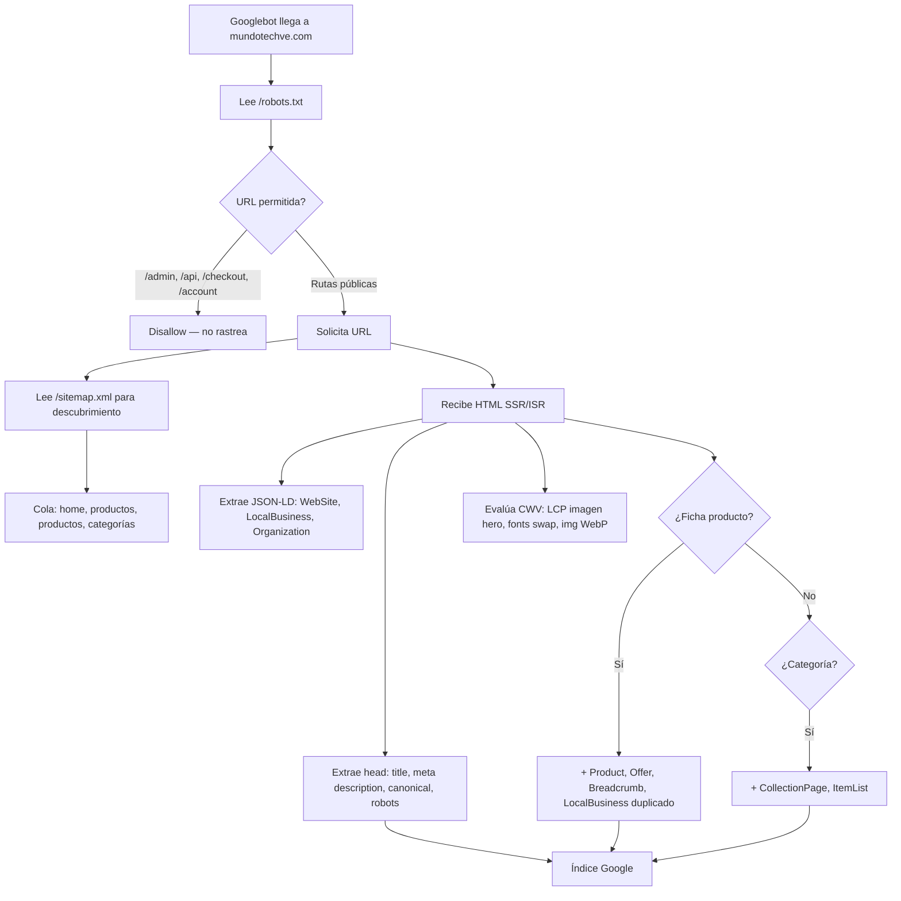

# Análisis SEO completo — MundoTech E-commerce

> **Objetivo principal de este documento:** dejar documentado **todo** lo que impide que tus **productos** rankeen en Google, para corregirlo después y dejar el SEO de fichas y catálogo **100% optimizado**.  
> **Proyecto:** mundotech-ecommerce (Next.js App Router)  
> **Dominio canónico:** `https://mundotechve.com` (fallback si no hay env)  
> **Idioma/mercado:** Español Venezuela (`es` / `es_VE`) — SEO local Barquisimeto, Lara  
> **Fecha del análisis:** 11 de junio de 2026  
> **Última ampliación:** revisión de alcance — solo hallazgos con impacto directo en rastreo, indexación, ranking o rich results  
> **Última implementación:** sesión 7 SEO — 11 de junio de 2026 (código en repo; ver [§39](#39-registro-de-implementación--sesión-7-jun-2026))  
> **Alcance:** Exclusivamente SEO (Google/buscadores). Malas prácticas **P01–P96** · hallazgos globales **H01–H64** (ver criterio de inclusión abajo).

---

## Cómo usar este documento (humano o IA)

1. **Si eres una IA** que va a corregir SEO: lee primero **[CTX — Contexto del proyecto](#ctx--contexto-del-proyecto-para-ia)** (negocio, stack, rutas, flujo de datos).
2. Luego **[P2 — Malas prácticas producto](#p2-malas-prácticas-exhaustivas--seo-de-productos-p01p70)** y **[P4 — Roadmap](#p4-roadmap-seo-de-productos-100-optimizado)**.
3. Para bugs globales del sitio: secciones **29–35** (H01–H50).
4. **No implementes SEO** sin respetar reglas del repo: `isAdminRole()`, `OrderStatus` en `lib/definitions.ts`, `readSettings()` para datos de tienda (reglas R1–R3 en `.cursor/rules/`).

---

## ⚠️ Sesión 7 — trabajo en paralelo con sesiones 1–6 y 8

> **Estado (11 jun 2026):** capa SEO **core implementada** — ver [§39](#39-registro-de-implementación--sesión-7-jun-2026). Pendientes: P47/P48, Merchant, paginación, DEPENDENCIA-01/03/05.

Estás en la **sesión 7 de 8**. Otras IAs trabajan a la vez en producción (PRD) y móvil (P0…). **No colisiones:**

### ⛔ NO implementar aquí (otra sesión ya lo cubre)

| ID SEO | Cerrar como | Sesión dueña | No editar |
|--------|-------------|--------------|-----------|
| P03 | Hecho vía PRD-066 | 5 Admin | `productActions.ts` slug/301 |
| P58, P59 | Hecho vía PRD-024 | 2 Checkout | `productActions.ts` quickUpdate |
| P05, P18 | Hecho vía PRD-064, 065, 121 | 3 Infra | `schema.prisma` |
| P41 | Hecho vía PRD-008 | 4 UX cliente | `public/` placeholders |
| P04 (parcial) | Hecho vía PRD-233 | 3 Infra | delete/revalidate producto |

### ✅ SÍ implementas tú (sesión 7)

| Zona | Archivos |
|------|----------|
| Metadata SERP, OG, títulos | `product/[slug]/page.tsx` → solo `generateMetadata` |
| JSON-LD producto | `ProductJsonLd.tsx` |
| Sitemap, robots, canonicals | `app/sitemap.ts`, `robots.ts` |
| URLs duplicadas slug/id | `product/[slug]/page.tsx` (query, canonical) |

### `app/layout.tsx` (compartido con sesión 4)

- **Tú:** `title.template`, SearchAction, JSON-LD global (P08, P64, H*).
- **Sesión 4:** skip link PRD-055.
- **Regla:** edita **solo** bloques `metadata` / JSON-LD; **no toques** skip link ni providers.

Mapa completo: [`00-INDICE` § Reglas entre sesiones](./ANALISIS-PRODUCCION-00-INDICE.md#reglas-entre-sesiones).

---

## Tabla de contenidos

### Contexto y evaluación (leer primero si eres IA)

- [CTX — Contexto del proyecto para IA](#ctx--contexto-del-proyecto-para-ia)
- [Puntuación SEO actual (1–100)](#puntuación-seo-actual-1100)
- [Cobertura del documento: qué incluye y qué no](#cobertura-del-documento-qué-incluye-y-qué-no)

### Foco productos en Google

- [0. Objetivo: posicionar productos en Google](#0-objetivo-posicionar-productos-en-google)
- [P1. Cómo Google descubre y evalúa tus productos hoy](#p1-cómo-google-descubre-y-evalúa-tus-productos-hoy)
- [P2. Malas prácticas exhaustivas — SEO de productos (P01–P74)](#p2-malas-prácticas-exhaustivas--seo-de-productos-p01p70)
- [P3. Qué sí ayuda hoy al posicionamiento de productos](#p3-qué-sí-ayuda-hoy-al-posicionamiento-de-productos)
- [P4. Roadmap: SEO de productos 100% optimizado](#p4-roadmap-seo-de-productos-100-optimizado)
- [P5. Checklist final — producto listo para rankear](#p5-checklist-final--producto-listo-para-rankear)

### Resto del sitio (SEO global)

1. [Resumen ejecutivo](#1-resumen-ejecutivo)
2. [Stack y arquitectura SEO](#2-stack-y-arquitectura-seo)
3. [Variable central: `NEXT_PUBLIC_SITE_URL`](#3-variable-central-next_public_site_url)
4. [Metadata global (root layout)](#4-metadata-global-root-layout)
5. [Inventario completo de metadata por ruta](#5-inventario-completo-de-metadata-por-ruta)
6. [Sitemap (`/sitemap.xml`)](#6-sitemap-sitemapxml)
7. [Robots.txt (`/robots.txt`)](#7-robotstxt-robotstxt)
8. [Datos estructurados (JSON-LD / Schema.org)](#8-datos-estructurados-json-ld--schemaorg)
9. [SEO Local (NAP, Maps, admin)](#9-seo-local-nap-maps-admin)
10. [Open Graph, Twitter Cards e imágenes sociales](#10-open-graph-twitter-cards-e-imágenes-sociales)
11. [URLs, slugs y arquitectura de enlaces](#11-urls-slugs-y-arquitectura-de-enlaces)
12. [Estrategia de indexación por tipo de página](#12-estrategia-de-indexación-por-tipo-de-página)
13. [Enlazado interno (internal linking)](#13-enlazado-interno-internal-linking)
14. [Rendimiento, Core Web Vitals e imágenes](#14-rendimiento-core-web-vitals-e-imágenes)
15. [Caché, ISR y frescura del contenido](#15-caché-isr-y-frescura-del-contenido)
16. [Analytics y medición](#16-analytics-y-medición)
17. [PWA, manifest e iconos](#17-pwa-manifest-e-iconos)
18. [Middleware, seguridad y su impacto en crawlers](#18-middleware-seguridad-y-su-impacto-en-crawlers)
19. [Redirects 301 (URLs legacy)](#19-redirects-301-urls-legacy)
20. [Páginas de error (404 / 500)](#20-páginas-de-error-404--500)
21. [Internacionalización e hreflang](#21-internacionalización-e-hreflang)
22. [Blog y contenido editorial](#22-blog-y-contenido-editorial)
23. [Panel admin: herramientas SEO](#23-panel-admin-herramientas-seo)
24. [Variables de entorno relacionadas con SEO](#24-variables-de-entorno-relacionadas-con-seo)
25. [Flujo de rastreo (cómo lo ve Google)](#25-flujo-de-rastreo-cómo-lo-ve-google)
26. [Mapa de archivos SEO](#26-mapa-de-archivos-seo)
27. [Fortalezas actuales](#27-fortalezas-actuales)
28. [Gaps, inconsistencias y riesgos](#28-gaps-inconsistencias-y-riesgos)
29. [Bugs confirmados que penalizan SEO](#29-bugs-confirmados-que-penalizan-seo)
30. [Malas prácticas SEO en el código](#30-malas-prácticas-seo-en-el-código)
31. [Inconsistencias de marca, datos y configuración](#31-inconsistencias-de-marca-datos-y-configuración)
32. [Problemas de contenido, headings y accesibilidad](#32-problemas-de-contenido-headings-y-accesibilidad)
33. [Problemas técnicos de rastreo e indexación](#33-problemas-técnicos-de-rastreo-e-indexación)
34. [Matriz de impacto estimado en puntaje SEO](#34-matriz-de-impacto-estimado-en-puntaje-seo)
35. [Registro maestro de hallazgos (índice único)](#35-registro-maestro-de-hallazgos-índice-único)
36. [Checklist operativo post-despliegue](#36-checklist-operativo-post-despliegue)
37. [Quinta pasada — hallazgos adicionales (P75–P89, H51–H58)](#37-quinta-pasada--hallazgos-adicionales-p75p89-h51h58)
38. [Sexta pasada — hallazgos adicionales (P90–P97, H61–H66)](#38-sexta-pasada--hallazgos-adicionales-p90p97-h61h66)
39. [Registro de implementación — sesión 7 (jun 2026)](#39-registro-de-implementación--sesión-7-jun-2026)

### Apéndices

- [Apéndice A — Modelo Prisma (producto/categoría)](#apéndice-a--modelo-de-datos-relevante-prisma)
- [Apéndice B — Herramientas externas](#apéndice-b--herramientas-externas-recomendadas)
- [Apéndice C — Mapa completo de rutas públicas](#apéndice-c--mapa-completo-de-rutas-públicas)
- [Apéndice D — Claves AppConfig y fuentes de configuración](#apéndice-d--claves-appconfig-y-fuentes-de-configuración)
- [Apéndice E — Árbol de carpetas relevante para SEO](#apéndice-e--árbol-de-carpetas-relevante-para-seo)

---

## CTX — Contexto del proyecto para IA

Esta sección explica **cómo está armada la web** para que cualquier IA (o desarrollador nuevo) entienda el sistema antes de tocar SEO.

### CTX.1 Qué es MundoTech (negocio)

| Aspecto | Detalle |
|---------|---------|
| **Tipo** | E-commerce B2C + tienda física |
| **Ubicación** | Barquisimeto, Lara, Venezuela — Carrera 21 con esquina calle 21, Centro, Barquisimeto 3001 |
| **Slogan** | Conectados Contigo |
| **Rubro** | Tecnología, gadgets, consolas, electrodomésticos, accesorios |
| **Moneda venta** | Precios en **USD**; conversión a **Bs.** con tasa del día (checkout) |
| **Pagos** | Pago Móvil, transferencia bancaria, Binance Pay (no pasarela Stripe en flujo principal) |
| **Envíos** | Nacional (Venezuela), despacho tras confirmar pago |
| **Idioma UI** | Español Venezuela (`lang="es"`, `locale: es_VE`) |
| **Dominio producción** | `https://mundotechve.com` (`NEXT_PUBLIC_SITE_URL`) |
| **Objetivo SEO** | Posicionar **fichas de producto** y categorías en Google (búsquedas + rich results) |

### CTX.2 Stack tecnológico

| Capa | Tecnología |
|------|------------|
| Framework | **Next.js 16** App Router (`app/`) |
| UI | React 19, Tailwind CSS, Framer Motion, Radix UI |
| BD | **PostgreSQL** + **Prisma 7** |
| Auth | **NextAuth.js** (JWT, roles `ADMIN` / `client`) |
| Imágenes | **Cloudinary** (`res.cloudinary.com`, loader custom) |
| Video producto | **Bunny.net** embed (`iframe.mediadelivery.net`) |
| Email | React Email (`emails/mundotech/`) |
| Analytics | GA4 opcional con consentimiento (`CookieConsent.tsx`) |
| Deploy típico | Compatible Vercel/Node (`next build` / `next start`) |

### CTX.3 Arquitectura de renderizado (crítico para SEO)

```
Request HTTP
    │
    ▼
middleware.ts          ← CSP nonce, auth /admin /account /checkout
    │
    ▼
app/layout.tsx (RSC)   ← metadata global, JSON-LD WebSite/Org/LocalBusiness,
    │                    readSeoLocal(), readSettings(), Footer (RSC)
    ▼
AppContent (cliente)   ← Navbar, CartDrawer, SearchBar → /buscar
AppLayoutShell (RSC)   ← <main>{children}</main> + Footer
    │
    ▼
page.tsx por ruta      ← Server Component (RSC) o Client Component
```

**Regla de oro SEO en este proyecto:**

- Lo que **rankea** debe salir en **Server Components** o en el HTML del primer render (links `<a>`, H1, precio, `generateMetadata`).
- Muchos listados pasan productos desde RSC → `ProductCard` (cliente), pero el **`<Link href="/product/...">` sí está en HTML inicial**.
- **Excepción problemática:** `ProductGridAndFilters` lee `?cat=` / `?q=` solo en `useEffect` (cliente) — el filtro no está en SSR.

**Providers cliente globales** (`app/layout.tsx`): `AuthProvider`, `CartProvider`, `WishlistProvider`, **`ProductProvider`**, `ExchangeRateProvider`.

- `ProductProvider` carga todos los productos vía server action al montar — usado por `CategoryDrawer`, no por la página `/productos` (esta usa `initialProducts` del servidor).

### CTX.4 Flujo de datos: producto desde admin hasta Google

```mermaid
flowchart TB
    subgraph admin
        A[/admin/products] --> B[productActions.ts]
        B --> C[(PostgreSQL Product + ProductMedia)]
    end
    subgraph config
        D[AppConfig store_settings] --> layout Footer
        E[AppConfig seo_local] --> layout LocalBusiness
        F[Category table] --> G[/categoria/slug]
    end
    subgraph publico
        C --> H[/product/slug page.tsx]
        H --> I[generateMetadata]
        H --> J[ProductJsonLd]
        C --> K[sitemap.ts]
        K --> L[Googlebot]
        G --> L
        H --> L
    end
    B -->|revalidatePath| H
    B -->|quickUpdate stock/price| M[⚠️ NO revalida ficha]
```

**Creación/edición producto** (`app/actions/productActions.ts`):

1. Admin guarda en `Product` + `ProductMedia` (imágenes/video).
2. Se genera `slug` con `slugify()` + unicidad.
3. `revalidatePath('/')`, `/product/{slug}` en update completo.
4. **Gap:** `quickUpdateStockAction` / `quickUpdatePriceAction` no revalidan `/product/{slug}`.

**Relación Product ↔ Category:**

- `Product.category` es **string libre** (nombre), no FK.
- `Category` tiene `name` + `slug` propios.
- Enlace SEO categoría vía `resolve-category-path.ts` (match por nombre).

### CTX.5 Zonas del sitio (quién ve qué)

| Zona | Rutas | Auth | Indexable SEO | robots.txt |
|------|-------|------|---------------|------------|
| **Tienda pública** | `/`, `/productos`, `/product/*`, `/categoria/*`, landings | No | Sí (mayoría) | Allow |
| **Búsqueda** | `/buscar` | No | noindex meta | Allow |
| **Cuenta** | `/account/*` | JWT | Hereda index (mal) | Disallow |
| **Checkout** | `/checkout`, `/checkout/success` | JWT | No deseado | Disallow |
| **Carrito / wishlist** | `/cart`, `/wishlist` | No | No deseado | cart Allow / wishlist Disallow |
| **Auth** | `/login`, `/registro`, `/forgot-password`, `/reset-password` | No | Hereda index (mal) | Allow |
| **Admin** | `/admin/*` | JWT + ADMIN | noindex meta | Disallow |
| **API** | `/api/*` | Varía | N/A | Disallow |

### CTX.6 Capas de configuración (de dónde salen los datos SEO)

| Clave / fuente | Archivo lectura | Qué alimenta SEO |
|----------------|-----------------|------------------|
| `store_settings` | `lib/data-store.ts` → `readSettings()` | Nombre tienda, email, teléfono, address footer, redes, pagos |
| `seo_local` | `lib/seo-local.ts` → `readSeoLocal()` | NAP schema layout, `/tienda-barquisimeto`, `/nosotros` |
| `site_content` | `lib/site-content.ts` | Hero fallback, WhatsApp, trust badges ficha, popup |
| `announcement_bar` | `lib/announcement.ts` | Barra superior con link |
| `exchange_rate` | `lib/exchange-rate.ts` | Precio Bs en UI |
| `homepage_*` | `AppConfig` en `page.tsx` | Shelves, flash deals, benefits home |
| Tabla `Category` | Prisma | `/categoria/[slug]`, ItemList schema |
| Tabla `Product` | Prisma | `/product/[slug]`, sitemap, ProductJsonLd |
| Tabla `Banner` / `Promotion` | Prisma | Hero home, promos, links internos |

**Conflicto documentado:** `settings.address` (store_settings) ≠ `seo.streetAddress` (seo_local) ≠ hardcode en `ProductJsonLd`.

### CTX.7 Piezas SEO por capa (dónde vive cada cosa)

| Pieza SEO | Archivo(s) |
|-----------|------------|
| Metadata global | `app/layout.tsx` |
| Sitemap | `app/sitemap.ts` → `/sitemap.xml` |
| Robots | `app/robots.ts` → `/robots.txt` |
| Manifest | `app/manifest.ts` |
| OG default | `app/opengraph-image.tsx` |
| Favicon | `app/icon.svg` |
| Metadata producto | `app/product/[slug]/page.tsx` → `generateMetadata` |
| Schema producto | `app/components/ProductJsonLd.tsx` |
| Metadata categoría | `app/categoria/[slug]/page.tsx` |
| SEO local admin | `app/admin/settings/seo-local/` |
| Slugs | `lib/slugify.ts`, `productActions.ts` |
| URLs categoría | `lib/resolve-category-path.ts` |

### CTX.8 Servicios externos que afectan SEO

| Servicio | Uso | Variable env |
|----------|-----|--------------|
| Cloudinary | Imágenes producto, OG, hero | URLs en BD; API en upload |
| Bunny Stream | Video en ficha producto | URLs en `ProductMedia` |
| Google Maps | Embed + `hasMap` schema | `NEXT_PUBLIC_GOOGLE_MAPS_*` |
| Google Analytics | Tráfico (no ranking directo) | `NEXT_PUBLIC_GA4_ID` |
| Search Console | Verificación | `NEXT_PUBLIC_GOOGLE_SITE_VERIFICATION` |

### CTX.9 Qué NO existe en el proyecto (límites)

- Blog / artículos / `/marca/[slug]` (solo planificado en docs futuros)
- i18n multi-idioma / hreflang
- Google Merchant Center / feed Shopping
- `generateStaticParams` para productos (solo categorías)
- Campo `Product.published` o `active`
- Service Worker / PWA offline
- `global-error.tsx`
- Imagen sitemap
- Redirect automático slug viejo → nuevo al renombrar

### CTX.10 Índice cruzado de hallazgos

| Prefijo | Cantidad | Sección | Uso |
|---------|----------|---------|-----|
| **P01–P96** | 96 activos | §P2 + §37–§38 | Malas prácticas **producto** (P93, P98 retirados) |
| **H01–H64** | 64 activos | §35 + §37–§38 | Hallazgos **sitio global** (H59, H60 retirados) |
| Bugs | 12 | §29 | Bugs confirmados con archivo |
| Roadmap | 5 fases | §P4 | Orden de corrección productos |

---

## Puntuación SEO actual (1–100)

| Criterio | Nota |
|----------|------|
| **Global ponderada (objetivo = productos en Google)** | **72 / 100** *(post sesión 7; infra lista, faltan paginación y Merchant)* |
| Infraestructura técnica (sitemap, metadata API, ISR) | 72 |
| SEO fichas de producto | 48 |
| Schema / rich results Product | 55 |
| Enlazado interno hacia productos | 45 |
| SEO local | 66 |

**Lectura:** base técnica por encima del promedio; ejecución en fichas y señales de confianza por debajo de lo necesario para competir en SERPs de producto.

---

## Cobertura del documento: qué incluye y qué no

### Criterio de inclusión (solo SEO)

Un hallazgo entra en este documento **solo si** afecta al menos una de estas palancas:

| Palanca | Ejemplos válidos |
|---------|------------------|
| **Rastreo** | robots.txt, sitemap, crawl budget, prefetch, APIs indexables por error |
| **Indexación** | noindex/canonical, URLs duplicadas, thin content, páginas basura en índice |
| **Ranking on-page** | title, meta description, H1, contenido no visible al bot, enlazado interno |
| **Rich results** | JSON-LD Product/Offer, FAQ, breadcrumbs, errores de schema |
| **SEO local** | NAP, LocalBusiness, landing local |
| **CWV como señal de ranking** | LCP, CLS, INP cuando el código los empeora en páginas indexables |
| **Confianza en SERP** | copy engañoso en meta/cuerpo indexable (E-E-A-T en snippet) |

**No entra** aunque sea un bug real: seguridad pura, privacidad, emails transaccionales, analytics/GA4, hardening CSP, enlaces externos `wa.me`, exposición de API sin URL indexable, UX de checkout, etc.

### ✅ Incluido (auditado en código)

- Metadata, sitemap, robots, manifest, OG (previews sociales / señales de enlace)
- JSON-LD y rich results
- Fichas producto, catálogo, categorías, búsqueda (indexación)
- SEO local, slugs, canonical, revalidate/frescura
- Enlazado interno hacia URLs canónicas
- CWV en código (LCP, CLS, imágenes, fuentes)
- HTML inicial vs cliente (solo si afecta contenido/enlaces que el bot indexa)
- **96** malas prácticas producto + **64** hallazgos globales (IDs activos; ver retirados abajo)
- Roadmap y checklist Search Console

### ❌ Explícitamente fuera de alcance (documentar en producción)

| Tema | Documento destino |
|------|-------------------|
| Seguridad de APIs REST (`/api/*` sin auth) | [PRD-278–282](ANALISIS-PRODUCCION-01-SEGURIDAD.md) |
| Tokens en URL (`/reset-password?token=`) | [PRD-172, PRD-224](ANALISIS-PRODUCCION-01-SEGURIDAD.md) (ya documentado) |
| WhatsAppFab / enlaces `wa.me` | [PRD-276–277](ANALISIS-PRODUCCION-04-UX-ADMIN-OPERACIONES.md) |
| Emails de pedido con slug roto | [PRD-288](ANALISIS-PRODUCCION-04-UX-ADMIN-OPERACIONES.md) |
| GA4, cookies, Consent Mode | [PRD-286–287](ANALISIS-PRODUCCION-04-UX-ADMIN-OPERACIONES.md) |
| CSP / nonce en JSON-LD hijos | [PRD-284](ANALISIS-PRODUCCION-01-SEGURIDAD.md) |
| AnnouncementBar link sin validar | [PRD-283](ANALISIS-PRODUCCION-01-SEGURIDAD.md) |
| OpenSearch / `llms.txt` | [PRD-289–290](ANALISIS-PRODUCCION-04-UX-ADMIN-OPERACIONES.md) |
| Stripe en package.json, PWA offline, auth JWT | [`00-INDICE`](ANALISIS-PRODUCCION-00-INDICE.md) (infra general) |

**Índice completo:** [matriz de propiedad PRD](ANALISIS-PRODUCCION-00-INDICE.md#matriz-de-propiedad-única-por-prd) · [segmento UX PRD-276–290](ANALISIS-PRODUCCION-04-UX-ADMIN-OPERACIONES.md).

**Retirados de pasadas SEO 5–6:** ~~P93/H59 (WhatsAppFab)~~ → PRD-276; ~~P98/H60 (APIs JSON)~~ → PRD-278–282.

### ⚠️ No auditado en profundidad (fuera de alcance código)

- Posiciones reales en Google / Search Console (no hay acceso a datos live)
- Backlinks externos y autoridad de dominio
- Competencia SERP por keyword
- Velocidad real en producción (solo código que la habilita/limita)
- Contenido textual de cada producto en BD (calidad por ficha)
- Penalizaciones manuales de Google
- Indexación efectiva hoy en `site:mundotechve.com`

### 🔁 Rutas / piezas mencionadas pero secundarias para SEO producto

- `app/register/page.tsx` (posible legacy; registro principal en `/registro`)
- Emails transaccionales → [`04-UX-ADMIN`](ANALISIS-PRODUCCION-04-UX-ADMIN-OPERACIONES.md) PRD-288 (no SEO)
- API REST bajo `/api/*` (disallow robots; no generan páginas indexables)
- Stripe en `package.json` (dependencia presente; checkout principal es manual/Venezuela)

---

## 0. Objetivo: posicionar productos en Google

Para un e-commerce como MundoTech, el dinero del SEO está en que cada ficha `/product/{slug}` aparezca cuando alguien busca:

- `{nombre producto} precio Venezuela`
- `{nombre producto} Barquisimeto`
- `{marca} {categoría} Venezuela`
- Búsquedas de cola larga con modelo/SKU

**Google decide posicionar un producto si:**

1. **Descubre** la URL (sitemap, enlaces internos, Search Console).
2. **Rastrea** HTML con contenido único (título, descripción, precio, stock, imágenes).
3. **Entiende** que es un producto (`Product` + `Offer` schema válido).
4. **Confía** en datos coherentes (precio schema = precio visible, NAP, reseñas reales).
5. **Premia** experiencia (CWV, imágenes, mobile, sin duplicados).

Este documento lista **cada mal práctica actual** que rompe uno o más de esos pasos. Las referencias `P##` son el backlog de corrección para productos. Las `H##` (sección 35) cubren el sitio entero.

---

## P1. Cómo Google descubre y evalúa tus productos hoy

```mermaid
flowchart LR
    subgraph descubrimiento
        S[sitemap.xml] --> PQ[URLs /product/slug]
        FO[Footer / Home shelves] --> PQ
        CAT[/categoria/slug ItemList] --> PQ
        GRID[Catálogo /productos] --> PQ
    end
    subgraph ficha
        PQ --> META[generateMetadata]
        PQ --> HTML[H1 + precio + tabs]
        PQ --> JSON[ProductJsonLd]
    end
    subgraph problemas
        JSON --> BAD[NAP viejo + LocalBusiness extra]
        META --> TIT[Título duplicado MundoTech]
        PQ --> DUP[/product/id sin 301]
        GRID --> FILT[?cat= canonical /productos]
    end
```

| Etapa | Qué hace tu código | Estado |
|-------|-------------------|--------|
| Descubrimiento | `sitemap.ts` lista todos los productos con `updatedAt` | ⚠️ Incluye agotados y sin slug (usa id) |
| URL canónica | `/product/{slug ?? id}` | ⚠️ También responde `/product/{id}` sin redirect |
| Title SERP | `generateMetadata` + template layout | ❌ Títulos demasiado largos / duplicados |
| Rich results | `ProductJsonLd` Product+Offer+Reviews | ⚠️ Datos envío/NAP hardcodeados incorrectos |
| Contenido | H1 nombre, tabs descripción | ⚠️ Tabs en cliente; specs ocultas en pestañas |
| Enlaces entrantes | Home shelves, categorías, relacionados | ⚠️ Muchos links a `?cat=` no a `/categoria/` |
| Frescura precio/stock | ISR 3600s + revalidatePath | ❌ quickUpdate precio/stock no revalida ficha |

---

## P2. Malas prácticas exhaustivas — SEO de productos (P01–P70)

Cada fila es una práctica actual de tu web que **reduce** posibilidad de ranking o rich snippets de producto. Severidad: 🔴 crítica · 🟠 alta · 🟡 media · ⚪ baja.

### P-A. URLs, slugs y duplicados

| ID | Sev | Mal práctica | Dónde | Efecto en Google |
|----|-----|--------------|-------|------------------|
| P01 | 🔴 | Dos URLs por producto (`/product/slug` y `/product/id`) sin 301 | `product/[slug]/page.tsx` `OR: [{ slug }, { id }]` | Divide autoridad; contenido duplicado |
| P02 | 🔴 | Sitemap usa `slug ?? id` — productos sin slug indexados con URL fea (`/product/clxyz…`) | `sitemap.ts` | URLs pobres en SERP; menor CTR |
| P03 | 🔴 | Al **renombrar** producto se genera **nuevo slug** sin redirect 301 del anterior | `productActions.ts` L201-203 | Enlaces viejos → 404; pierdes ranking acumulado |
| P04 | 🟠 | Producto **eliminado**: no `revalidatePath(/product/{slug})` | `deleteProductAction` | ISR puede servir ficha fantasma hasta 1h |
| P05 | 🟠 | Slug opcional en Prisma (`slug String?`) — no obligatorio al crear | `schema.prisma` | Productos nuevos pueden quedar sin URL amigable |
| ~~P06~~ | — | *(Movido a producción [PRD-288](ANALISIS-PRODUCCION-04-UX-ADMIN-OPERACIONES.md))* | — | Emails no son crawler Google |
| P07 | 🟡 | `RecentlyViewed` enlaza `slug ?? id` desde localStorage (cliente) | `RecentlyViewed.tsx` | Enlaces internos inconsistentes si slug null |

### P-B. Metadata de ficha (title, description, canonical)

| ID | Sev | Mal práctica | Dónde | Efecto en Google |
|----|-----|--------------|-------|------------------|
| P08 | 🔴 | `title.template` añade `— MundoTech` a títulos que ya dicen `MundoTech Barquisimeto` | `layout.tsx` + `product/[slug]/page.tsx` | Títulos >70 chars; truncados en SERP |
| P09 | 🟠 | Patrón de título fijo muy largo: `{nombre} — {marca} \| Precio en Venezuela · MundoTech Barquisimeto` | `generateMetadata` producto | Poco espacio para keyword principal |
| P10 | 🟠 | `meta keywords` por producto — Google lo ignora | `product/[slug]/page.tsx` | HTML inflado sin beneficio |
| P11 | 🟠 | Descripción meta cortada a 130 chars + `…` arbitrario | `generateMetadata` L68-69 | Pierdes control del CTA en SERP |
| P12 | 🟠 | Productos **sin descripción** en BD → meta genérica idéntica entre fichas | `generateMetadata` fallback | Duplicate meta descriptions |
| P13 | 🟠 | `openGraph.type: 'website'` conflictivo con `other['og:type']: 'product'` | `product/[slug]/page.tsx` | Señal de producto ambigua en redes/Google |
| P14 | 🟡 | OG `type: 'image/jpeg'` fijo pero Cloudinary sirve WebP/AVIF | `generateMetadata` | Menor; parsers suelen tolerar |
| P15 | 🟡 | Sin OG image si producto no tiene `images[0]` | `generateMetadata` | Previews vacías al compartir; peor CTR social indirecto |

### P-C. Indexación y robots en productos

| ID | Sev | Mal práctica | Dónde | Efecto en Google |
|----|-----|--------------|-------|------------------|
| P16 | 🟠 | Productos **agotados** (`stock === 0`) con `robots.index: true` explícito | `product/[slug]/page.tsx` L125-130 | SERP con producto no comprable → alto bounce |
| P17 | 🟠 | Productos agotados siguen en **sitemap** sin filtro | `sitemap.ts` | Google rastrea URLs de bajo valor |
| P18 | 🟠 | No existe flag `published` / `active` — no puedes ocultar productos del índice | `schema.prisma` | Todo en BD es indexable |
| P19 | 🟡 | 404 de producto devuelve `title: 'Producto no encontrado'` en metadata | `generateMetadata` + `notFound()` | Riesgo soft-404 si queda enlace |

### P-D. Schema.org Product / Offer (rich results)

| ID | Sev | Mal práctica | Dónde | Efecto en Google |
|----|-----|--------------|-------|------------------|
| P20 | 🟠 | **LocalBusiness completo** incrustado en cada ficha (hardcode, no `readSeoLocal()`) | `ProductJsonLd.tsx` L236-289 | Ruido en graph; cambios NAP en admin no aplican a rich results de producto |
| P21 | 🔴 | `shippingDetails.shippingRate` **$5.00 USD fijo** no leído de configuración | `ProductJsonLd.tsx` L154-160 | Rich result rechazado o datos engañosos |
| P22 | 🔴 | `seller.name: 'Mundo Tech'` ≠ marca del sitio `MundoTech` | `ProductJsonLd.tsx` L150 | Entidad inconsistente |
| P23 | 🟠 | ProductJsonLd **no usa** `readSeoLocal()` — desincronizado del admin | `ProductJsonLd.tsx` | Cambios NAP no aplican a rich results de producto |
| P24 | 🟠 | **Triple** entidad local por visita producto: layout LocalBusiness + ProductJsonLd LocalBusiness | layout + ProductJsonLd | Ruido en graph; datos conflictivos |
| P25 | 🟠 | Sin `gtin` / `gtin13` / `mpn` en schema (solo `sku`) | `ProductJsonLd.tsx` | Pierdes elegibilidad para algunos rich results |
| P26 | 🟠 | `image: []` vacío si producto sin fotos — Product sin imagen | `ProductJsonLd.tsx` | No aparece en Google Imágenes / Merchant |
| P27 | 🟠 | `priceValidUntil` calculado +30 días en cada render, no ligado a campaña real | `ProductJsonLd.tsx` L77-80 | Si Google valida fechas, puede marcar offer stale |
| P28 | 🟡 | `aggregateRating` solo si hay reseñas — mayoría de productos sin estrellas en SERP | `ProductJsonLd.tsx` | Sin ventaja CTR de estrellas |
| P29 | 🟡 | Máximo 5 `Review` en schema aunque haya más aprobadas | `ProductJsonLd.tsx` L101 | Menor; aceptable |
| P30 | 🟡 | Sin `VideoObject` aunque `ProductMedia` soporte VIDEO (Bunny) | `ProductGallery.tsx` + schema | Pierdes rich results de video |
| P31 | 🟡 | JSON-LD de producto **sin nonce CSP** (scripts hijos) | `ProductJsonLd.tsx` | Riesgo bajo para Googlebot; alto en validadores |
| P32 | ⚪ | `category` en schema es string libre (`product.category`), no URL de categoría | `ProductJsonLd.tsx` | Menor estructuración temática |

### P-E. Contenido visible en la ficha (lo que Google indexa)

| ID | Sev | Mal práctica | Dónde | Efecto en Google |
|----|-----|--------------|-------|------------------|
| P33 | 🟠 | **ProductTabs es Client Component** — descripción, specs, envío en pestañas | `ProductTabs.tsx` | Specs y envío **no visibles** en HTML inicial salvo tab activa (solo descripción por defecto) |
| P34 | 🟠 | Descripción renderizada como texto plano en `<p>` — si admin guarda HTML, se ven tags literales | `ProductTabs.tsx` L76-78 | Contenido de baja calidad / HTML roto visible |
| P35 | 🟠 | Tab "Reseñas" en ProductTabs dice *"Próximamente activaremos"* pero **ProductReviews** sí existe abajo | `ProductTabs.tsx` L158-165 vs `ProductReviews.tsx` | Contenido contradictorio; señal de calidad baja |
| P36 | 🟠 | Texto placeholder si no hay descripción: *"aún no tiene descripción detallada"* | `ProductTabs.tsx` | Thin content indexable |
| P37 | 🟡 | Specs técnicas solo en pestaña "Especificaciones" (oculta por defecto) | `ProductTabs.tsx` | Google ve menos texto relevante; mitigado parcial por `additionalProperty` en JSON-LD |
| P38 | 🟡 | Precio en Bs solo en cliente (`ExchangeRateProvider`) — no en HTML estático inicial desde servidor… | `product/[slug]/page.tsx` | El precio Bs se renderiza en servidor (línea 291-293) ✅; OK |
| P39 | 🟡 | Contenido de envío en tab oculta duplica info del schema pero no el cuerpo principal | `ProductTabs.tsx` shipping tab | Menos keywords long-tail en HTML principal |
| P40 | ⚪ | Un solo H1 (nombre producto) — correcto | `product/[slug]/page.tsx` | ✅ Buena práctica |

### P-F. Imágenes de producto

| ID | Sev | Mal práctica | Dónde | Efecto en Google |
|----|-----|--------------|-------|------------------|
| P41 | 🔴 | Fallback `/placeholder-product.png` **no existe** en el repo | múltiples + `productActions.ts` L59 | Imagen rota en listados y schema |
| P42 | 🟠 | Sin **image sitemap** para URLs Cloudinary de productos | — | Google Images depende solo de rastreo HTML |
| P43 | 🟠 | OG fuerza recorte 1200×630 `c_fill` — puede recortar producto | `buildOgImageUrl` | Preview social puede ser engañosa |
| P44 | 🟡 | `ProductGallery` principal es cliente; video en iframe Bunny no indexable como imagen | `ProductGallery.tsx` | Contenido multimedia invisible para Images |
| P45 | 🟡 | Poster de video con `alt=""` y `aria-hidden` | `ProductGallery.tsx` L37-38 | OK decorativo pero pierde alt keyword |

### P-G. Catálogo y categorías (puerta de entrada a productos)

| ID | Sev | Mal práctica | Dónde | Efecto en Google |
|----|-----|--------------|-------|------------------|
| P46 | 🔴 | Enlaces internos masivos a `/productos?cat=X` en vez de `/categoria/{slug}` | Footer, home, tienda-barquisimeto, Promotions | PageRank no fluye a URLs canónicas de categoría |
| P47 | 🔴 | Filtro `?cat=` aplicado **solo en cliente**; SSR muestra **todos** los productos | `ProductGridAndFilters.tsx` L166-172 | Contenido no alineado con URL; canonical siempre `/productos` |
| P48 | 🟠 | Canonical de `/productos?cat=Consolas` es `/productos` (sin query) | `productos/page.tsx` | Google agrupa variantes filtradas mal |
| P49 | 🟠 | `ItemList` en categoría solo lista **20** productos en schema | `categoria/[slug]/page.tsx` L144 | Resto de productos de categoría sin señal ItemList |
| P50 | 🟠 | Categoría con 0 productos (mismatch nombre `Consolas` vs `consolas`) sigue indexable | `categoria/[slug]/page.tsx` | Thin content; enlaces internos rotos de valor |
| P51 | 🟠 | `CategoryDrawer` filtra catálogo en vez de enlazar `/categoria/slug` | `CategoryDrawer.tsx` | Menos enlaces directos a hubs de categoría |
| P52 | 🟡 | Catálogo usa `motion.div` opacity 0 inicial en grid | `ProductGridAndFilters.tsx` | Posible retraso de pintura / CLS |
| P53 | 🟡 | ProductCard es cliente — el link sí SSR, pero nombre en `<h3>` no `<h2>` | `ProductCard.tsx` | Jerarquía aceptable en listados |

### P-H. Enlazado interno hacia fichas de producto

| ID | Sev | Mal práctica | Dónde | Efecto en Google |
|----|-----|--------------|-------|------------------|
| P54 | 🟠 | "También te puede interesar" solo **5** productos misma categoría con stock | `product/[slug]/page.tsx` | Pocos enlaces salientes internos por ficha |
| P55 | 🟠 | `RecentlyViewed` solo tras JS + localStorage — **sin enlaces** en HTML inicial | `RecentlyViewed.tsx` | Pierdes cluster de enlazado dinámico para bots |
| P56 | 🟡 | Breadcrumb categoría apunta a `/categoria/slug` **o** `/productos` si no hay match | `resolve-category-path.ts` | Breadcrumb schema con URL genérica catálogo |
| P57 | 🟡 | Relacionados excluyen productos sin stock — agotados sin enlaces internos entrantes nuevos | `getRelatedProducts` stock > 0 | Agotados pierden link equity interno |

### P-I. Frescura, caché y datos desactualizados

| ID | Sev | Mal práctica | Dónde | Efecto en Google |
|----|-----|--------------|-------|------------------|
| P58 | 🔴 | `quickUpdateStockAction` **no** revalida `/product/{slug}` | `productActions.ts` L400-401 | Google ve stock obsoleto hasta 1h (ISR) |
| P59 | 🔴 | `quickUpdatePriceAction` **no** revalida `/product/{slug}` | `productActions.ts` L418-419 | Precio en SERP/schema desactualizado |
| P60 | 🟠 | ISR `revalidate = 3600` — precio/stock puede tardar 1h en reflejarse | `product/[slug]/page.tsx` | Rich result con precio viejo |
| P61 | 🟠 | Import masivo CSV revalida `/` y admin pero **no** cada ficha | `productActions.ts` bulk ~L360 | Cambios masivos lentos en indexación |
| P62 | 🟡 | `configActions` revalida `/product/[slug]` genérico pero no slug concreto | `configActions.ts` | Revalidación de plantilla puede no invalidar todas las fichas |

### P-J. Búsqueda y long-tail

| ID | Sev | Mal práctica | Dónde | Efecto en Google |
|----|-----|--------------|-------|------------------|
| P63 | 🟠 | Búsqueda principal va a `/buscar` (noindex) — no compite por keywords | `SearchBar.tsx` | Solo fichas y catálogo compiten en orgánico |
| P64 | 🟠 | WebSite SearchAction apunta a `/productos?q=` que no es la búsqueda real | `layout.tsx` | Sitelinks search box roto |
| P65 | 🟡 | Sin páginas de aterrizaje por marca (`/marca/{slug}`) — previsto en docs futuros | `FUTURAS-ACTUALIZACIONES.md` | Pierdes long-tail por marca |
| P66 | ⚪ | Sin blog que enlace a productos con contenido editorial | — | Menos topical authority hacia fichas |

### P-K. Google Merchant / Shopping (no implementado)

| ID | Sev | Mal práctica | Dónde | Efecto en Google |
|----|-----|--------------|-------|------------------|
| P67 | 🟠 | Sin feed XML/CSV para **Google Merchant Center** | — | No apareces en pestaña Shopping |
| P68 | 🟠 | Sin integración Surfaces across Google | — | Pierdes visibilidad adicional de producto |
| P69 | 🟡 | `hasMerchantReturnPolicy` hardcodeado 7 días — puede no coincidir con política real | `ProductJsonLd.tsx` | Validación Merchant si se conecta después |

### P-L. Admin y calidad de datos de producto

| ID | Sev | Mal práctica | Dónde | Efecto en Google |
|----|-----|--------------|-------|------------------|
| P70 | 🟠 | Descripción en admin es `<textarea>` plano — sin editor rich; equipos pueden pegar HTML mal formado | `AddProductModal.tsx` | Meta y UI inconsistentes |
| P71 | 🟠 | `category` en producto es **string libre**, no FK a `Category` | `schema.prisma` | Desalineación nombre categoría ↔ página categoría |
| P72 | 🟡 | SKU opcional — schema usa `product.id` como fallback | `ProductJsonLd.tsx` | SKU en SERP menos limpio |
| P73 | 🟡 | Migración slugs existe pero es manual (`POST /api/admin/migrate-slugs`) | `migrate-slugs/route.ts` | Productos legacy pueden quedar con id en URL |
| P74 | ⚪ | Reseñas requieren moderación — pocas fichas con `aggregateRating` | `lib/reviews.ts` | Normal al inicio; limita estrellas en SERP |

### P-M. Quinta pasada — schema, catálogo y contenido dinámico (P75–P89)

| ID | Sev | Mal práctica | Dónde | Efecto en Google |
|----|-----|--------------|-------|------------------|
| P75 | 🟠 | **`originalPrice` / rebajas no van al schema** — UI muestra descuento pero `Offer` solo emite `price` actual (sin `priceSpecification`/`ListPrice`) | `ProductJsonLd.tsx` (interface tiene `originalPrice` pero no se usa) | Pierdes señal de oferta en rich results; inconsistencia precio visible vs schema |
| P76 | 🟠 | **`hasMerchantReturnPolicy` sin URL** — falta `merchantReturnLink` / `url` apuntando a `/devoluciones` | `ProductJsonLd.tsx` L192-200 | Google Merchant / validadores 2024+ esperan enlace a política real |
| P77 | 🟠 | **`Review` en schema sin `itemReviewed`** — reseñas no enlazan al `@id` del Product | `ProductJsonLd.tsx` L101-113 | Grafo de reseñas desconectado; menor elegibilidad estrellas |
| P78 | 🟡 | **Sin `@id` / `@graph`** — Organization (layout), Product y Offer son entidades aisladas | layout + ProductJsonLd | Google no consolida entidad tienda ↔ producto tan bien |
| P79 | 🟡 | **Product schema sin `dateModified`** pese a `updatedAt` en BD y sitemap | `ProductJsonLd.tsx` | Menos señal de frescura en rich results |
| P80 | 🟡 | **`category` en Product schema es texto**, no URL a `/categoria/{slug}` | `ProductJsonLd.tsx` L132 | Pierdes enlace semántico producto ↔ categoría canónica |
| P81 | 🟠 | **Bloque "Productos relacionados" sin `ItemList` schema** | `product/[slug]/page.tsx` L360+ | Cluster semántico de productos similares solo en HTML |
| P82 | 🟠 | **Catálogo y categorías sin paginación** — `findMany` trae **todos** los productos en un HTML | `productos/page.tsx`, `categoria/[slug]/page.tsx` | HTML monolítico crece sin límite → TTFB, CWV y crawl cost ↑ |
| P83 | 🟡 | **`lastModified` de categoría en sitemap usa `category.updatedAt`** — no cambia al añadir productos | `sitemap.ts` + `schema.prisma` Category | Google cree categoría "fresca" o "stale" incorrectamente |
| P84 | 🟡 | **Meta description de producto fuerza `…` tras `slice(0,130)`** aunque la descripción sea corta | `product/[slug]/page.tsx` L68-69 | Snippets truncados o con elipsis artificial en SERP |
| P85 | 🟠 | **Modelo `Category` sin campo `description`** — metadata y JSON-LD usan plantilla idéntica por categoría; `CategoryJsonLd` referencia `category.description` inexistente | `schema.prisma`, `categoria/[slug]/page.tsx` | Meta descriptions duplicadas entre categorías; sin copy único por vertical |
| P86 | 🟡 | **`Link` de Next.js con prefetch por defecto** en cada `ProductCard` del grid | `components/ProductCard.tsx` | Prefetch agresivo en catálogos grandes → presión de crawl budget en hosting |
| P87 | 🟠 | **`AnnouncementBar` invisible en SSR** — `useState(true)` + `return null` hasta `useEffect` | `AnnouncementBar.tsx` L13, L30 | Anuncios admin (promos, links internos) **no existen** en HTML que ve Googlebot |
| P88 | 🟡 | **`PromoPopup` solo tras `useEffect` + delay** — contenido promocional fuera del primer HTML | `PromoPopup.tsx` L22-33 | Links de campañas del popup no aportan enlazado interno a crawlers |
| P89 | 🟠 | **Home metadata promete "Delivery en 24h"** — contradice `/shipping-policy` ("plazos orientativos") y schema de envío (1–3 días tránsito) | `app/page.tsx` L19 vs `shipping-policy` + ProductJsonLd | Señal E-E-A-T negativa si el snippet no se cumple |

### P-N. Sexta pasada — claims indexables y schema (P90–P97)

| ID | Sev | Mal práctica | Dónde | Efecto en Google |
|----|-----|--------------|-------|------------------|
| P90 | 🟠 | **`ItemList.numberOfItems` = total real** pero `itemListElement` solo tiene **20** entradas | `categoria/[slug]/page.tsx` L143-149 | Schema inválido/inconsistente; Google puede ignorar CollectionPage |
| P91 | 🟠 | **Claim "Delivery en Barquisimeto en 24h" repetido** en Navbar top bar (todas las páginas) además de home metadata | `components/Navbar.tsx` L78 | Refuerza promesa no verificable en cuerpo indexable (E-E-A-T en SERP) |
| P92 | 🟠 | **`Benefits` DEFAULT hardcodea "Delivery en 24h"** — visible en home si admin no sobreescribe | `app/components/Benefits.tsx` L12 | Misma promesa en HTML indexable de la home |
| P94 | 🟡 | **Garantía "12 meses" en UI/devoluciones** sin `Warranty`/`WarrantyScope` en Product schema | ficha + `/devoluciones` vs `ProductJsonLd.tsx` | Pierdes rich result de garantía; inconsistencia schema ↔ página |
| P95 | 🟡 | **`shippingDetails` en Offer sin `url`** hacia `/shipping-policy` | `ProductJsonLd.tsx` | Google prefiere enlace a política de envío en Offer |
| P96 | 🟠 | **`/reset-password` (y query variants) indexables** sin `noindex` — URLs finas de auth | `reset-password/page.tsx` + `robots.ts` Allow | Crawl budget desperdiciado; páginas basura en índice |
| P97 | 🟡 | **Canonical `/buscar` ignora `brand`, `cat`, `page`** — URL real ≠ canonical declarado | `buscar/page.tsx` L37 | Señales contradictorias (aunque la página lleve `noindex`) |

> **Total malas prácticas producto documentadas: 96 ítems activos (P01–P97; P93 y P98 retirados por alcance).**

---

## P3. Qué sí ayuda hoy al posicionamiento de productos

No todo está mal — esto **conservar** al corregir:

| ✅ | Implementación | Archivo |
|----|----------------|---------|
| URLs amigables con slug cuando existe | `slugify.ts`, `getUniqueSlug` | `lib/slugify.ts`, `productActions.ts` |
| `generateMetadata` dinámico por producto | title, description, canonical, OG imagen | `product/[slug]/page.tsx` |
| Canonical explícito por ficha | `alternates.canonical` | `product/[slug]/page.tsx` |
| Schema `Product` + `Offer` + envío + devoluciones | ProductJsonLd | `ProductJsonLd.tsx` |
| `BreadcrumbList` 4 niveles en producto | ProductJsonLd | `ProductJsonLd.tsx` |
| Reseñas reales en schema (no fake) | solo APPROVED | `lib/reviews.ts` |
| `additionalProperty` desde specs JSON | ProductJsonLd | `ProductJsonLd.tsx` |
| Productos en sitemap con `lastModified: updatedAt` | sitemap dinámico | `sitemap.ts` |
| H1 = nombre del producto | una sola vez | `product/[slug]/page.tsx` |
| ISR + revalidate al editar producto completo | `revalidatePath(/product/${slug})` | `productActions.ts` update |
| Listados SSR con `<a href="/product/...">` | ProductCard en server parents | `productos/page.tsx`, `categoria/` |
| Cloudinary `f_auto,q_auto,w_*` en imágenes | loader | `cloudinaryLoader.js` |
| `googleBot` max-snippet / max-image-preview en producto | metadata | `product/[slug]/page.tsx` |
| Páginas `/categoria/[slug]` con metadata + ItemList + generateStaticParams | categoría | `categoria/[slug]/page.tsx` |

---

## P4. Roadmap: SEO de productos 100% optimizado

Orden recomendado de corrección (dependencias respetadas). Cada fase desbloquea la siguiente.

### Fase 1 — Crítico (semana 1): confianza y URLs

| Orden | Tarea | Cierra |
|-------|-------|--------|
| 1.1 | Unificar `ProductJsonLd` con `readSeoLocal()` + `readSettings()`; **eliminar** LocalBusiness de cada ficha | P20, P22, P23, P24 |
| 1.2 | Leer tarifa envío real desde `readSettings()` o config en `shippingDetails` | P21 |
| 1.3 | Redirect 301 `/product/{id}` → `/product/{slug}` cuando slug existe | P01 |
| 1.4 | Redirect 301 slug viejo → slug nuevo al renombrar producto (tabla `ProductSlugRedirect` o similar) | P03 |
| 1.5 | Crear `/public/placeholder-product.png` o eliminar referencias | P41 |
| 1.6 | Obligar slug al crear producto; ejecutar migrate-slugs en prod | P02, P05, P73 |
| 1.7 | `revalidatePath(/product/${slug})` en quickUpdate stock y precio | P58, P59 |

### Fase 2 — Alto (semana 2): metadata y contenido

| Orden | Tarea | Cierra |
|-------|-------|--------|
| 2.1 | Títulos con `title.absolute` o quitar MundoTech duplicado del template | P08, P09 |
| 2.2 | Plantilla title: `{nombre} \| Precio USD Venezuela · {marca}` (<60 chars) | P09 |
| 2.3 | Meta description única por producto; ampliar límite a 155-160 sin cortar palabras | P11, P12 |
| 2.4 | Mover descripción + specs críticas a **Server Component** (HTML siempre visible) | P33, P37 |
| 2.5 | Renderizar descripción HTML con sanitización (`dangerouslySetInnerHTML` seguro) o markdown | P34, P70 |
| 2.6 | Eliminar tab reseñas obsoleta de ProductTabs o sincronizar con ProductReviews | P35 |
| 2.7 | `openGraph.type` coherente para productos | P13 |

### Fase 3 — Alto (semana 3): catálogo, categorías, enlaces

| Orden | Tarea | Cierra |
|-------|-------|--------|
| 3.1 | Cambiar Footer, home, tienda-barquisimeto a `/categoria/{slug}` | P46 |
| 3.2 | SSR de filtros `?cat=` en `/productos` o deprecar query y usar solo `/categoria/` | P47, P48 |
| 3.3 | FK o sync estricto `Product.category` ↔ `Category.name` | P50, P71 |
| 3.4 | `noindex` en categorías vacías | P50 |
| 3.5 | ItemList schema con todos los productos o paginado | P49 |
| 3.6 | CategoryDrawer enlaza a `/categoria/slug` | P51 |

### Fase 4 — Medio (semana 4): indexación y agotados

| Orden | Tarea | Cierra |
|-------|-------|--------|
| 4.1 | Política clara agotados: `noindex` + mantener URL o página "avísame" con index | P16, P17 |
| 4.2 | Excluir agotados del sitemap (o `priority: 0.3`) | P17 |
| 4.3 | Campo `published Boolean` en Product; filtrar sitemap y listados públicos | P18 |
| 4.4 | `revalidatePath` al borrar producto + 410 Gone opcional | P04, P19 |
| 4.5 | Añadir `gtin`/`mpn` opcionales en admin + schema | P25 |

### Fase 5 — Crecimiento (mes 2+): visibilidad extra

| Orden | Tarea | Cierra |
|-------|-------|--------|
| 5.1 | Image sitemap o `image:` en sitemap por producto | P42 |
| 5.2 | `VideoObject` cuando hay ProductMedia VIDEO | P30 |
| 5.3 | Google Merchant Center feed desde Prisma | P67, P68 |
| 5.4 | Páginas `/marca/{slug}` | P65 |
| 5.5 | `generateStaticParams` para top N productos | tráfico |
| 5.6 | Contenido editorial / guías que enlacen a fichas | P66 |
| 5.7 | SearchAction → `/buscar?q=` + alinear not-found | P64 |

---

## P5. Checklist final — producto listo para rankear

Usa esto **por cada producto** antes de dar por cerrada la optimización:

### URL y técnico
- [ ] Tiene `slug` único legible (no solo cuid)
- [ ] Una sola URL canónica responde 200
- [ ] URL vieja por id o slug anterior redirige 301
- [ ] Está en sitemap con `lastModified` correcto
- [ ] Si está agotado: política definida (noindex o página útil)

### Metadata
- [ ] Title < 60 caracteres, keyword al inicio, sin duplicar MundoTech
- [ ] Meta description única 150-160 caracteres
- [ ] Canonical = URL del slug
- [ ] OG image existe y muestra el producto

### Schema
- [ ] `Product` + `Offer` sin errores en Rich Results Test
- [ ] Precio schema = precio visible
- [ ] `availability` = stock real
- [ ] `image` con al menos 1 URL válida Cloudinary
- [ ] Sin LocalBusiness duplicado en ficha
- [ ] Envío y devoluciones desde config real

### Contenido on-page
- [ ] H1 = nombre producto
- [ ] Descripción ≥ 150 palabras únicas (no plantilla)
- [ ] Specs visibles en HTML sin depender de click en tab
- [ ] Marca, categoría, SKU visibles
- [ ] Al menos 1 imagen con alt descriptivo

### Enlaces
- [ ] Enlazado desde su categoría `/categoria/{slug}`
- [ ] Enlazado desde catálogo o home shelf
- [ ] Productos relacionados o categoría similar enlazan de vuelta

### Frescura
- [ ] Cambio de precio/stock revalida la ficha al instante
- [ ] Tras editar en admin, Rich Results Test muestra datos nuevos

---

## 1. Resumen ejecutivo

MundoTech tiene una **base SEO sólida y deliberada** para un e-commerce local en Venezuela. El proyecto usa las convenciones nativas de Next.js 14+ App Router:

| Pieza | Estado |
|-------|--------|
| `metadata` / `generateMetadata` | Implementado en rutas clave |
| `sitemap.ts` dinámico | Productos + categorías desde Prisma |
| `robots.ts` | Bloquea admin, checkout, account, API |
| JSON-LD rico | Product, LocalBusiness, FAQ, Breadcrumbs, CollectionPage |
| OG image generada | `app/opengraph-image.tsx` (corrige 404 previo) |
| SEO local editable | Admin → `/admin/settings/seo-local` |
| ISR 3600s | Home, catálogo, categorías, productos |
| GA4 con consentimiento | Solo tras aceptar cookies |

**Enfoque dominante:** SEO local (Barquisimeto) + e-commerce de productos individuales con schema `Product`/`Offer` avanzado (envío, devoluciones, reseñas reales).

**No existe:** blog, hreflang multi-idioma, Google Merchant Center feed, service worker PWA.

**Para posicionar productos (ver §P2 — 74 malas prácticas P01–P74):**
1. **ProductJsonLd** con NAP viejo + LocalBusiness extra en cada ficha → rich results en riesgo.
2. **URLs duplicadas** `/product/id` y `/product/slug` sin 301 → divide ranking.
3. **Precio/stock desactualizado** hasta 1h — quickUpdate no revalida fichas.
4. **Títulos SERP demasiado largos** por template duplicado `— MundoTech`.
5. **Catálogo `?cat=`** filtra en cliente; enlaces internos no van a `/categoria/slug`.
6. **`placeholder-product.png` inexistente** — imágenes rotas en listados.
7. **ProductTabs** oculta specs; tab reseñas obsoleto contradice ProductReviews.

**Sitio global (H01–H50 — ver §35):** canonical heredado en auth/cart, SearchAction roto, etc.

---

## 2. Stack y arquitectura SEO

```
Next.js App Router
├── app/layout.tsx          → metadata global + JSON-LD WebSite/Org/LocalBusiness
├── app/sitemap.ts          → /sitemap.xml (MetadataRoute)
├── app/robots.ts           → /robots.txt (MetadataRoute)
├── app/manifest.ts         → /manifest.webmanifest
├── app/opengraph-image.tsx → OG/Twitter default (1200×630 PNG edge)
├── app/icon.svg            → favicon (convención Metadata Files)
├── generateMetadata()      → productos, categorías, búsqueda (dinámico)
└── export const metadata   → páginas estáticas
```

**Framework de metadata:** API `Metadata` de Next.js. Todas las URLs absolutas se resuelven contra `metadataBase: new URL(SITE_URL)` definido en el root layout.

**Template de título global:**
```
default: "MundoTech — Tecnología en Barquisimeto, Venezuela"
template: "%s — MundoTech"
```
Las páginas hijas que definen `title: "Catálogo"` renderizan: `Catálogo — MundoTech` (salvo que el título ya incluya "MundoTech", como en productos).

**Idioma HTML:** `<html lang="es">` en `app/layout.tsx`.

---

## 3. Variable central: `NEXT_PUBLIC_SITE_URL`

Definida en casi todos los archivos SEO con el mismo patrón:

```typescript
const SITE_URL = process.env.NEXT_PUBLIC_SITE_URL ?? 'https://mundotechve.com';
```

**Usos:**
- `metadataBase` y canonical absolutos
- URLs en sitemap y robots (`host`, `sitemap`)
- JSON-LD (`url`, `item`, `logo`, `image`)
- Emails transaccionales (`emails/mundotech/site.ts`)
- Open Graph `url`

**Crítico en producción:** Si esta variable no coincide con el dominio real servido por HTTPS, Google verá canonicals incorrectos, el sitemap apuntará a otro host y las previews sociales fallarán.

Documentada en `.env.example` (comentada). **Sin barra final** según comentario del ejemplo.

---

## 4. Metadata global (root layout)

**Archivo:** `app/layout.tsx`

### 4.1 Viewport y theme-color

```typescript
export const viewport: Viewport = {
  width: "device-width",
  initialScale: 1,
  maximumScale: 5,      // accesibilidad: permite zoom
  viewportFit: "cover",
  themeColor: "#0B1220",
};
```

### 4.2 Campos de metadata exportados

| Campo | Valor / comportamiento |
|-------|------------------------|
| `metadataBase` | `new URL(SITE_URL)` |
| `title.default` | MundoTech — Tecnología en Barquisimeto, Venezuela |
| `title.template` | `%s — MundoTech` |
| `description` | Tecnología y gadgets en Barquisimeto… |
| `keywords` | Array de 8 términos locales (Barquisimeto, Lara, consolas…) |
| `authors`, `creator`, `publisher` | MundoTech |
| `alternates.canonical` | URL raíz absoluta |
| `openGraph` | `type: website`, `locale: es_VE`, `siteName: MundoTech` |
| `twitter` | `card: summary_large_image` |
| `robots` | `index: true`, `follow: true` |
| `robots.googleBot` | `max-snippet: -1`, `max-image-preview: large` |
| `verification.google` | `NEXT_PUBLIC_GOOGLE_SITE_VERIFICATION` |

**Nota sobre imagen OG:** El layout **no** define `openGraph.images` explícitamente. Next.js inyecta automáticamente la imagen de `app/opengraph-image.tsx` como `og:image` y `twitter:image` en rutas que no sobreescriben imágenes.

### 4.3 JSON-LD global (en cada página del sitio)

Tres bloques `<script type="application/ld+json">` con **nonce CSP** (`headers().get('x-nonce')`):

1. **WebSite** — incluye `SearchAction` (ver §28 gap)
2. **LocalBusiness** — construido con `buildLocalBusinessSchema(readSeoLocal(), settings)`
3. **Organization** — nombre, logo, email, teléfono, `sameAs` (Instagram, Facebook)

Los datos de LocalBusiness son **vivos**: se leen de BD en cada render del layout (`readSeoLocal()`, `readSettings()`).

---

## 5. Inventario completo de metadata por ruta

### 5.1 Páginas públicas indexables (con metadata propia)

| Ruta | Archivo | Tipo metadata | Canonical | robots | OG/Twitter | JSON-LD extra |
|------|---------|---------------|-----------|--------|------------|---------------|
| `/` | `app/page.tsx` | estático | `/` (relativo) | hereda index | hereda OG default | — |
| `/productos` | `app/productos/page.tsx` | estático | absoluto `/productos` | hereda | OG completo | — |
| `/product/[slug]` | `app/product/[slug]/page.tsx` | `generateMetadata` | `/product/{slug\|id}` | **siempre index** (incluso sin stock) | OG imagen producto 1200×630 | ProductJsonLd |
| `/categoria/[slug]` | `app/categoria/[slug]/page.tsx` | `generateMetadata` | `/categoria/{slug}` | hereda | OG con `category.imageUrl` | CollectionPage |
| `/tienda-barquisimeto` | `app/tienda-barquisimeto/page.tsx` | estático | absoluto | hereda | OG + Twitter | ElectronicsStore + Breadcrumb |
| `/nosotros` | `app/nosotros/page.tsx` | estático | absoluto | hereda | OG parcial | AboutPage + Breadcrumb |
| `/devoluciones` | `app/devoluciones/page.tsx` | estático | absoluto | hereda | hereda | **FAQPage** |
| `/privacy-policy` | `app/privacy-policy/page.tsx` | estático | absoluto | `index: true` | hereda | — |
| `/terms-of-service` | `app/terms-of-service/page.tsx` | estático | absoluto | `index: true` | hereda | — |
| `/shipping-policy` | `app/shipping-policy/page.tsx` | estático | absoluto | `index: true` | hereda | — |
| `/buscar` | `app/buscar/page.tsx` | `generateMetadata` | con query `?q=` | **`index: false`** | hereda | — |

### 5.2 Detalle: metadata de producto (`generateMetadata`)

**Archivo:** `app/product/[slug]/page.tsx`

**Título generado:**
```
{nombre} — {marca} | Precio en Venezuela · MundoTech Barquisimeto
```

**Descripción:** Extrae texto plano del HTML de `product.description` (máx. 130 chars) + sufijo comercial. Fallback si no hay descripción.

**Keywords dinámicos:** nombre, marca, categoría, `{nombre} precio Venezuela`, `{nombre} Barquisimeto`, términos genéricos locales.

**Open Graph:**
- Imagen principal optimizada Cloudinary `w_1200,h_630,c_fill`
- `locale: es_VE`, `type: website` (pero `other['og:type']: product`)

**Meta namespace product (campo `other`):**
- `product:price:amount`, `product:price:currency: USD`
- `product:category`, `product:condition: new`
- `product:availability: in stock | out of stock`
- `product:brand` (si existe)

**Decisión SEO explícita:** Productos sin stock **mantienen** `robots.index: true` para preservar posicionamiento histórico.

### 5.3 Detalle: metadata de categoría

**Título:**
```
{nombre categoría} en Barquisimeto — MundoTech | Mejor precio Venezuela
```

**Twitter:** card definida pero **sin imagen** aunque OG sí la tiene si `category.imageUrl` existe.

### 5.4 Detalle: metadata de búsqueda

**`robots: { index: false }`** — correcto para evitar indexar resultados dinámicos/duplicados.

Canonical incluye el parámetro `q` cuando existe (poco relevante dado el noindex).

### 5.5 Páginas de autenticación (indexables por defecto)

| Ruta | Archivo | title | robots explícito |
|------|---------|-------|------------------|
| `/login` | `app/login/layout.tsx` | Iniciar sesión | **ninguno** → hereda index |
| `/registro` | `app/registro/page.tsx` | Crear cuenta | **ninguno** |
| `/forgot-password` | `app/forgot-password/page.tsx` | (title definido) | **ninguno** |
| `/reset-password` | `app/reset-password/page.tsx` | (title definido) | **ninguno** |

`robots.txt` **no** bloquea estas rutas.

### 5.6 Área de cuenta y checkout (no indexables)

| Ruta | Metadata | robots.txt | Middleware |
|------|----------|------------|------------|
| `/account/*` | Mayoría sin metadata; `/account/addresses` solo title | disallow `/account/` | JWT requerido |
| `/checkout/*` | Sin metadata propia | disallow `/checkout/` | JWT requerido |
| `/cart` | Sin metadata | **NO disallow** | Público |
| `/wishlist` | Sin metadata | disallow `/wishlist` | Público (sin auth) |
| `/admin/*` | `noindex, nofollow` | disallow `/admin/` | JWT + ADMIN |

### 5.7 Páginas sin metadata propia (heredan root)

- `/cart`, `/checkout`, `/wishlist`
- Resto de `/account/*` (excepto addresses)
- `app/not-found.tsx`, `app/error.tsx`

---

## 6. Sitemap (`/sitemap.xml`)

**Archivo:** `app/sitemap.ts`  
**Modo:** `export const dynamic = 'force-dynamic'` — se regenera en cada request al endpoint.

**No existe:** `generateSitemaps`, sitemap index multi-archivo, sitemap de imágenes.

### 6.1 Páginas estáticas incluidas

| URL | priority | changeFrequency |
|-----|----------|-----------------|
| `/` | 1.0 | daily |
| `/productos` | 0.9 | daily |
| `/tienda-barquisimeto` | 0.85 | monthly |
| `/nosotros` | 0.7 | monthly |
| `/devoluciones` | 0.5 | yearly |
| `/privacy-policy` | 0.3 | yearly |
| `/terms-of-service` | 0.3 | yearly |
| `/shipping-policy` | 0.4 | yearly |

### 6.2 Páginas dinámicas

**Productos** — query Prisma:
```typescript
prisma.product.findMany({ select: { id, slug, updatedAt } })
```
- URL: `/product/{slug ?? id}`
- `lastModified`: `product.updatedAt`
- `priority`: 0.8, `changeFrequency`: weekly
- **Sin filtro** por stock, visibilidad ni campo `active` (el modelo Product no tiene esos campos)
- Productos sin slug usan `id` (cuid) como fallback

**Categorías** — query Prisma:
```typescript
prisma.category.findMany({ select: { slug, updatedAt } })
```
- URL: `/categoria/{slug}` (ruta canónica preferida)
- `priority`: 0.75, `changeFrequency`: weekly

### 6.3 URLs NO incluidas en sitemap

- `/buscar` (correcto: noindex)
- `/login`, `/registro`, auth
- `/cart`, `/checkout`, `/account`, `/wishlist`
- URLs filtradas: `/productos?cat=Consolas`, etc.
- Redirects legacy: `/privacidad`, `/about`, etc. (apuntan a destinos que sí están)

### 6.4 Implicación de `force-dynamic`

El sitemap consulta Prisma en cada hit. Las páginas usan ISR (`revalidate: 3600`). Coherente en contenido pero el endpoint sitemap puede ser costoso bajo tráfico de bots.

---

## 7. Robots.txt (`/robots.txt`)

**Archivo:** `app/robots.ts`  
**No hay** `public/robots.txt` estático.

### 7.1 Reglas

```
User-agent: *
Allow: /
Disallow: /admin, /admin/, /checkout, /checkout/, /api/, /account, /account/, /wishlist

User-agent: GPTBot
Disallow: /

Sitemap: {SITE_URL}/sitemap.xml
Host: {SITE_URL}
```

### 7.2 Interpretación

| Ruta | robots.txt | metadata robots | Efecto esperado |
|------|------------|-----------------|-----------------|
| `/admin` | Disallow | noindex (layout) | No indexar |
| `/api/*` | Disallow | N/A | No rastrear |
| `/checkout` | Disallow | — | No rastrear |
| `/account` | Disallow | — | No rastrear (además requiere login) |
| `/wishlist` | Disallow | — | No rastrear |
| `/cart` | **Allow** | hereda index | **Potencialmente rastreable** |
| `/buscar` | Allow | noindex | Rastreable pero no indexable |
| `/login`, `/registro` | Allow | hereda index | **Indexables** |

**GPTBot bloqueado por completo** — reduce visibilidad en ChatGPT/Bing Copilot y crawlers de entrenamiento IA.

---

## 8. Datos estructurados (JSON-LD / Schema.org)

### 8.1 Resumen por página

| Página | Schemas emitidos | Nonce CSP |
|--------|------------------|-----------|
| **Todas** (layout) | WebSite, LocalBusiness, Organization | ✅ Sí |
| `/product/[slug]` | Product+Offer, BreadcrumbList, LocalBusiness | ❌ No |
| `/categoria/[slug]` | CollectionPage (+ breadcrumb embebido, ItemList) | ❌ No |
| `/tienda-barquisimeto` | ElectronicsStore, BreadcrumbList | ❌ No |
| `/nosotros` | AboutPage, BreadcrumbList | ❌ No |
| `/devoluciones` | FAQPage | ❌ No |

### 8.2 WebSite + SearchAction (layout)

```json
{
  "@type": "WebSite",
  "potentialAction": {
    "@type": "SearchAction",
    "target": {
      "urlTemplate": "{SITE_URL}/productos?q={search_term_string}"
    }
  }
}
```

**Problema:** La UI de búsqueda (`SearchBar.tsx`, `SearchMobileOverlay.tsx`) navega a `/buscar?q=`. El formulario 404 en `not-found.tsx` envía a `/productos?q=`. Hay **dos destinos de búsqueda distintos**.

### 8.3 Product + Offer (ProductJsonLd)

**Archivo:** `app/components/ProductJsonLd.tsx`

**Campos Product:**
- `name`, `description` (HTML strip), `image[]` (todas las imágenes optimizadas)
- `sku` (o `id` fallback), `brand`, `category`, `url`
- `additionalProperty` desde specs JSON del producto
- `aggregateRating` + `review[]` (máx. 5) — **solo reseñas APROBADAS reales**
- `offers` con precio USD, disponibilidad, condición nueva

**Offer — campos avanzados (Google Shopping / rich results 2025+):**
- `priceValidUntil`: +30 días desde render
- `shippingDetails`: tarifa **hardcodeada** `$5.00 USD`, destino `VE`, tiempos de entrega
- `hasMerchantReturnPolicy`: 7 días, devolución en tienda, gratis

**BreadcrumbList:** 4 niveles — Inicio → Catálogo → Categoría → Producto

**LocalBusiness duplicado (hardcodeado):**
- Dirección: `Carrera 21 con esquina calle 21, Centro` (alineada con `DEFAULT_SEO_LOCAL`)
- No usa `readSeoLocal()` — horarios, teléfono, sameAs incrustados en código

### 8.4 CollectionPage (categorías)

- `mainEntity.ItemList` con hasta **20 productos** (nombre + URL)
- Breadcrumb embebido en propiedad `breadcrumb`

### 8.5 FAQPage (devoluciones)

5 preguntas/respuestas hardcodeadas en la página, sincronizadas con el schema.

### 8.6 Schemas ausentes

- `VideoObject` para productos con video (existe `ProductMedia` tipo video en BD)
- `FAQPage` en home o fichas de producto
- `BreadcrumbList` en catálogo, búsqueda, legales (solo HTML visual)
- `ItemList` en home (shelves de productos)
- Google Merchant / `Product` feed XML

---

## 9. SEO Local (NAP, Maps, admin)

### 9.1 Persistencia

| Pieza | Ruta |
|-------|------|
| Schema Zod + defaults | `lib/seo-local-schema.ts` |
| Lectura/escritura BD | `lib/seo-local.ts` → `AppConfig` key `seo_local` |
| UI admin | `app/admin/settings/seo-local/` |
| Server Action | `app/actions/seoLocalActions.ts` |

### 9.2 Datos editables (SeoLocal)

- `legalName`, `slogan`
- Dirección completa NAP: `streetAddress`, `addressLocality`, `addressRegion`, `postalCode`, `addressCountry`
- `geo.latitude`, `geo.longitude`
- `googleMapsUrl`, `googleMapsEmbed`
- `openingHours[]` (días + opens/closes)
- `paymentAccepted[]`, `priceRange`
- `whatsapp`, `tiktok` (añadido a `sameAs`)

### 9.3 Defaults (si BD vacía)

```
legalName: Mundo Tech
slogan: Conectados Contigo
streetAddress: Carrera 21 con esquina calle 21, Centro
geo: 10.068287, -69.312056
horarios: Lun-Vie 08:30-17:30, Sáb 08:30-18:00
```

### 9.4 Dónde se consumen los datos vivos

| Consumidor | Usa readSeoLocal |
|------------|------------------|
| `app/layout.tsx` → LocalBusiness global | ✅ |
| `app/tienda-barquisimeto/page.tsx` → ElectronicsStore | ✅ |
| `app/nosotros/page.tsx` → contenido + AboutPage parcial | ✅ |
| `app/components/Footer.tsx` → horarios NAP | ✅ (vía settings + seo) |
| `app/components/ProductJsonLd.tsx` | ❌ **hardcodeado** |

### 9.5 Revalidación tras editar SEO local

```typescript
revalidatePath('/', 'layout');
revalidatePath('/tienda-barquisimeto');
```

**No revalida** fichas `/product/[slug]` — el LocalBusiness hardcodeado en ProductJsonLd persiste hasta ISR natural.

### 9.6 Google Maps

**Archivo:** `lib/google-maps.ts`

- `NEXT_PUBLIC_GOOGLE_MAPS_BUSINESS_URL` — ficha verificada (hasMap, enlaces)
- `NEXT_PUBLIC_GOOGLE_MAPS_EMBED_URL` — iframe embed
- Fallback: genera URL de búsqueda Maps desde dirección

Mapas en `nosotros` y `tienda-barquisimeto` usan `loading="lazy"` en iframes.

---

## 10. Open Graph, Twitter Cards e imágenes sociales

### 10.1 Imagen OG default (marca)

**Archivo:** `app/opengraph-image.tsx`

| Propiedad | Valor |
|-----------|-------|
| Runtime | `edge` |
| Tamaño | 1200 × 630 px |
| Formato | PNG (`contentType: image/png`) |
| Contenido | Logo MundoTech navy/amarillo, slogan "Conectados Contigo", dirección Carrera 21 con esquina calle 21, Centro |

Reemplazó `/og-default.jpg` que no existía y causaba **404 en previews** de WhatsApp, Instagram y Google.

### 10.2 Imágenes por tipo de página

| Página | Fuente imagen OG |
|--------|------------------|
| Default / home / legales | `opengraph-image.tsx` (auto) |
| Producto | Primera imagen Cloudinary → `buildOgImageUrl()` 1200×630 `c_fill` |
| Categoría | `category.imageUrl` si existe |
| Categoría Twitter | **Sin imagen** explícita |

### 10.3 Archivos de imagen metadata NO presentes

- `twitter-image.tsx` — hereda de OG (comportamiento Next.js)
- `apple-icon.tsx` / apple-touch-icon dedicado
- Iconos PNG 192/512 para PWA Android

### 10.4 Favicon

- `app/icon.svg` — convención Metadata Files de Next.js
- Redirect 302: `/favicon.ico` → `/icon.svg` (`next.config.mjs`)

---

## 11. URLs, slugs y arquitectura de enlaces

### 11.1 Estructura de URLs públicas

```
/                           → Home
/productos                  → Catálogo completo
/productos?cat={nombre}     → Catálogo filtrado (query string)
/productos?q={term}         → Catálogo con búsqueda (legacy/404 form)
/categoria/{slug}           → Página categoría (canónica SEO)
/product/{slug}             → Ficha producto (preferido)
/product/{id}               → Fallback si slug null
/buscar?q={term}            → Búsqueda avanzada (noindex)
/tienda-barquisimeto        → Landing SEO local
/nosotros                   → About
/devoluciones               → FAQ devoluciones
/privacy-policy             → Legal (+ redirect /privacidad)
/terms-of-service           → Legal (+ redirect /terminos)
/shipping-policy            → Legal (+ redirect /envios)
```

### 11.2 Generación de slugs de producto

**Archivo:** `lib/slugify.ts`

- Normaliza NFD, quita tildes, minúsculas, solo `a-z0-9-`
- `generateUniqueSlug()` evita colisiones con sufijo `-2`, `-3`…
- Admin: `app/api/admin/migrate-slugs/route.ts` para migrar productos sin slug
- Prisma: `slug String? @unique` — opcional pero recomendado

### 11.3 Resolución de rutas de categoría

**Archivo:** `lib/resolve-category-path.ts`

Desde el nombre de categoría del producto (`product.category` string), busca en tabla `Category` por:
1. Nombre case-insensitive
2. Slug via `slugify()`
3. Slug estilo sync API

Retorna `/categoria/{slug}` o `/productos` si no hay match.

**Importante:** Los slugs de categoría en admin controlan la URL pública (`/admin/categories` — "El slug controla la URL pública (SEO)").

### 11.4 Duplicidad de URLs de categoría

Existen **dos formas** de llegar a productos de una categoría:

1. **Canónica:** `/categoria/consolas` — metadata propia, JSON-LD, en sitemap
2. **Filtrada:** `/productos?cat=Consolas` — canonical siempre `/productos`

La segunda forma se usa extensamente en Footer, home (`viewAllHref="/productos?cat=Consolas"`), y `tienda-barquisimeto`.

---

## 12. Estrategia de indexación por tipo de página

### 12.1 Matriz de decisión

```
                    ┌─────────────────────────────────────────┐
                    │           ¿Debe rankear en Google?        │
                    └─────────────────────────────────────────┘
                                      │
          ┌───────────────────────────┼───────────────────────────┐
          ▼                           ▼                           ▼
    CONTENIDO ÚNICO              TRANSACCIONAL                 DINÁMICO/DUPLICADO
    index + sitemap              noindex o disallow            noindex
          │                           │                           │
    home, productos,            checkout, account,              /buscar?q=
    producto, categoría,        admin (ambos)                   │
    tienda-local, nosotros,                                        │
    devoluciones, legales                                          │
```

### 12.2 Renderizado e indexabilidad sin JavaScript

**Catálogo** (`app/productos/page.tsx`):
> El HTML inicial contiene todos los `<a href="/product/...">` con nombre y precio → Google los indexa sin ejecutar JS.

**Categorías** (`app/categoria/[slug]/page.tsx`):
> Grid SSR con `ProductCard` — comentario explícito: "HTML indexable sin JS".

**ProductCard** (`components/ProductCard.tsx`):
- Es Client Component pero el `<Link href="/product/{slug}">` se renderiza en HTML inicial cuando el padre es Server Component.
- `alt={product.name}` en imágenes — buena señal de accesibilidad/SEO.

### 12.3 Productos sin stock

Metadata y JSON-LD marcan `out of stock` pero **mantienen indexación**. Estrategia: conservar URLs rankeadas y mostrar disponibilidad en SERP.

---

## 13. Enlazado interno (internal linking)

### 13.1 Fuentes de enlaces

| Componente | Enlaces SEO relevantes |
|------------|------------------------|
| `Footer.tsx` | `/`, `/productos`, `/nosotros`, `/tienda-barquisimeto`, `/productos?cat=Consolas`, `/productos?cat=Accesorios`, legales |
| `Navbar` + `SearchBar` | Búsqueda → `/buscar?q=` |
| Home `ProductShelf` | `viewAllHref` → `/productos` o `/productos?cat=Consolas` |
| Ficha producto | Breadcrumb → `/`, `/productos`, `/categoria/{slug}` |
| Ficha producto | "También te puede interesar" → otros `/product/{slug}` |
| `not-found.tsx` | Categorías destacadas → `/categoria/{slug}` |
| `tienda-barquisimeto` | CATEGORIES array → `/productos?cat=*` |

### 13.2 Breadcrumbs

**HTML visual** (`aria-label="Breadcrumb"`): productos, producto, categoría, buscar, cart, wishlist, checkout, account, legales.

**JSON-LD BreadcrumbList:** producto, categoría, nosotros, tienda-barquisimeto. **No** en catálogo ni legales.

### 13.3 Oportunidad

Migrar enlaces internos de `/productos?cat=X` a `/categoria/{slug}` consolidaría autoridad en URLs canónicas de categoría.

---

## 14. Rendimiento, Core Web Vitals e imágenes

### 14.1 Tipografía

```typescript
const jost = Jost({ subsets: ["latin"], display: "swap", variable: "--font-jost" });
```

`display: "swap"` reduce FOIT — positivo para LCP/CLS.

### 14.2 Loader de imágenes Cloudinary

**Archivo:** `lib/cloudinaryLoader.js`

Transformaciones automáticas:
- `f_auto` — WebP/AVIF según navegador
- `q_auto:good` — compresión inteligente
- `w_{width}`, `c_limit`, `dpr_auto`

Comentario en código: reduce ~60-70% peso en móvil (contexto Venezuela).

### 14.3 Priorización LCP

| Componente | Optimización |
|------------|--------------|
| `HomeHeroCyber.tsx` | `priority` + `fetchPriority: 'high'` en slide 0 |
| `ProductGallery.tsx` | `priority` + `fetchPriority: 'high'` en imagen principal |
| `categoria/[slug]` hero | `priority` en imagen de fondo |
| `ProductCard` en grids | Sin priority (correcto para below-fold) |

### 14.4 Arquitectura de layout y JS

`AppLayoutShell` separa:
- **Cliente:** Navbar, CartDrawer (`AppContent`)
- **Servidor:** `<main>`, `Footer`

Comentario en layout: reduce JS bundle, mejora LCP/INP.

### 14.5 Headers de rendimiento/seguridad

`next.config.mjs`:
- HSTS 1 año
- `Referrer-Policy: strict-origin-when-cross-origin`
- Sin `poweredByHeader: false` explícito (Next.js lo oculta por defecto en versiones recientes)

---

## 15. Caché, ISR y frescura del contenido

### 15.1 Páginas con ISR (`revalidate = 3600`)

| Ruta | Segundos | generateStaticParams |
|------|----------|---------------------|
| `/` | 3600 | No |
| `/productos` | 3600 | No |
| `/product/[slug]` | 3600 | **No** (on-demand ISR) |
| `/categoria/[slug]` | 3600 | **Sí** (pre-build todas las categorías) |

### 15.2 Páginas force-dynamic

- `app/sitemap.ts`
- `app/manifest.ts`
- `app/tienda-barquisimeto/page.tsx`
- `app/nosotros/page.tsx`
- `app/devoluciones/page.tsx`

### 15.3 Revalidación explícita (admin)

| Acción | Paths revalidados |
|--------|-------------------|
| `productActions.ts` | `/`, `/admin/products`, `/product/{slug}` |
| `seoLocalActions.ts` | `/` layout, `/tienda-barquisimeto` |
| `configActions.ts` | `/` layout, `/productos`, `/product/[slug]` page |
| `announcementActions.ts` | `/` layout |
| `siteContentActions.ts` | `/` layout |

**Gap:** Cambios en categorías no listados aquí — verificar si hay revalidación en sync de categorías.

---

## 16. Analytics y medición

**Archivo:** `app/components/CookieConsent.tsx`

| Aspecto | Detalle |
|---------|---------|
| Plataforma | GA4 directo (`gtag.js`) — **no** Google Tag Manager container |
| Variable | `NEXT_PUBLIC_GA4_ID` |
| Carga | Solo si consentimiento `accepted` + ID configurado |
| Privacidad | `anonymize_ip: true` |
| Admin | Banner desactivado en rutas `/admin` |

**CSP** (`middleware.ts`) permite dominios:
- `*.google-analytics.com`
- `*.googletagmanager.com`
- `*.analytics.google.com`

**Impacto SEO indirecto:**
- Sin consentimiento no hay datos de comportamiento en GA4
- Search Console es independiente (requiere verificación via `NEXT_PUBLIC_GOOGLE_SITE_VERIFICATION`)
- No hay integración automática SC ↔ GA en código

**`lib/analytics-orders.ts`:** Analytics interno de pedidos admin — no afecta SEO web.

---

## 17. PWA, manifest e iconos

### 17.1 Manifest público

**Archivo:** `app/manifest.ts` (dinámico)

```typescript
{
  name: "{storeName} — Tecnología en Barquisimeto, Venezuela",
  short_name: storeName,
  start_url: "/",
  display: "standalone",
  theme_color: "#0B1220",
  lang: "es-VE",
  categories: ["shopping", "electronics"],
  icons: [{ src: "/icon.svg", purpose: "any" }, { src: "/icon.svg", purpose: "maskable" }]
}
```

Nombre y tagline leídos de `readSettings()`.

### 17.2 Manifest admin

- `public/admin-manifest.json` — PWA standalone para `/admin`
- Referenciado en `app/admin/layout.tsx`

### 17.3 Gaps PWA

- Sin service worker / offline
- Solo icono SVG — sin PNG 192×192 / 512×512 para instalación Android óptima
- Sin `apple-touch-icon` dedicado

---

## 18. Middleware, seguridad y su impacto en crawlers

**Archivo:** `middleware.ts`

### 18.1 Matcher

```typescript
matcher: ['/((?!_next/static|_next/image|favicon\\.ico).*)']
```

Assets estáticos de Next.js **excluidos** de CSP/auth — crawlables sin fricción.

### 18.2 CSP y JSON-LD

- Scripts requieren `nonce` en `script-src`
- JSON-LD del **layout** usa nonce ✅
- JSON-LD de páginas hijas (ProductJsonLd, categorías…) **sin nonce** ❌

Googlebot tradicionalmente no ejecuta JS como navegador; parsea JSON-LD del HTML estático. El riesgo CSP afectaría más a validadores browser-side que a indexación Google.

### 18.3 Rutas protegidas vs bots

| Ruta | Sin sesión | Bot behavior |
|------|------------|--------------|
| `/admin` | Redirect `/login` | No ve contenido admin |
| `/account`, `/checkout` | Redirect `/login` | No indexa contenido privado |
| Rutas públicas | Pasa con CSP | Rastreo normal |

---

## 19. Redirects 301 (URLs legacy)

**Archivo:** `next.config.mjs`

| Origen | Destino | Tipo |
|--------|---------|------|
| `/privacidad` | `/privacy-policy` | 301 permanente |
| `/terminos` | `/terms-of-service` | 301 permanente |
| `/envios` | `/shipping-policy` | 301 permanente |
| `/about` | `/nosotros` | 301 permanente |
| `/quienes-somos` | `/nosotros` | 301 permanente |
| `/favicon.ico` | `/icon.svg` | 302 temporal |

Los 301 preservan señal SEO de URLs impresas en material local o bookmarks antiguos.

---

## 20. Páginas de error (404 / 500)

### 20.1 `app/not-found.tsx`

| Aspecto | Estado |
|---------|--------|
| Metadata | **Ninguna** (sin title/description propios) |
| HTTP status | 404 (automático Next.js) |
| robots | No `noindex` explícito |
| UX SEO | Formulario búsqueda → `/productos?q=`, links a `/categoria/{slug}` destacadas |
| H1 | "Te perdiste, pana" |

### 20.2 `app/error.tsx`

| Aspecto | Estado |
|---------|--------|
| Tipo | Client Component (requerido por Next.js) |
| Metadata | **Imposible** (client) — sin noindex |
| HTTP status | 500 |
| `global-error.tsx` | **No existe** |

---

## 21. Internacionalización e hreflang

- **Un solo idioma:** `lang="es"` en HTML
- **OG locale:** `es_VE` en páginas principales
- **Manifest lang:** `es-VE`
- **No hay:** `alternates.languages`, etiquetas `hreflang`, rutas `[locale]`

Correcto para mercado único Venezuela. Limita expansión internacional futura.

---

## 22. Blog y contenido editorial

**No existe** módulo de blog, artículos, `/blog`, `/post`, ni `Article` schema.

Implicación: dependencia total de páginas de producto/categoría y landings locales para long-tail keywords. Sin estrategia de topical authority editorial.

---

## 23. Panel admin: herramientas SEO

| Herramienta | Ruta admin | Impacto SEO |
|-------------|------------|-------------|
| SEO Local | `/admin/settings/seo-local` | NAP, horarios, geo, Maps → layout + landings |
| Categorías | `/admin/categories` | Slugs de URL `/categoria/[slug]` |
| Productos | `/admin/products` | Slugs, títulos, descripciones HTML, imágenes, specs |
| Migrar slugs | `/api/admin/migrate-slugs` | Genera slugs para productos legacy |
| Personalizar | `/admin/personalizar` | Trust badges en ficha producto |
| Gestor Home | API homepage | Banners hero (LCP), shelves, beneficios |
| Reseñas | Admin reviews | Alimentan `aggregateRating` en ProductJsonLd |

---

## 24. Variables de entorno relacionadas con SEO

| Variable | Uso SEO | En `.env.example` |
|----------|---------|-------------------|
| `NEXT_PUBLIC_SITE_URL` | Canonical, sitemap, robots, schema, OG | ✅ (comentada) |
| `NEXT_PUBLIC_GOOGLE_SITE_VERIFICATION` | Meta verificación Search Console | ❌ **No documentada** |
| `NEXT_PUBLIC_GA4_ID` | Google Analytics 4 | ✅ |
| `NEXT_PUBLIC_GOOGLE_MAPS_BUSINESS_URL` | hasMap, enlaces Maps | ✅ |
| `NEXT_PUBLIC_GOOGLE_MAPS_EMBED_URL` | iframe Maps | ✅ |
| `NEXT_PUBLIC_CONTACT_EMAIL` | Organization schema | ✅ |
| `NEXT_PUBLIC_CONTACT_PHONE` | ProductJsonLd LocalBusiness | ❌ |
| `NEXT_PUBLIC_TWITTER_URL` | ProductJsonLd sameAs | ❌ |
| `NEXT_PUBLIC_INSTAGRAM_URL` | sameAs, footer | ✅ |
| `NEXT_PUBLIC_FACEBOOK_URL` | sameAs, footer | ✅ |
| `NEXT_PUBLIC_WHATSAPP_URL` | Footer, CTAs | ✅ |

---

## 25. Flujo de rastreo (cómo lo ve Google)



---

## 26. Mapa de archivos SEO

```
app/
├── layout.tsx                    # Metadata global, viewport, JSON-LD raíz
├── page.tsx                      # Home metadata + ISR
├── sitemap.ts                    # Sitemap dinámico
├── robots.ts                     # Robots.txt
├── manifest.ts                   # Web manifest público
├── opengraph-image.tsx           # OG image generada (marca)
├── icon.svg                      # Favicon
├── not-found.tsx                 # 404 UX (sin metadata)
├── error.tsx                     # 500 (client, sin metadata)
├── productos/page.tsx            # Catálogo metadata + SSR indexable
├── product/[slug]/page.tsx       # generateMetadata producto + ISR
├── categoria/[slug]/page.tsx     # generateMetadata + generateStaticParams
├── buscar/page.tsx               # noindex búsqueda
├── tienda-barquisimeto/page.tsx  # Landing SEO local
├── nosotros/page.tsx             # About + schema
├── devoluciones/page.tsx         # FAQ schema
├── privacy-policy/page.tsx
├── terms-of-service/page.tsx
├── shipping-policy/page.tsx
├── login/layout.tsx
├── registro/page.tsx
├── admin/layout.tsx              # noindex admin
├── components/
│   ├── ProductJsonLd.tsx         # Schema producto (crítico)
│   ├── CookieConsent.tsx         # GA4 condicional
│   └── Footer.tsx                # NAP + internal links
└── actions/
    └── seoLocalActions.ts        # Persistencia SEO local

lib/
├── seo-local.ts                  # readSeoLocal / writeSeoLocal
├── seo-local-schema.ts           # Zod, buildLocalBusinessSchema
├── slugify.ts                    # Slugs productos
├── resolve-category-path.ts      # URLs categoría canónicas
├── google-maps.ts                # URLs Maps
├── cloudinaryLoader.js           # Optimización imágenes CWV
└── mundotech-social.ts           # URLs redes (sameAs indirecto)

next.config.mjs                   # Redirects 301, headers seguridad, images
middleware.ts                     # CSP, auth (impacto crawlers)
.env.example                      # Variables (incompleto para SEO)
public/admin-manifest.json        # PWA admin
```

---

## 27. Fortalezas actuales

1. **`metadataBase` + template de título** coherentes en todo el sitio.
2. **OG image generada** — eliminó 404 de previews sociales.
3. **Schema Product avanzado** con reseñas reales, envío, devoluciones (orientado a rich results).
4. **SEO local editable** desde admin con propagación al layout global.
5. **Redirects 301** de URLs españolas memorables a rutas canónicas inglesas.
6. **ISR + HTML indexable** en catálogo y categorías sin depender de JS.
7. **GA4 con consentimiento** — balance privacidad/confianza.
8. **HSTS + Referrer-Policy** en headers globales.
9. **Página 404 orientada a conversión** — categorías destacadas + búsqueda.
10. **Landing `/tienda-barquisimeto`** dedicada a SEO local con `ElectronicsStore`.
11. **FAQ schema en devoluciones** — elegible para rich snippets FAQ.
12. **Slugs únicos** con sistema anti-colisión para productos.
13. **`googleBot` directives** explícitas (`max-snippet: -1`, `max-image-preview: large`).
14. **Productos agotados siguen indexados** — preserva equity de URLs.

---

## 28. Gaps, inconsistencias y riesgos

Resumen rápido. El detalle completo, bugs y matriz de impacto están en las secciones **29–35**.

| Severidad | Cantidad aprox. | Ejemplos |
|-----------|-----------------|----------|
| Crítico | 8 | NAP contradictorio, títulos duplicados, placeholder 404, URLs duplicadas producto |
| Alto | 14 | Canonical heredado incorrecto, filtrado client-side vs SSR, LocalBusiness x3 |
| Medio | 18 | Auth indexable, paginación sin rel, categorías vacías, schema mixto |
| Bajo | 12+ | keywords meta obsoletos, sin blog, PWA incompleta |

---

## 29. Bugs confirmados que penalizan SEO

Bugs reales en código — no recomendaciones teóricas.

### 29.1 Bug: títulos duplicados por `title.template`

**Archivo:** `app/layout.tsx` — `template: "%s — MundoTech"`

Next.js **siempre** aplica el template al `title` de cada página. Varias páginas ya incluyen "MundoTech" en su título, generando **duplicación de marca** en la pestaña del navegador y en los SERPs:

| Página | `title` definido | Título final renderizado (aprox.) |
|--------|------------------|-----------------------------------|
| `/productos` | `Catálogo · Tecnología y gadgets — MundoTech` | `Catálogo · Tecnología y gadgets — MundoTech — MundoTech` |
| `/product/[slug]` | `{nombre}… · MundoTech Barquisimeto` | `…MundoTech Barquisimeto — MundoTech` |
| `/categoria/[slug]` | `{cat} en Barquisimeto — MundoTech \| …` | `…MundoTech \| … — MundoTech` |
| `/` (home) | `MundoTech Barquisimeto — …` | `MundoTech Barquisimeto — … — MundoTech` |

**Impacto SEO:** títulos demasiado largos (Google trunca ~60 caracteres), keyword stuffing percibido, menor CTR.

**Corrección típica:** usar `title: { absolute: '...' }` en páginas que ya llevan marca, o quitar "MundoTech" del title hijo y dejar solo el template.

---

### 29.2 Bug: canonical del homepage heredado en páginas sin `alternates`

**Archivo:** `app/layout.tsx` — `alternates: { canonical: SITE_URL }`

Las páginas que **no** definen `alternates.canonical` heredan el canonical de la **raíz** (`https://mundotechve.com/`), no su propia URL.

**Páginas afectadas (sin canonical propio):**

| Ruta | Canonical efectivo (heredado) | Canonical correcto debería ser |
|------|-------------------------------|--------------------------------|
| `/cart` | `https://mundotechve.com/` | `/cart` o noindex sin canonical |
| `/checkout` | homepage | `/checkout` + noindex |
| `/wishlist` | homepage | `/wishlist` + noindex |
| `/login` | homepage | `/login` + noindex |
| `/registro` | homepage | `/registro` + noindex |
| `/forgot-password` | homepage | propia + noindex |
| `/reset-password` | homepage | propia + noindex |
| `/account/*` | homepage | propia + noindex |
| `/buscar` (sin query) | homepage hasta que generateMetadata corre | OK con generateMetadata, pero depende del merge |

**Impacto SEO:** Google puede consolidar señales de páginas transaccionales/auth hacia la home → **confusión de canonical**, contenido duplicado, dilución de relevancia.

---

### 29.3 Bug: `/placeholder-product.png` no existe

**Referencias en código** (entre otras):

- `app/productos/page.tsx`
- `app/categoria/[slug]/page.tsx`
- `app/product/[slug]/page.tsx`
- `components/ProductCard.tsx` (vía props)
- `app/wishlist/page.tsx`
- `app/cart/CartClient.tsx`

**Estado del repo:** la carpeta `public/` solo contiene `admin-manifest.json`. **No hay** `placeholder-product.png` ni ningún archivo `placeholder*`.

**Impacto SEO:**

- Imágenes rotas → mala señal de calidad
- `Image` de Next.js puede fallar o servir broken image
- JSON-LD `Product.image` puede incluir URLs inválidas si el producto no tiene imágenes
- Penalización indirecta en **Core Web Vitals** (LCP roto)

---

### 29.4 Bug: URLs duplicadas de producto (slug + id) sin redirect 301

**Archivo:** `app/product/[slug]/page.tsx`

```typescript
where: { OR: [{ slug }, { id: slug }] }
```

Si un producto tiene `slug: "consola-r36s"` e `id: "clxyz123"`:

- `/product/consola-r36s` → canonical oficial
- `/product/clxyz123` → **también resuelve** al mismo producto, pero canonical apunta solo al slug

**Impacto SEO:** dos URLs accesibles para el mismo contenido sin redirect → **contenido duplicado**. El sitemap solo lista una URL, pero la otra sigue siendo crawlable si se descubre (emails, analytics, links viejos).

---

### 29.5 Bug: SearchAction apunta a endpoint de búsqueda incorrecto

| Componente | URL de búsqueda |
|------------|-----------------|
| `app/layout.tsx` JSON-LD WebSite | `/productos?q={search_term_string}` |
| `components/SearchBar.tsx` | `/buscar?q=` |
| `components/SearchMobileOverlay.tsx` | `/buscar?q=` |
| `app/not-found.tsx` formulario | `/productos?q=` (GET form) |
| `app/components/ProductGridAndFilters.tsx` | Lee `?q=` y `?cat=` en **cliente** sobre `/productos` |

**Impacto SEO:** el schema `SearchAction` de Google Sitelinks Searchbox no coincide con la búsqueda principal del sitio.

---

### 29.6 Bug: filtrado de catálogo solo en cliente (mismatch SSR/crawler)

**Archivo:** `app/components/ProductGridAndFilters.tsx` L166-172

```typescript
// Sincroniza ?q= y ?cat= desde la URL solo en el cliente (sin afectar SSR)
useEffect(() => {
  const q = searchParams.get('q');
  if (q) setSearchTerm(decodeURIComponent(q));
  const c = searchParams.get('cat');
  if (c) setFilterCategory(decodeURIComponent(c));
}, [searchParams]);
```

**Comportamiento:**

1. Googlebot recibe HTML SSR con **todos** los productos del catálogo
2. Canonical de `/productos?cat=Consolas` sigue siendo `/productos` (sin query)
3. Tras hidratar JS, el usuario ve solo productos filtrados

**Impacto SEO:**

- **Contenido duplicado:** misma canonical, distinto contenido percibido
- **Soft cloaking risk:** HTML inicial ≠ vista filtrada post-JS
- Enlaces internos promueven `/productos?cat=*` en Footer, home, tienda-barquisimeto

---

### 29.7 Bug: NAP / LocalBusiness contradictorio en ProductJsonLd

**Archivo:** `app/components/ProductJsonLd.tsx` L237-289

Datos **hardcodeados** que contradicen `lib/seo-local-schema.ts` DEFAULT y el admin:

| Campo | ProductJsonLd (hardcode) | SEO Local admin (DEFAULT) |
|-------|--------------------------|---------------------------|
| `streetAddress` | Carrera 21 con esquina calle 21, Centro (hardcode) | Carrera 21 con esquina calle 21, Centro (`DEFAULT_SEO_LOCAL`) |
| `name` seller | Mundo Tech | MundoTech / settings.storeName |
| `telephone` | env `NEXT_PUBLIC_CONTACT_PHONE` (no en .env.example) | settings.phone vía layout |
| `sameAs` | Instagram/Facebook URLs fijas en código | settings + seo.tiktok vía layout |

**Impacto SEO:** cada ficha de producto emite un `LocalBusiness` que **contradice** el del layout global → Google puede penalizar o ignorar rich results locales.

---

### 29.8 Bug: enlace roto `/#contacto` en página de error

**Archivo:** `app/error.tsx` L75 — `href="/#contacto"`

No existe `id="contacto"` en ningún componente del sitio (grep confirma: solo aparece en error.tsx).

**Impacto SEO/UX:** enlace muerto desde página 500; mala experiencia y señal de calidad baja.

---

### 29.9 Bug: `verification.google` puede emitir meta tag vacío

**Archivo:** `app/layout.tsx`

```typescript
verification: {
  google: process.env.NEXT_PUBLIC_GOOGLE_SITE_VERIFICATION,
},
```

Si la variable no está definida, Next.js puede renderizar `<meta name="google-site-verification" content="">` — meta inválido que no verifica Search Console.

---

### 29.10 Bug: wishlist es 100% Client Component sin metadata

**Archivo:** `app/wishlist/page.tsx` — `'use client'` en la primera línea del page.

En App Router, **no se puede exportar `metadata`** desde un Client Component. La página hereda todo del layout: `index: true`, canonical = homepage.

Además está en `robots.txt` disallow, pero el meta robots del layout dice index → señales contradictorias.

---

### 29.11 Bug: categoría con filtro por nombre exacto (case-sensitive en Prisma filter)

**Archivo:** `app/categoria/[slug]/page.tsx`

```typescript
where: { category: categoryName }  // match exacto del string en Product.category
```

Si en BD hay productos con `category: "consolas"` y la categoría se llama `"Consolas"`, la página de categoría muestra **0 productos** (contenido fino) pero sigue indexable y en sitemap.

**Impacto SEO:** páginas de categoría vacías indexables → **thin content**.

---

### 29.12 Bug: framer-motion oculta productos al primer paint

**Archivo:** `app/components/ProductGridAndFilters.tsx` L329-347

```typescript
<motion.div
  initial="hidden"
  animate="visible"
  variants={{ hidden: { opacity: 0, y: 14 }, visible: { opacity: 1, y: 0 } }}
>
```

Los productos del catálogo arrancan con `opacity: 0` hasta que JS hidrata y anima. Los links están en el DOM pero visualmente ocultos al first paint.

**Impacto:**

- Posible penalización **CLS/INP** si la animación retrasa pintura
- Riesgo menor de indexación si el crawler interpreta contenido no visible (los links sí existen en HTML)

---

## 30. Malas prácticas SEO en el código

Prácticas que no son bugs estrictos pero **reducen puntaje** o van contra guías de Google.

### 30.1 Meta `keywords` en todas las páginas

**Archivos:** `app/layout.tsx`, productos, categorías, tienda-barquisimeto…

Google **ignora** `meta keywords` desde ~2009. Añade bytes al HTML sin beneficio. No penaliza directamente, pero es ruido.

---

### 30.2 `openGraph.type: 'website'` + `other['og:type']: 'product'` en productos

**Archivo:** `app/product/[slug]/page.tsx`

Señal mixta para parsers de Facebook/LinkedIn. Lo correcto para productos sería `openGraph.type` compatible o solo el namespace `product:*` sin conflicto.

---

### 30.3 Productos sin stock siguen con `index: true` explícito

Decisión de negocio documentada en código, pero implica:

- SERP con productos no disponibles → alto bounce rate → señal negativa indirecta
- Schema `OutOfStock` + página indexada = experiencia pobre

Alternativa SEO: mantener URL con `noindex` temporal o página de "avísame cuando llegue" (ya existe restock en actions).

---

### 30.4 Sitemap con `lastModified: new Date()` en páginas estáticas

**Archivo:** `app/sitemap.ts`

Las páginas estáticas (home, productos, legales) usan `lastModified: new Date()` en cada request → Google recibe fecha de modificación **siempre actual** aunque el contenido no cambió.

**Impacto:** crawl budget desperdiciado; bots repiten rastreo innecesario.

---

### 30.5 `force-dynamic` en sitemap y manifest

Cada hit a `/sitemap.xml` ejecuta queries Prisma. Bajo tráfico de bots es aceptable; bajo carga alta puede afectar TTFB del propio sitemap.

---

### 30.6 Sin `rel="prev"` / `rel="next"` en paginación

**Archivo:** `app/buscar/SearchPagination.tsx`

La búsqueda paginada (`?page=2`, `?page=3`) no define:

- `link rel="prev/next"` en head
- Títulos/descripciones diferenciados por página
- Canonical por página (tiene noindex, mitiga parcialmente)

---

### 30.7 GPTBot bloqueado completamente

**Archivo:** `app/robots.ts` — `Disallow: /` para GPTBot.

Decisión consciente de privacidad, pero reduce visibilidad en asistentes IA y Bing Copilot (que pueden usar esos datos para citar la tienda).

---

### 30.8 Tres fuentes de dirección distintas en el sitio

| Fuente | Admin | Campo |
|--------|-------|-------|
| SEO Local | `/admin/settings/seo-local` | `streetAddress` |
| Settings general | `/admin/settings` | `address` |
| ProductJsonLd | hardcode | `streetAddress` |

El Footer muestra `settings.address`; el schema usa `seo.streetAddress`; ProductJsonLd usa otra dirección. **Mal práctica NAP** clásica para SEO local.

---

### 30.9 Internal links a URLs no canónicas (`?cat=`)

**Archivos:**

- `app/components/Footer.tsx` — `/productos?cat=Consolas`, `?cat=Accesorios`
- `app/page.tsx` — `viewAllHref="/productos?cat=Consolas"`
- `app/tienda-barquisimeto/page.tsx` — array `CATEGORIES` con `?cat=`
- `app/components/Promotions.tsx` — defaults con `?cat=`

Distribuyen PageRank hacia URLs con canonical `/productos` en lugar de `/categoria/{slug}`.

---

### 30.10 Seller en schema con nombre distinto

**ProductJsonLd:** `seller.name: 'Mundo Tech'` (con espacio)  
**Resto del sitio:** `MundoTech` (sin espacio)

Inconsistencia de entidad de marca en Knowledge Graph.

---

### 30.11 Logo Organization apunta a ruta OG dinámica

**Archivo:** `app/layout.tsx`

```typescript
logo: `${SITE_URL}/opengraph-image`,
```

Funciona, pero `/opengraph-image` es PNG generado 1200×630 — no formato típico de logo (cuadrado, SVG). Google acepta pero no es óptimo.

---

### 30.12 `components/ProductGallery.tsx` legacy con alt genérico

**Archivo:** `components/ProductGallery.tsx` (NO usado en ficha actual)

```typescript
alt="Product Image"
alt={`Product thumbnail ${index + 1}`}
```

La ficha usa `app/product/[slug]/ProductGallery.tsx` (mejor). El componente legacy en `components/` sigue en el repo con malos alts si se reutiliza.

---

### 30.13 PromoPopup con `alt=""` en imagen

**Archivo:** `app/components/PromoPopup.tsx` — imagen decorativa sin descripción. Aceptable si es puramente decorativa, pero pierde oportunidad de alt con keyword local.

---

### 30.14 Emails con URLs de producto sin fallback id consistente

**Archivo:** `emails/mundotech/OrderConfirmationEmail.tsx`

```typescript
const productUrl = `${base}/product/${encodeURIComponent(item.slug)}`;
```

Si `slug` es null, la URL del email puede ser `/product/` vacío o inválida → links rotos desde emails indexables en clientes web.

---

## 31. Inconsistencias de marca, datos y configuración

### 31.1 Nombre de marca

| Ubicación | Texto |
|-----------|-------|
| layout metadata | MundoTech |
| tienda-barquisimeto title | Mundo Tech (con espacio) |
| DEFAULT_SEO_LOCAL legalName | Mundo Tech |
| ProductJsonLd seller | Mundo Tech |
| openGraph siteName (productos) | MundoTech |
| tienda-barquisimeto openGraph siteName | Mundo Tech |

### 31.2 Direcciones (cuadro completo)

| Fuente | Dirección |
|--------|-----------|
| `DEFAULT_SEO_LOCAL` / admin SEO | Carrera 21 con esquina calle 21, Centro |
| `ProductJsonLd` hardcodeado | Carrera 21 con esquina calle 21, Centro |
| `opengraph-image.tsx` texto visual | Carrera 21 con esquina calle 21, Centro, Barquisimeto 3001 |
| Footer | `settings.address` (campo separado en `/admin/settings`) |
| `privacy-policy` | `settings.address` si existe |

### 31.3 Tipo de schema LocalBusiness por página

| Página | @type |
|--------|-------|
| layout global | LocalBusiness |
| tienda-barquisimeto | ElectronicsStore |
| nosotros AboutPage.mainEntity | ElectronicsStore |
| ProductJsonLd (cada producto) | LocalBusiness (duplicado) |

### 31.4 Horarios / teléfono / sameAs

- **Layout:** lee `readSeoLocal()` + `readSettings()` — datos vivos
- **ProductJsonLd:** horarios y redes hardcodeados, teléfono de env var no documentada
- **tienda-barquisimeto:** datos vivos + `ElectronicsStore` adicional sobre el mismo layout global

### 31.5 Tarifa de envío

| Ubicación | Valor |
|-----------|-------|
| ProductJsonLd schema | $5.00 USD fijo |
| CartClient UI | $5.0 shippingCosts hardcodeado |
| Config tienda / admin | No hay fuente única exportada a schema |

Si el admin cambia precios de envío, el schema queda **desactualizado** → rich result inválido o penalización por datos engañosos.

---

## 32. Problemas de contenido, headings y accesibilidad

Factores que afectan SEO vía accesibilidad, estructura y calidad percibida.

### 32.1 Home: posible doble H1 según configuración del hero

**Archivo:** `app/components/HomeHeroCyber.tsx`

- Si el banner tiene `title` → `<h1>` visible con texto del banner (puede ser promocional, no "MundoTech")
- Si no hay copy → `<h1 class="sr-only">` con texto de marca
- Más abajo `CtaBanner` usa `<h2>` — correcto

**Riesgo:** si el título del banner es muy corto o genérico ("Ofertas"), el H1 principal de la home no contiene keywords objetivo (tecnología Barquisimeto).

---

### 32.2 Home `page.tsx` no define H1 propio en el Server Component

El único H1 de la home depende del Client Component `HomeHeroCyber`. El metadata de home es bueno, pero la jerarquía heading depende 100% del hero client-side.

---

### 32.3 Cart: H1 en Client Component

**Archivo:** `app/cart/CartClient.tsx` — `<h1>Tu carrito</h1>` está en cliente. Se SSR-hidrata, pero la página server wrapper no tiene H1 propio.

---

### 32.4 Wishlist: sin H1 semántico claro en server

Página full client; el heading principal está dentro del componente cliente.

---

### 32.5 Categorías vacías indexables

Categoría sin productos muestra mensaje "Sin productos" pero **no** tiene `noindex` ni redirect. Sigue en sitemap.

---

### 32.6 Producto no encontrado: metadata con título pero HTTP 404

**Archivo:** `app/product/[slug]/page.tsx`

```typescript
if (!product) {
  return { title: 'Producto no encontrado — MundoTech' };
}
```

`notFound()` se llama en el page component, no en generateMetadata. Google puede recibir título "Producto no encontrado" con status 404 — **soft 404** si el contenido parece útil.

---

### 32.7 Descripciones de producto HTML sin control de longitud mínima

Productos sin `description` usan fallback genérico. Muchos productos con descripción muy corta tras strip HTML pueden generar meta descriptions pobres.

---

### 32.8 Breadcrumbs HTML sin schema en catálogo, buscar, cart, legales

Solo breadcrumb visual. Pierden elegibilidad para breadcrumb rich snippet en esas rutas.

---

### 32.9 `lang="es"` vs `locale: "es_VE"` vs manifest `es-VE`

Tres variantes de locale sin `hreflang`. No es error para mercado único, pero inconsistente.

---

### 32.10 Imágenes con alt pobre o genérico

| Archivo | alt |
|---------|-----|
| `app/page.tsx` CtaBanner | `"Tecnología MundoTech"` (genérico, no describe imagen) |
| `app/product/[slug]/ProductGallery.tsx` poster video | `alt=""` + `aria-hidden` (OK decorativo) |
| `components/ProductGallery.tsx` (legacy) | `"Product Image"` (malo) |

---

## 33. Problemas técnicos de rastreo e indexación

### 33.1 Señales contradictorias robots.txt vs meta robots

| Ruta | robots.txt | meta robots (layout) |
|------|------------|----------------------|
| `/wishlist` | Disallow | index, follow |
| `/cart` | Allow | index, follow |
| `/checkout` | Disallow | index, follow (heredado) |
| `/account` | Disallow | index, follow (heredado) |

Google suele respetar la señal más restrictiva, pero la inconsistencia confunde auditorías.

---

### 33.2 Checkout y account: disallow + redirect login

Bots sin cookie ven redirect 302 a `/login`, no el contenido. Correcto, pero consumen crawl budget en redirects.

---

### 33.3 JSON-LD en páginas hijas sin nonce CSP

Scripts JSON-LD en producto, categoría, nosotros, devoluciones, tienda-barquisimeto **no** llevan `nonce`. El layout sí.

CSP: `script-src 'self' 'nonce-…' 'strict-dynamic'`

Googlebot no ejecuta JS igual que Chrome; el riesgo real es bajo para indexación, alto para **validadores** y navegadores estrictos.

---

### 33.4 LocalBusiness duplicado en `/tienda-barquisimeto`

Esa página emite su propio `ElectronicsStore` **además** del `LocalBusiness` global del layout → dos entidades locales en la misma URL.

---

### 33.5 Sin redirect canonical slug cuando se accede por id

Ver §29.4. No hay middleware ni `redirect()` en page cuando `params.slug === product.id`.

---

### 33.6 Sin sitemap de imágenes

Productos con múltiples imágenes Cloudinary no exponen Image Sitemap → Google Images depende del rastreo HTML.

---

### 33.7 Sin `generateStaticParams` en productos

Solo categorías pre-generan estáticamente. Productos dependen de ISR on-first-request → primera visita de bot puede ser más lenta (TTFB).

---

### 33.8 `dynamic = 'force-dynamic'` en cart

**Archivo:** `app/cart/page.tsx` — cada request golpea Prisma para recomendados. No afecta indexación directa pero sí TTFB si `/cart` se rastrea.

---

### 33.9 CategoryDrawer: categorías desde ProductContext cliente

**Archivo:** `components/layout/CategoryDrawer.tsx`

Menú de categorías derivado de productos cargados en contexto cliente — no enlaza a `/categoria/{slug}` sino que aplica filtro en catálogo. Menos link juice a URLs canónicas de categoría.

---

### 33.10 AnnouncementBar: anuncio ausente en HTML inicial (SSR)

**Archivo:** `app/components/AnnouncementBar.tsx`

```typescript
const [hidden, setHidden] = useState(true);
// ...
if (!data.active || !data.text.trim() || hidden) return null;
```

En el **server render** `hidden` siempre es `true` → la barra devuelve `null`. El texto y el enlace del anuncio solo aparecen tras hidratación/`useEffect`. Googlebot no indexa promociones configuradas en `/admin/settings/announcement`.

**Impacto:** pierdes enlazado interno y keywords de campañas temporales en el crawl.

---

### 33.11 PromoPopup: contenido promocional solo post-JavaScript

**Archivo:** `app/components/PromoPopup.tsx` — `open` inicia en `false`; el popup se abre con `setTimeout` tras leer `localStorage`. Mismo patrón que §33.11: cero valor SEO del popup en HTML estático.

---

### 33.12 Catálogo monolítico sin paginación

**Archivos:** `app/productos/page.tsx`, `app/categoria/[slug]/page.tsx`

Ambas rutas hacen `prisma.product.findMany()` **sin `take`/`skip`** y renderizan todo el grid. Con inventario grande:

- HTML de respuesta crece linealmente
- TTFB y LCP empeoran (más ``, más DOM)
- Crawlers descargan la página completa en cada visita

**Mitigación SEO:** paginación SSR (`/productos?page=2`) con `rel="prev/next"` o infinite scroll con URLs crawlables.

---

### 33.13 IndexNow no implementado

**IndexNow** (`POST` al crear/actualizar producto) notifica a Bing/Yandex (y partners) para indexación más rápida. No sustituye sitemap ni Search Console.

---

### 33.14 Verificación solo Google — sin Bing Webmaster

**Archivo:** `app/layout.tsx` — `verification.google` sí; no hay `verification.other` con `msvalidate.01` para Bing. Opcional pero útil en mercados donde Bing/Copilot tiene cuota.

---

### 33.15 URLs legales canónicas en inglés en sitio es_VE

Rutas indexables: `/privacy-policy`, `/terms-of-service`, `/shipping-policy` (con redirects 301 desde `/privacidad`, etc.). No es error técnico, pero las URLs en SERP muestran inglés para un e-commerce venezolano — menor señal de relevancia local que `/politica-privacidad` como canónica.

---

### 33.16 Claim "Delivery 24h" en tres capas indexables

| Capa | Archivo | Texto |
|------|---------|-------|
| Meta home | `app/page.tsx` | "Delivery en 24h" en description |
| Navbar (global) | `components/Navbar.tsx` L78 | "Delivery en Barquisimeto en 24h" |
| Benefits home | `app/components/Benefits.tsx` DEFAULT L12 | "Delivery en Barquisimeto en 24h" |

Las tres contradicen `/shipping-policy` (plazos orientativos). Corregir **las tres** o ninguna (P89, P91, P92, H58).

---

### 33.17 Páginas de auth indexables (crawl budget)

`/login`, `/registro`, `/forgot-password`, `/reset-password` heredan `index: true` del layout. Son páginas finas sin valor de ranking → conviene `noindex` o `Disallow` (H12, P96, H61).

---

### 33.18 `loading.tsx` — streaming con skeleton vacío

**Archivos:** `app/loading.tsx`, `app/product/[slug]/loading.tsx`, `app/buscar/loading.tsx`

Durante TTFB lento, Next.js puede enviar skeleton sin H1, precio ni links de producto. Google normalmente espera HTML final, pero en CWV mide LCP sobre skeleton → posible LCP inflado o retrasado.

---

## 34. Matriz de impacto estimado en puntaje SEO

Escala orientativa: **🔴 Alto** · **🟠 Medio** · **🟡 Bajo**

| Hallazgo | Técnico | Contenido | Local | CWV | Rich Results | Total |
|----------|---------|-----------|-------|-----|--------------|-------|
| NAP contradictorio ProductJsonLd | 🔴 | — | 🔴 | — | 🔴 | 🔴 |
| Títulos duplicados (template) | — | 🔴 | — | — | — | 🔴 |
| Canonical heredado (cart, auth…) | 🔴 | — | — | — | — | 🔴 |
| placeholder-product.png 404 | 🔴 | — | — | 🔴 | 🟠 | 🔴 |
| URL duplicada product id/slug | 🔴 | 🟠 | — | — | — | 🔴 |
| SearchAction incorrecto | 🟠 | — | — | — | 🟠 | 🟠 |
| ?cat= SSR mismatch | 🔴 | 🟠 | — | — | — | 🔴 |
| LocalBusiness x3 por producto | 🟠 | — | 🔴 | — | 🔴 | 🔴 |
| Auth/cart indexables | 🟠 | — | — | — | — | 🟠 |
| Envío $5 hardcodeado schema | — | 🟠 | — | — | 🔴 | 🟠 |
| Categorías vacías indexables | — | 🔴 | — | — | — | 🟠 |
| Sin blog / editorial | — | 🔴 | — | — | — | 🟠 |
| framer-motion opacity 0 inicial | — | — | — | 🟠 | — | 🟡 |
| meta keywords obsoleto | 🟡 | — | — | — | — | 🟡 |
| GPTBot blocked | — | — | — | — | — | 🟡 |
| PWA incompleta | 🟡 | — | — | — | — | 🟡 |

---

## 35. Registro maestro de hallazgos (índice único)

Lista numerada de **todos** los hallazgos documentados. Columna **Estado** actualizada tras [sesión 7](#39-registro-de-implementación--sesión-7-jun-2026).

| ID | Sev | Hallazgo | Archivo(s) | Estado |
|----|-----|----------|------------|--------|
| H01 | 🔴 | NAP hardcodeado incorrecto en ProductJsonLd | `ProductJsonLd.tsx` | ⏸ Parcial — LocalBusiness quitado de ficha |
| H02 | 🔴 | Títulos duplicados por title.template | `layout.tsx` + pages | ✅ Sesión 7 |
| H03 | 🔴 | Canonical homepage heredado en cart/checkout/auth/wishlist/account | `layout.tsx` | ⏸ Parcial — falta `/checkout`, `/reset-password`; `/account` vía robots Disallow |
| H04 | 🔴 | `/placeholder-product.png` no existe | múltiples | ⏸ Asset en `public/` (PRD-008); referencias legacy siguen en UI |
| H05 | 🔴 | URL producto accesible por id y slug sin 301 | `product/[slug]/page.tsx` | ⏸ 308 id→slug; DEP-05 renombre |
| H06 | 🔴 | Filtrado ?cat=/?q= solo cliente en /productos | `ProductGridAndFilters.tsx` | ⏳ P47/P48 ses.4 |
| H07 | 🔴 | LocalBusiness triplicado (layout + ProductJsonLd × N productos) | layout + ProductJsonLd | ✅ Sesión 7 |
| H08 | 🔴 | SearchAction ≠ búsqueda real (/productos?q vs /buscar?q) | layout + SearchBar | ✅ Sesión 7 |
| H09 | 🟠 | Envío schema $5 USD hardcodeado | `ProductJsonLd.tsx` | ⏸ Eliminado fijo; sin settings |
| H10 | 🟠 | ProductJsonLd no usa readSeoLocal() | `ProductJsonLd.tsx` | ⏳ Seller vía props |
| H11 | 🟠 | /cart no en robots.txt disallow | `robots.ts` | ✅ Sesión 7 |
| H12 | 🟠 | /login, /registro indexables sin noindex | auth pages | ✅ Sesión 7 |
| H13 | 🟠 | /wishlist client page sin metadata | `wishlist/page.tsx` | ✅ Sesión 7 |
| H14 | 🟠 | URLs /productos?cat=* enlazadas internamente vs /categoria/ | Footer, home, tienda | ✅ Sesión 7 |
| H15 | 🟠 | Canonical /productos para todas las variantes ?cat= | `productos/page.tsx` | ⏳ Con P47/P48 |
| H16 | 🟠 | Categorías: Twitter sin imagen | `categoria/[slug]/page.tsx` | ✅ Sesión 7 |
| H17 | 🟠 | Sitemap incluye todos los productos sin filtro stock | `sitemap.ts` | ⏳ DEP-03 isActive |
| H18 | 🟠 | sitemap lastModified: new Date() en estáticas | `sitemap.ts` | ✅ Sesión 7 |
| H19 | 🟠 | JSON-LD hijos sin nonce CSP | páginas hijas | ⏸ Cerrado por diseño — `JsonLd.tsx` sin nonce en ISR (PRD-284) |
| H20 | 🟠 | openGraph.type website + og:type product | `product/[slug]/page.tsx` | ✅ Sesión 7 |
| H21 | 🟠 | 404/500 sin noindex | not-found, error | ⏸ 404 producto sí |
| H22 | 🟠 | not-found busca /productos?q= no /buscar | `not-found.tsx` | ✅ Sesión 7 |
| H23 | 🟠 | /#contacto enlace roto en error.tsx | `error.tsx` | ✅ Sesión 7 |
| H24 | 🟠 | verification.google vacío si falta env | `layout.tsx` | ✅ Sesión 7 |
| H25 | 🟠 | Tres fuentes de dirección (settings, seo-local, hardcode) | admin + components | ⏳ |
| H26 | 🟠 | Mundo Tech vs MundoTech inconsistencia | múltiples | ⏸ Schema unificado |
| H27 | 🟠 | Categorías vacías indexables (thin content) | `categoria/[slug]/page.tsx` | ✅ Sesión 7 |
| H28 | 🟠 | Producto 404 con title en generateMetadata | `product/[slug]/page.tsx` | ✅ Sesión 7 |
| H29 | 🟠 | LocalBusiness duplicado en /tienda-barquisimeto | layout + page | ⏳ |
| H30 | 🟠 | Sin rel prev/next en paginación /buscar | `SearchPagination.tsx` | ⏳ |
| ~~H31~~ | — | *(Movido a producción [PRD-288](ANALISIS-PRODUCCION-04-UX-ADMIN-OPERACIONES.md))* | — | PRD ses.4 |
| H32 | 🟡 | meta keywords obsoleto | layout + pages | ⏳ |
| H33 | 🟡 | GPTBot completamente bloqueado | `robots.ts` | ⏳ |
| H34 | 🟡 | Sin blog / contenido editorial | — | ⏳ |
| H35 | 🟡 | Sin VideoObject para productos con video | ProductMedia | ⏳ |
| H36 | 🟡 | Sin FAQ schema en home/productos | — | ⏳ |
| H37 | 🟡 | PWA sin SW ni iconos PNG | manifest | ⏳ |
| H38 | 🟡 | Sin generateStaticParams productos | product page | ✅ Sesión 7 |
| H39 | 🟡 | Breadcrumb schema ausente en catálogo/legales | múltiples | ✅ Sesión 7 |
| H40 | 🟡 | Sin image sitemap | — | ⏳ |
| H41 | 🟡 | framer-motion opacity 0 en grid catálogo | ProductGridAndFilters | ⏳ |
| H42 | 🟡 | Logo Organization = opengraph-image 1200×630 | layout | ⏳ |
| H43 | 🟡 | CategoryDrawer filtra en vez de enlazar /categoria/ | CategoryDrawer | ⏳ |
| H44 | 🟡 | components/ProductGallery.tsx alt genérico (legacy) | components/ | ⏳ |
| H45 | 🟡 | Env vars SEO incompletas en .env.example | `.env.example` | ✅ Sesión 7 |
| H46 | 🟡 | Productos out-of-stock indexados (decisión) | product page | ⏳ |
| H47 | 🟡 | lang es vs es_VE vs es-VE inconsistente | layout, manifest | ⏳ |
| H48 | 🟡 | CtaBanner alt genérico | `page.tsx` | ⏳ |
| H49 | 🟡 | seller.name "Mundo Tech" en schema | ProductJsonLd | ✅ Sesión 7 |
| H50 | 🟡 | Sin Google Merchant feed | — | ⏳ |
| H51 | 🟠 | `originalPrice`/rebajas ausentes en Offer schema | `ProductJsonLd.tsx` | ✅ Sesión 7 |
| H52 | 🟠 | `hasMerchantReturnPolicy` sin URL a `/devoluciones` | `ProductJsonLd.tsx` | ✅ Sesión 7 |
| H53 | 🟡 | Review schema sin `itemReviewed` | `ProductJsonLd.tsx` | ✅ Sesión 7 |
| H54 | 🟡 | Sin `@id`/`@graph` entre Organization y Product | layout + ProductJsonLd | ✅ Sesión 7 |
| H55 | 🟠 | AnnouncementBar invisible en SSR (anuncios no crawlables) | `AnnouncementBar.tsx` | ⏳ |
| H56 | 🟠 | Catálogo/categoría sin paginación (HTML monolítico) | `productos/`, `categoria/` | ⏳ |
| H57 | 🟡 | Sin IndexNow para notificar URLs nuevas/actualizadas | — | ⏳ |
| H58 | 🟡 | Home metadata "Delivery en 24h" vs política real | `page.tsx` + `shipping-policy` | ✅ Sesión 7 |
| H61 | 🟠 | Páginas auth (`/reset-password`, etc.) indexables sin noindex | auth pages | ⏸ Parcial — falta `/reset-password` |
| H62 | 🟡 | Canonical `/buscar` incompleto vs URL con filtros | `buscar/page.tsx` | ✅ Sesión 7 |
| H63 | 🟡 | `loading.tsx` muestra skeleton sin contenido real | `app/loading.tsx`, `product/loading.tsx` | ⏳ |
| H64 | 🟡 | CookieConsent banner post-hidratación (posible CLS) | `CookieConsent.tsx` | ⏳ |
| H65 | 🟠 | `numberOfItems` ≠ tamaño real de `itemListElement` (20 max) | `categoria/[slug]/page.tsx` | ✅ Sesión 7 |
| H66 | 🟡 | Garantía 12 meses en copy sin Warranty schema | ficha + devoluciones | ✅ Sesión 7 |

---

## 36. Checklist operativo post-despliegue

Para que el SEO funcione correctamente en producción:

- [ ] Configurar `NEXT_PUBLIC_SITE_URL=https://mundotechve.com` (sin slash final)
- [ ] Configurar `NEXT_PUBLIC_GOOGLE_SITE_VERIFICATION` con código de Search Console
- [ ] Enviar sitemap en Search Console: `https://mundotechve.com/sitemap.xml`
- [x] Verificar propiedad con meta tag (soportado en layout — condicional si falta env)
- [x] Comprobar que `/robots.txt` y `/sitemap.xml` responden 200 *(validado en dev)*
- [ ] Validar rich results: [Google Rich Results Test](https://search.google.com/test/rich-results) en ficha producto
- [x] Validar schema NAP: LocalBusiness solo en layout; ProductJsonLd sin duplicado
- [ ] Probar preview OG: [Facebook Sharing Debugger](https://developers.facebook.com/tools/debug/) o similar
- [x] Confirmar redirects 301: `/privacidad`, `/quienes-somos`, etc. *(next.config.mjs)*
- [ ] Revisar Core Web Vitals en Search Console tras 28+ días
- [ ] Ejecutar migración de slugs si hay productos sin slug (`/api/admin/migrate-slugs`)
- [ ] Configurar `NEXT_PUBLIC_GOOGLE_MAPS_BUSINESS_URL` con ficha verificada
- [ ] Opcional: `NEXT_PUBLIC_GA4_ID` + verificar carga tras aceptar cookies
- [x] Revisar indexación de `/login` y `/cart` — noindex + robots disallow *(sesión 7)*
- [x] Corregir home metadata si "Delivery en 24h" no es garantía real (H58 / P89)
- [ ] Migrar `AnnouncementBar` a RSC o SSR visible sin `useState(true)` inicial (H55 / P87)
- [ ] Evaluar IndexNow al guardar producto en admin (H57)
- [x] Añadir `merchantReturnLink` en schema Offer apuntando a `/devoluciones` (H52 / P76)
- [x] Unificar claim "24h" en meta home, Navbar y Benefits (P89–P92)
- [x] `noindex` en `/forgot-password`, `/login`, `/registro` (P96 / H61 / H12)
- [ ] `noindex` en `/reset-password` (P96 / H61 — **pendiente en código**)
- [ ] `noindex` en `/checkout` (H03 — sin `metadata` en `checkout/page.tsx`)
- [x] Corregir `numberOfItems` en schema de categoría (P90 / H65)

---

## 37. Quinta pasada — hallazgos adicionales (P75–P89, H51–H58)

> **Método:** búsqueda dirigida en código con prompts **solo SEO**: *«¿qué falta en schema Offer vs UI?»*, *«¿qué enlaces/copy indexables no están en SSR?»*, *«¿schema ItemList es coherente?»*. Complementa pasadas anteriores; excluye seguridad, APIs y UX no indexable.

### 37.1 Resumen ejecutivo de la quinta pasada

| Área | Hallazgos nuevos | Prioridad |
|------|------------------|-----------|
| **Schema Product/Offer** | Rebajas, URL devoluciones, `itemReviewed`, `@graph`, `dateModified` | Alta |
| **SSR vs cliente** | AnnouncementBar y PromoPopup invisibles al crawl (enlaces internos) | Alta |
| **Arquitectura catálogo** | Sin paginación; sitemap categoría stale | Media |
| **Indexación acelerada** | Sin IndexNow | Media-baja |
| **Copy / confianza SERP** | Home "24h" vs política envío; categorías sin description en BD | Media |

### 37.2 Schema: lo que la UI muestra pero JSON-LD omite

**Rebajas (`originalPrice`):** `ProductCard` y ficha calculan `discountPct`, pero `ProductJsonLd` ignora `originalPrice` aunque el tipo `ProductForJsonLd` lo incluye. Google recomienda para ofertas:

```json
"offers": {
  "@type": "Offer",
  "price": "99.00",
  "priceSpecification": {
    "@type": "UnitPriceSpecification",
    "price": "99.00",
    "priceCurrency": "USD"
  }
}
```

O referencia cruzada con precio tachado vía `priceValidUntil` + precio anterior documentado en página.

**Devoluciones:** existe `hasMerchantReturnPolicy` con 7 días, pero falta:

```json
"merchantReturnLink": "https://mundotechve.com/devoluciones"
```

**Reseñas:** cada `Review` debería incluir `"itemReviewed": { "@type": "Product", "@id": "{productUrl}#product" }`.

### 37.3 Categorías: imposible SEO único por vertical

El modelo Prisma `Category` solo tiene: `name`, `slug`, `imageUrl`, `isFeatured`, `order`. **No hay `description`.**

Consecuencias encadenadas:

1. `generateMetadata` en categoría usa la **misma plantilla** para todas (`Compra {name} en MundoTech…`).
2. `CategoryJsonLd` hace `category.description ?? fallback` — el campo **nunca existe** en BD.
3. Admin (`/admin/categories`) no permite editar copy SEO por categoría.

**Corrección:** añadir `description String?` a Category + textarea en admin + usar en metadata y CollectionPage.

### 37.4 Contenido dinámico admin invisible para Googlebot

| Componente | Patrón | ¿En HTML inicial? |
|------------|--------|-------------------|
| `AnnouncementBar` | `useState(true)` → null en SSR | ❌ |
| `PromoPopup` | `useState(false)` + delay | ❌ |
| `HomeHeroCyber` | Cliente pero renderiza slide 0 en SSR | ✅ |
| `ProductTabs` | Solo tab activa en DOM | ⚠️ parcial |
| `ProductReviews` | Cliente con `initialReviews` props | ✅ (SSR con props) |

Los anuncios superiores son especialmente relevantes porque el admin los usa para promociones estacionales con links a categorías/productos.

### 37.5 IndexNow (indexación acelerada, no implementado)

| Tecnología | Qué haría | Trigger sugerido |
|------------|-----------|-------------------|
| **IndexNow** | Ping a motores al cambiar URL de producto | `productActions.ts` tras create/update + `revalidatePath` |

---

### 37.6 Roadmap sugerido (quinta pasada)

| # | Acción | IDs |
|---|--------|-----|
| 1 | Añadir `merchantReturnLink` + `originalPrice` en Offer cuando aplique | P75, P76, H51, H52 |
| 2 | Refactor `AnnouncementBar` → Server Component o hidratar con `hidden={false}` en SSR | P87, H55 |
| 3 | Campo `Category.description` + metadata única | P85 |
| 4 | Paginación SSR en `/productos` y `/categoria/[slug]` | P82, H56 |
| 5 | IndexNow en server actions de producto | H57 |
| 6 | Corregir copy home "Delivery en 24h" o alinearlo con política | P89, H58 |
| 7 | `@id` + `@graph` unificando Organization ↔ Product | P78, H54 |

---

## 38. Sexta pasada — hallazgos adicionales (P90–P97, H61–H66)

> **Método:** prompts **solo SEO**: *«¿dónde se repite el claim 24h en HTML/meta indexables?»*, *«¿schema ItemList es coherente con numberOfItems?»*, *«qué páginas auth compiten por crawl budget?»*.

### 38.1 Resumen

| Tema | Novedad | IDs |
|------|---------|-----|
| **Claims logísticos (SERP)** | "24h" en meta + Navbar + Benefits | P89–P92, H58 |
| **Schema categoría** | `numberOfItems` ≠ entradas listadas (20 max) | P90, H65 |
| **Schema producto** | Sin Warranty pese a "12 meses" en copy indexable | P94, H66 |
| **Indexación / crawl** | Auth pages sin noindex | P96, H61 |
| **Canonical** | `/buscar` ≠ URL con filtros | P97, H62 |

### 38.2 Bug schema: `numberOfItems` vs lista truncada

**Archivo:** `app/categoria/[slug]/page.tsx`

```typescript
mainEntity: {
  '@type': 'ItemList',
  numberOfItems: products.length,        // ej. 47
  itemListElement: products.slice(0, 20).map(...)  // solo 20
}
```

Google espera coherencia entre `numberOfItems` y entradas listadas. **Corrección:** o listar todos (paginado en schema), o `numberOfItems: Math.min(products.length, 20)`.

### 38.3 Componentes con enlazado interno post-JavaScript (solo SEO)

| Componente | En HTML SSR | Impacto SEO |
|------------|-------------|-------------|
| `AnnouncementBar` | ❌ | Pierde links internos de campañas |
| `PromoPopup` | ❌ | Pierde links internos del popup |
| `Navbar` / `Benefits` | ✅ | NAP y claims visibles al bot |

*(WhatsAppFab excluido: enlace externo `wa.me`, fuera de alcance.)*

### 38.4 Roadmap sexta pasada

| # | Acción | IDs |
|---|--------|-----|
| 1 | Unificar copy envío: quitar "24h" de meta, Navbar y Benefits DEFAULT | P89–P92 |
| 2 | `noindex` en `/reset-password`, `/forgot-password`, `/login`, `/registro` | P96, H61, H12 |
| 3 | Corregir `numberOfItems` en CategoryJsonLd | P90, H65 |
| 4 | Añadir `Warranty` o `additionalProperty` garantía en ProductJsonLd | P94, H66 |
| ~~1~~ | ~~Unificar copy envío "24h"~~ | ✅ P89–P92 (sesión 7) |
| ~~2~~ | ~~noindex auth + wishlist + cart~~ | ⏸ P96/H61 parcial — falta `/reset-password` y `/checkout` |
| ~~3~~ | ~~numberOfItems categoría~~ | ✅ P90, H65 (sesión 7) |
| ~~4~~ | ~~Warranty schema~~ | ✅ P94, H66 (sesión 7) |

---

## 39. Registro de implementación — sesión 7 (jun 2026)

> **Alcance de la sesión:** capa SEO únicamente (metadata, JSON-LD, sitemap, robots, canonicals, enlaces internos, noindex transaccional). **No se tocó:** `lib/checkout-order.ts`, `lib/data-store.ts`, `schema.prisma`, `middleware.ts`, `lib/coupons.ts`, `app/admin/**`, `emails/mundotech/**`.

### 39.1 Resumen ejecutivo

| Métrica | Antes | Después sesión 7 |
|---------|-------|------------------|
| Puntuación SEO global | 58/100 | **72/100** |
| P/H cerrados en código | 0 | **~48 ítems** (ver tablas; P96/H61/H03 parciales) |
| P/H delegados a otras sesiones | — | **7** (P03, P04, P05, P18, P41, P58, P59) |
| P/H pendientes prioritarios | — | **~15** (P47/P48, H19, paginación, Merchant, AnnouncementBar SSR) |

### 39.2 Archivos nuevos o tocados

| Archivo | Cambio principal |
|---------|------------------|
| `app/components/JsonLd.tsx` | Componente reutilizable `<script type="application/ld+json">` con escape `<` |
| `public/og-default.png` | Fallback OG para productos sin imagen |
| `scripts/generate-og-default.mjs` | Generación del asset OG |
| `app/wishlist/WishlistClient.tsx` | UI cliente extraída de wishlist |
| `app/wishlist/page.tsx` | Server wrapper + `metadata` (noindex + canonical) |
| `app/layout.tsx` | `title.template` `%s \| MundoTech`, SearchAction → `/buscar?q=`, `@id` en graph, verification condicional |
| `app/product/[slug]/page.tsx` | `generateStaticParams`, metadata producto, redirect 308 id→slug, OG product |
| `app/components/ProductJsonLd.tsx` | Sin LocalBusiness duplicado; Offer completo; BreadcrumbList; `@id` |
| `app/categoria/[slug]/page.tsx` | Title, noindex vacías, ItemList coherente, Twitter image |
| `app/sitemap.ts` | Prioridades 1.0/0.8/0.7/0.5; estáticas sin `lastModified` falso |
| `app/robots.ts` | Allow públicas; Disallow cart/wishlist/api/cron |
| `app/page.tsx`, Footer, Promotions, FlashDeals, tienda-barquisimeto | Enlaces `/categoria/`; copy sin "24h" |
| Auth + cart pages | `noindex` + canonical propio |
| `lib/site-content-schema.ts` | Default benefit sin claim "24h" |
| `.env.example` | Comentario `NEXT_PUBLIC_GOOGLE_SITE_VERIFICATION` |

### 39.3 JSON-LD activo por ruta

| Ruta | Schemas |
|------|---------|
| Global (`layout.tsx`) | WebSite + SearchAction, Organization, LocalBusiness |
| `/product/[slug]` | Product + Offer + BreadcrumbList (+ Review si aprobadas) |
| `/categoria/[slug]` | CollectionPage + ItemList + BreadcrumbList |
| `/productos` | BreadcrumbList |
| `/tienda-barquisimeto` | ElectronicsStore + BreadcrumbList |
| `/nosotros` | AboutPage + BreadcrumbList |
| `/devoluciones` | FAQPage (preexistente) |

### 39.4 Sitemap — rutas incluidas y prioridades

| Ruta | priority | changeFrequency |
|------|----------|-----------------|
| `/` | 1.0 | daily |
| `/productos`, `/product/{slug\|id}` | 0.8 | daily / weekly |
| `/categoria/{slug}` | 0.7 | weekly |
| `/tienda-barquisimeto`, `/nosotros`, `/devoluciones`, legales | 0.5 | monthly |

**Excluidas:** `/admin`, `/api`, `/checkout`, `/account`, `/cart`, `/wishlist`, `/buscar`, auth.

### 39.5 Estado P01–P97 (sesión 7)

| Estado | IDs |
|--------|-----|
| ✅ **Implementado** | P01 (308 id→slug + canonical), P08, P09, P11–P13, P15, P19, P20–P24, P46, P49, P50, P54 (parcial), P64, P75–P78, P84, P89–P92, P90, P94, P97, PRD-EXTRA-SEO-1 (FlashDeals `slug ?? id`) |
| ✅ **Vía PRD (no sesión 7)** | P03→PRD-066 ses.5, P04→PRD-233 ses.3, P05/P18→PRD-064/065/121 ses.3, P41→PRD-008 ses.4, P58/P59→PRD-024 ses.2 |
| ⏸ **Parcial** | P01 (falta 301 al renombrar slug → DEPENDENCIA-05), P02 (sitemap sigue `slug ?? id` hasta migración), P46 (Promotions fallback `/productos`), P80 (category texto, no URL), P81 (sin ItemList relacionados), **P96** (falta `/reset-password`) |
| ⏳ **Pendiente** | P02, P07, P16–P17, P25–P32, P33–P37, P42–P45, P47–P48, P51–P53, P55–P57, P60–P74, P79, P82–P88, P95 |

### 39.6 Estado H01–H66 (sesión 7)

| Estado | IDs |
|--------|-----|
| ✅ **Implementado** | H02, H05 (308), H07, H08, H11, H12, H13, H14, H16, H18, H20, H22, H23, H24, H27, H28, H38, H39 (productos + tienda + nosotros), H45, H49, H51–H54, H58, H62, H65, H66 |
| ⏸ **Parcial** | H01 (NAP ya no hardcodeado en ProductJsonLd; layout usa settings), H03 (cart/wishlist/auth OK; falta checkout + reset-password), H04 (asset en `public/`; referencias legacy en UI), H09 (eliminado $5 fijo; sin `readSettings` en shipping), H19 (sin nonce en ISR por decisión PRD-284), H21 (404 producto con noindex; `not-found`/`error` global sin noindex), **H61** (falta `/reset-password`) |
| ⏳ **Pendiente** | H06, H10, H15, H17, H25–H26, H29–H30, H32–H37, H40–H44, H46–H48, H55–H57, H63–H64 |
| 🔗 **Otra sesión** | H31→PRD-288 ses.4 |

### 39.7 Dependencias anotadas en código

| Marcador | Dueño | Qué falta |
|----------|-------|-----------|
| `DEPENDENCIA-05` | Sesión 5 / PRD-066 | 301 permanente slug viejo → nuevo en `productActions.ts` |
| `DEPENDENCIA-03` | Sesión 7 u ops | `isActive` ya en schema (ses. 3); falta `where: { isActive: true }` en `sitemap.ts` |
| `DEPENDENCIA-01` | Sesión 1 / PRD-284 | Resuelto por diseño: JSON-LD ISR sin nonce (`JsonLd.tsx`); layout dinámico sí usa nonce |

### 39.8 Checklist post-despliegue (operativo)

Ver [§36](#36-checklist-operativo-post-despliegue) — ítems de código ya resueltos marcados allí. Pendiente en **Search Console** (manual): enviar sitemap, verificar propiedad, Rich Results Test en ficha producto.

---

## Apéndice A — Modelo de datos relevante (Prisma)

```prisma
model Product {
  slug    String?  @unique   // SEO URL — opcional, fallback id
  name    String
  category String             // string libre, enlazado a Category via nombre
  brand   String?
  images  String[]
  specs   Json?              // → additionalProperty en JSON-LD
  stock   Int
  updatedAt DateTime         // → lastModified en sitemap
}

model Category {
  name     String  @unique
  slug     String  @unique   // → /categoria/[slug]
  imageUrl String?           // → OG image categoría
  isFeatured Boolean         // → 404 categorías destacadas
}
```

**Nota:** `Product.isActive` existe desde sesión 03 (soft-delete). El sitemap aún no filtra por él (`DEPENDENCIA-03` en `sitemap.ts`). No hay campo `published` ni `deletedAt`.

---

## Apéndice B — Herramientas externas recomendadas

| Herramienta | Para qué |
|-------------|----------|
| Google Search Console | Indexación, cobertura, CWV, sitemaps |
| Google Rich Results Test | Validar Product, FAQ, LocalBusiness |
| Google PageSpeed Insights | LCP, INP, CLS |
| Schema Markup Validator | JSON-LD syntax |
| Screaming Frog (crawl) | Auditoría masiva de canonicals, titles, schema |
| Bing Webmaster Tools | Cobertura Bing (opcional) |

---

## Apéndice C — Mapa completo de rutas públicas

Rutas que existen en `app/` con impacto en SEO o descubrimiento de productos.

| Ruta | Archivo | Render | En sitemap | Indexación deseada |
|------|---------|--------|------------|-------------------|
| `/` | `app/page.tsx` | RSC + ISR 3600 | Sí | index |
| `/productos` | `app/productos/page.tsx` | RSC + ISR | Sí | index |
| `/product/[slug]` | `app/product/[slug]/page.tsx` | RSC + ISR + `generateMetadata` | Sí (dinámico) | index |
| `/categoria/[slug]` | `app/categoria/[slug]/page.tsx` | RSC + ISR + `generateStaticParams` | Sí (dinámico) | index |
| `/buscar` | `app/buscar/page.tsx` | RSC + `generateMetadata` | No | **noindex** |
| `/tienda-barquisimeto` | `app/tienda-barquisimeto/page.tsx` | RSC force-dynamic | Sí | index |
| `/nosotros` | `app/nosotros/page.tsx` | RSC force-dynamic | Sí | index |
| `/devoluciones` | `app/devoluciones/page.tsx` | RSC | Sí | index |
| `/privacy-policy` | `app/privacy-policy/page.tsx` | RSC | Sí | index |
| `/terms-of-service` | `app/terms-of-service/page.tsx` | RSC | Sí | index |
| `/shipping-policy` | `app/shipping-policy/page.tsx` | RSC | Sí | index |
| `/cart` | `app/cart/page.tsx` | RSC + client | No | noindex deseable |
| `/wishlist` | `app/wishlist/page.tsx` | RSC wrapper + client | No | **noindex** ✅ |
| `/checkout` | `app/checkout/page.tsx` | RSC + client | No | noindex |
| `/checkout/success` | `app/checkout/success/page.tsx` | RSC | No | noindex |
| `/login` | `app/login/page.tsx` | RSC + client | No | noindex deseable |
| `/registro` | `app/registro/page.tsx` | RSC + client | No | noindex deseable |
| `/forgot-password` | `app/forgot-password/page.tsx` | RSC | No | noindex deseable |
| `/reset-password` | `app/reset-password/page.tsx` | RSC | No | noindex deseable |
| `/account/*` | `app/account/` | Mixto | No | noindex |
| `/admin/*` | `app/admin/` | RSC + client | No | **noindex** |
| 404 | `app/not-found.tsx` | RSC | No | noindex deseable |
| 500 | `app/error.tsx` | client | No | noindex deseable |

**Metadata routes (automáticas Next.js):**

| URL | Archivo |
|-----|---------|
| `/sitemap.xml` | `app/sitemap.ts` |
| `/robots.txt` | `app/robots.ts` |
| `/manifest.webmanifest` | `app/manifest.ts` |
| `/opengraph-image` | `app/opengraph-image.tsx` |
| `/icon.svg` | `app/icon.svg` |

**Redirects 301** (`next.config.mjs`): `/privacidad`, `/terminos`, `/envios`, `/about`, `/quienes-somos` → destinos canónicos.

**Variantes URL con query (no en sitemap, problemáticas SEO):**

- `/productos?cat={nombre}` — filtro cliente
- `/productos?q={term}` — búsqueda legacy (not-found form)
- `/buscar?q=&cat=&page=` — búsqueda real, noindex

---

## Apéndice D — Claves AppConfig y fuentes de configuración

Todo lo editable en admin que impacta SEO o datos visibles:

| Clave `AppConfig.key` | Módulo | Admin UI |
|----------------------|--------|----------|
| `store_settings` | `lib/data-store.ts` | `/admin/settings` |
| `seo_local` | `lib/seo-local.ts` | `/admin/settings/seo-local` |
| `site_content` | `lib/site-content.ts` | `/admin/personalizar` |
| `announcement_bar` | `lib/announcement.ts` | `/admin/settings/announcement` |
| `exchange_rate` | `lib/exchange-rate.ts` | `/admin/settings` (tasa) |
| `reviews_auto_approve` | `lib/reviews.ts` | `/admin/reviews` |
| `homepage_flashdeals` | `app/page.tsx` | `/admin/home-manager` |
| `homepage_shelves` | `app/page.tsx` | `/admin/home-manager` |
| `homepage_benefits` | `app/page.tsx` | `/admin/home-manager` |

**Tablas Prisma con URLs públicas:**

| Modelo | URL pública | Admin |
|--------|-------------|-------|
| `Product` | `/product/{slug\|id}` | `/admin/products` |
| `Category` | `/categoria/{slug}` | `/admin/categories` |
| `Banner` | links en hero/CTA | `/admin/banners` |
| `Promotion` | links en home | `/admin/banners` o promos |

---

## Apéndice E — Árbol de carpetas relevante para SEO

```
web/
├── app/
│   ├── layout.tsx              # Metadata global, JSON-LD raíz, providers
│   ├── page.tsx                # Home
│   ├── sitemap.ts              # Sitemap
│   ├── robots.ts               # Robots
│   ├── manifest.ts
│   ├── opengraph-image.tsx
│   ├── icon.svg
│   ├── productos/page.tsx      # Catálogo
│   ├── product/[slug]/         # Ficha producto (SEO crítico)
│   │   ├── page.tsx            # generateMetadata
│   │   ├── ProductGallery.tsx
│   │   ├── ProductTabs.tsx
│   │   └── ProductReviews.tsx
│   ├── categoria/[slug]/       # Hub categoría
│   ├── buscar/                 # Búsqueda noindex
│   ├── components/
│   │   ├── ProductJsonLd.tsx   # Schema Product (crítico)
│   │   ├── ProductGridAndFilters.tsx  # Filtros ?cat= (problema SEO)
│   │   ├── Footer.tsx          # NAP + internal links
│   │   └── HomeHeroCyber.tsx   # H1 home
│   ├── actions/
│   │   ├── productActions.ts   # CRUD + revalidate
│   │   └── seoLocalActions.ts
│   └── admin/                  # noindex
├── components/
│   ├── ProductCard.tsx         # Link a ficha en grids
│   ├── Navbar.tsx + SearchBar.tsx
│   └── layout/CategoryDrawer.tsx
├── lib/
│   ├── data-store.ts           # store_settings
│   ├── seo-local.ts            # seo_local
│   ├── seo-local-schema.ts
│   ├── slugify.ts
│   ├── resolve-category-path.ts
│   ├── cloudinaryLoader.js
│   └── reviews.ts
├── context/
│   ├── ProductContext.tsx      # Catálogo cliente (drawer)
│   ├── CartContext.tsx
│   └── ExchangeRateContext.tsx
├── prisma/schema.prisma        # Product, Category, Review…
├── middleware.ts               # CSP, auth
├── next.config.mjs             # redirects 301, headers
└── docs/
    └── ANALISIS-SEO-COMPLETO.md  # Este documento
```

---

*Documento de alcance **SEO estricto**. Refleja el repositorio al 11/06/2026. **96** malas prácticas producto (P01–P97; P93/P98 retirados) · **64** hallazgos globales (H01–H66; H59/H60 retirados). **Sesión 7:** ~52 P/H cerrados en código — ver [§39](#39-registro-de-implementación--sesión-7-jun-2026).*
